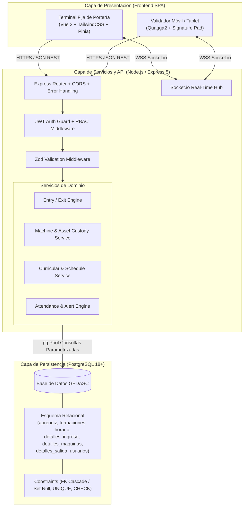
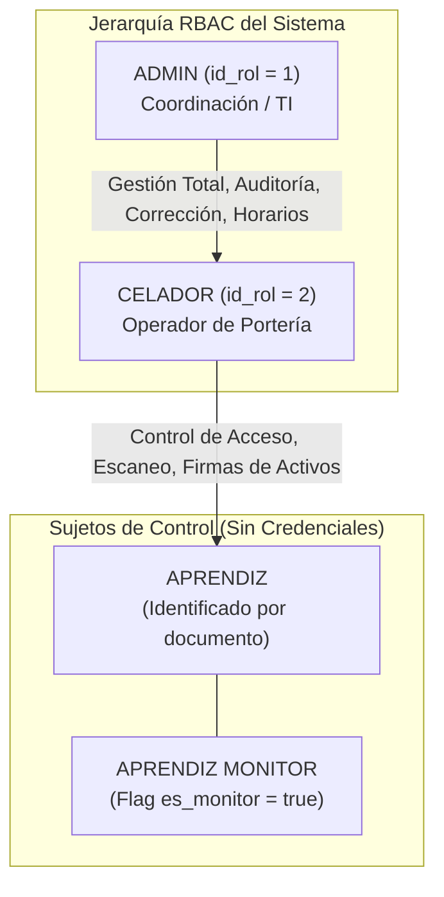
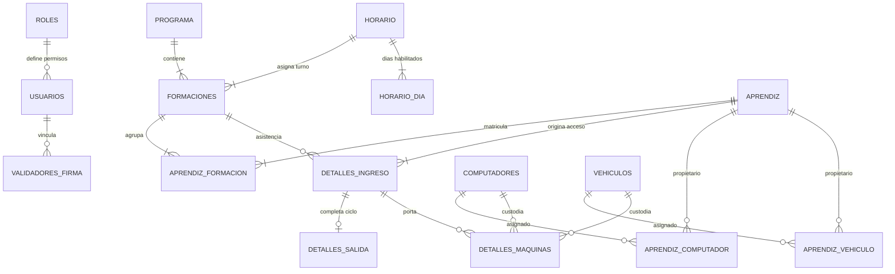
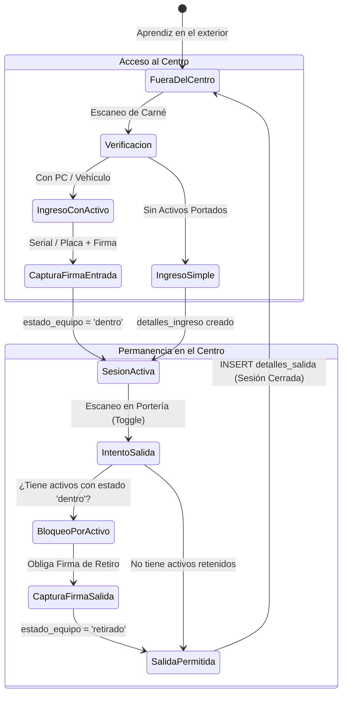
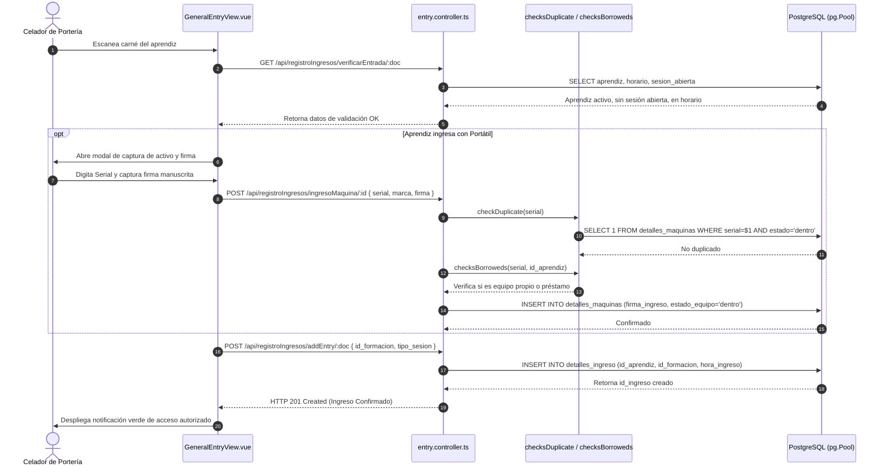
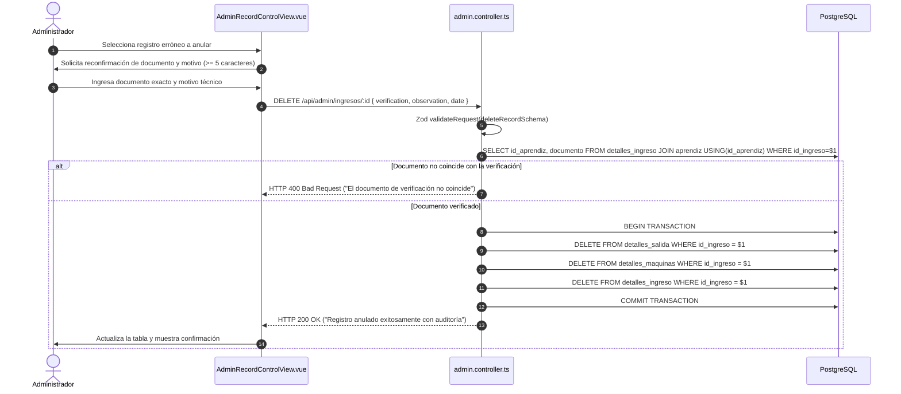

# GEDASC — Arquitectura, Patrones de Ingeniería y Modelo de Datos

Este documento detalla la arquitectura de software, los patrones de ingeniería, la jerarquía de roles, los flujos técnicos críticos y las entidades fundamentales de la base de datos de **GEDASC** (*Gestión de Entradas y Salidas de Aprendices con Autenticación de Equipos y Doble Firma*), implementado para el **Centro de Tecnología de la Amazonía (CTA) — SENA Regional Caquetá**.

---

## Stack Tecnológico

### Arquitectura General

GEDASC implementa una arquitectura **Cliente-Servidor Desacoplada** basada en una Single Page Application (SPA) reactiva en el frontend, una API RESTful stateless con capacidades de comunicación bidireccional en tiempo real (WebSockets) en el backend, y un motor de base de datos relacional PostgreSQL con integridad referencial estricta.



### Frontend

- **Framework:** Vue.js `3.5.x` (Composition API con sintaxis `<script setup lang="ts">`).
- **Lenguaje:** TypeScript `5.9.x` con tipado estricto y chequeo en compilación (`vue-tsc`).
- **Enrutamiento:** Vue Router `5.0.x` con Navigation Guards (`router.beforeEach`) para protección de rutas según roles RBAC.
- **Gestión de Estado:** Pinia `3.0.x` con stores modulares (`auth.store.ts`, estado reactivo de jornada y UI).
- **Diseño y Estilos:** TailwindCSS `3.3.x` con sistema utilitario optimizado para pantallas táctiles y escritorios de portería.
- **Captura Óptica y Biométrica:** Quagga2 `1.12.x` para lectura óptica de códigos de barras (Code 128 / EAN) y Signature Pad `5.1.x` sobre HTML5 Canvas para firmas manuscritas en Base64.
- **Build / Tooling:** Vite `6.x` con soporte HTTPS local mediante `@vitejs/plugin-basic-ssl` / `mkcert` y PostCSS.

### Backend

- **Entorno de Ejecución:** Node.js `>=20.19.0` (LTS recomendada).
- **Framework Web:** Express `5.2.x` con enrutamiento modular y middlewares asíncronos nativos.
- **Lenguaje:** TypeScript `5.9.x` transpilado con `tsc` y ejecutado en desarrollo con `ts-node-dev`.
- **Comunicación en Tiempo Real:** Socket.io `4.8.x` para enlace de terminales móviles y estaciones de portería.
- **Validación de Entradas:** Zod `4.4.x` con middleware declarativo `validateRequest({ body, params, query })`.
- **Acceso a Datos:** Driver nativo `pg` (node-postgres `8.18.x`) con connection pooling (`pg.Pool`) y consultas SQL parametrizadas (`$1, $2, ...`). Prisma `7.8.x` como referencia de esquema.
- **Base de Datos:** PostgreSQL `18.x` / `16.x` Relacional con soporte transaccional ACID y restricciones DDL.
- **Seguridad Criptográfica:** `bcryptjs` (10 salt rounds) para contraseñas y `jsonwebtoken` (JWT) con HMAC-SHA256 y vigencia de 24 horas (`1d`).
- **Servicios de Exportación:** `jspdf` / `jspdf-autotable` para PDF vectoriales y `xlsx (SheetJS)` para libros de cálculo.

---

## Jerarquía de Roles y Autenticación

El sistema implementa un modelo de **Control de Acceso Basado en Roles (RBAC)** desacoplado de las personas que son objeto de control (aprendices):



### 1. Administrador del Sistema

- **Identificador:** `ADMIN` (`id_rol = 1`).
- **Responsabilidades:** Administración curricular (programas, fichas, horarios), creación y desvinculación masiva de aprendices desde Excel, monitoreo de alertas de ausentismo ($\ge 3\text{ días}$), analítica de aforo, creación de cuentas de celadores y anulación justificada de registros erróneos.
- **Permisos relevantes:** Acceso exclusivo a todas las rutas bajo `/api/admin/*` y vistas `/admin/*`. Capacidad de ejecutar bajas lógicas y anulación en cascada de registros.

### 2. Celador / Operador de Portería

- **Identificador:** `CELADOR` (`id_rol = 2`).
- **Responsabilidades:** Operación continua de puestos de control de acceso, escaneo de carnés, captura de firmas digitales de equipos y vehículos, registro de motivos de reingreso o visita extraordinaria, y consultas históricas en modalidad de solo lectura.
- **Permisos relevantes:** Acceso a `/api/registroIngresos/*`, `/api/registroSalidas/*`, `/api/validador/*` y `/api/historico/*`. Prohibido el acceso a configuraciones curriculares, borrado de registros o creación de usuarios.

### 3. Aprendiz / Portador de Activos (Sujeto de Control)

- **Identificador:** No posee credenciales de acceso al software (`usuarios`); se identifica mediante su documento de identidad único en la tabla `aprendiz`.
- **Responsabilidades:** Portar su carné con código de barras y estampar su firma digital manuscrita al ingresar y retirar activos.

---

## Esquema de Base de Datos y Entidades

El modelo relacional se organiza en cuatro dominios estructurales:



### 1. Dominio Académico y Curricular

- **`programa`**: Catálogo de diseños curriculares del SENA (`id_programa PK`, `nombre_programa UNIQUE`, `version`, `nivel`, `estado`).
- **`horario`**: Franjas horarias maestras (`id_horario PK`, `hora_inicio`, `hora_fin`, `jornada`).
- **`horario_dia`**: Días de funcionamiento normalizados (`id_horario FK`, `dia_semana PK`) con `ON DELETE CASCADE`.
- **`formaciones`**: Fichas académicas institucionales (`id_formacion PK`, `id_programa FK`, `id_horario FK`, `fecha_inicio`, `fecha_fin`, `estado`).
- **`aprendiz_formacion`**: Matrículas activas e históricas (`id PK`, `id_aprendiz FK`, `id_formacion FK`, `estado`) con constraint `UNIQUE(id_aprendiz, id_formacion)` y `ON DELETE CASCADE`.

### 2. Dominio de Control de Acceso y Sesiones

- **`aprendiz`**: Directorio maestro de aprendices (`id_aprendiz PK`, `documento UNIQUE`, `nombre`, `apellido`, `estado`, `es_monitor`).
- **`detalles_ingreso`**: Registro atómico de acceso (`id_ingreso PK`, `id_aprendiz FK`, `id_formacion FK`, `hora_ingreso`, `tipo_sesion`, `motivo_reingreso`, `motivo_visita`) con `FK id_formacion ON DELETE SET NULL`.
- **`detalles_salida`**: Cierre de sesión de permanencia (`id_salida PK`, `id_ingreso FK UNIQUE`, `hora_salida`, `motivo_salida_anticipada`) con `FK id_ingreso ON DELETE CASCADE`.

### 3. Dominio de Custodia de Activos y Equipos

- **`computadores`**: Catálogo de portátiles (`id_computador PK`, `serial UNIQUE`, `marca`, `activo`).
- **`vehiculos`**: Catálogo de vehículos (`id_vehiculo PK`, `tipo_vehiculo`, `placa`, `modelo`).
- **`aprendiz_computador`** y **`aprendiz_vehiculo`**: Vínculos de titularidad histórica y máquina principal.
- **`detalles_maquinas`**: Movimientos de activos por sesión (`id_detallemaquina PK`, `id_ingreso FK`, `id_computador FK`, `id_vehiculo FK`, `firma_ingreso TEXT NOT NULL`, `firma_salida TEXT`, `estado_equipo VARCHAR(20)`, `hora_retiro_equipo`) con `FK id_ingreso ON DELETE CASCADE`.

### 4. Dominio de Seguridad y Usuarios

- **`roles`**: Perfiles autorizados (`id_rol PK`, `nombre UNIQUE` $\rightarrow$ `'ADMIN'`, `'CELADOR'`).
- **`usuarios`**: Cuentas del personal (`id_usuario PK`, `nombre`, `email UNIQUE`, `password`, `id_rol FK`, `activo`, `ultimo_login`).
- **`validadores_firma`**: Dispositivos móviles vinculados (`id_validador PK`, `device_id UNIQUE`, `id_usuario FK`, `activo`, `ultimo_ping`).

---

## Modelo de Sesión Dinámica y Cadena de Custodia con Doble Firma

GEDASC implementa un patrón de **Sesión Dinámica Transaccional** combinado con una **Máquina de Estados Finita para Custodia de Activos**:



### Fuentes de Verdad

1. **`detalles_ingreso` + `detalles_salida`**
   - **Propósito:** Determinar si un aprendiz se encuentra físicamente dentro de las instalaciones en el instante actual.
   - **Uso:** El estado de permanencia se calcula evaluando si existe un registro en `detalles_ingreso` para la fecha actual donde `detalles_salida.hora_salida IS NULL`.
   - **Restricciones:** Un aprendiz no puede tener más de una sesión abierta en el mismo instante (`RN-ING-004`).

2. **`detalles_maquinas`**
   - **Propósito:** Garantizar el valor probatorio de la cadena de custodia de equipos.
   - **Uso:** Valida la no concurrencia (`checkDuplicate.ts`), asienta la tenencia (`estado_equipo = 'dentro'`) e impide el egreso físico del aprendiz si el activo no ha sido firmado en salida (`RN-ACT-005`, `RN-SAL-003`).
   - **Restricciones:** `firma_ingreso` es obligatoria (`NOT NULL`). La firma de salida es requerida para transicionar a `'retirado'`.

### Ventajas de esta Arquitectura

- **Operación en 1 Solo Paso**: La misma terminal de escaneo opera ingresos y egresos sin exigir cambio manual de interfaz.
- **Cero Pérdidas de Custodia**: Imposibilidad física y lógica de que un aprendiz abandone la sede dejando un equipo registrado a su nombre sin firmar.
- **Inmutabilidad Probatoria**: Firmas rasterizadas en Base64 persistidas atómicamente en la base de datos relacional.

---

## Patrones y Decisiones de Ingeniería

### 1. Validación Declarativa en Frontera con Zod (`validateRequest`)

- **Problema:** Evitar que datos corruptos, cadenas maliciosas o tipos incongruentes alcancen la capa de servicios o provoquen errores no controlados en PostgreSQL.
- **Solución:** Middleware de orden superior `validateRequest({ body, params, query })` que ejecuta `parseAsync` contra esquemas tipificados en `DataBase/src/schemas/`.
- **Motivación:** Tipado estático en tiempo de desarrollo (`z.infer`) combinado con sanitización automática (`.trim()`, `.toLowerCase()`) y respuestas `HTTP 400 Bad Request` estandarizadas.

### 2. Connection Pooling y Consultas Parametrizadas Nativas

- **Problema:** En horas pico de portería, abrir y cerrar conexiones TCP por cada escaneo satura el motor de base de datos y degrada la latencia.
- **Solución:** Instancia única de `pg.Pool` compartida con consultas SQL parametrizadas (`$1, $2, ...`).
- **Motivación:** Soporte de alto rendimiento concurrente con tiempos de respuesta inferiores a $50\text{ ms}$ y protección contra inyección SQL.

### 3. Sincronización Reactiva Bidireccional con WebSockets (Socket.io)

- **Problema:** Necesidad de desacoplar la captura óptica y táctil (realizada en smartphones de los celadores en la fila) de la terminal fija de escritorio de portería.
- **Solución:** Servidor Socket.io montado sobre el servidor HTTP Express en el namespace `/validador`.
- **Motivación:** Permite despachar eventos `validator:scanned` y `validator:signature_saved` en milisegundos sin sobrecarga de sondeo HTTP (*polling*).

### 4. Algoritmo de Inferencia Temporal y Tolerancia Horaria

- **Problema:** Coordinar la asistencia lectiva con flexibilidad institucional ante llegadas tempranas y salidas ordenadas de talleres.
- **Solución:** Evaluación de intervalos temporales con margen de tolerancia de $\pm 30\text{ minutos}$ cruzando `horario_dia`, `horario` y la hora efectiva del servidor (o reloj simulado en pruebas).
- **Motivación:** Automatiza la imputación a la ficha formativa y exige justificaciones únicamente ante anomalías reales (visitas extraordinarias o reingresos).

---

## Flujos Técnicos Críticos

### Flujo 1: Ciclo Completo de Acceso Peatonal con Registro de Activo



### Flujo 2: Validador Móvil en Tiempo Real mediante WebSockets

```mermaid
sequenceDiagram
    autonumber
    actor C_MOB as Celador en Fila (Móvil)
    participant MOB as MobileValidatorView.vue
    participant WS as Socket.io Server (Node.js)
    participant DESK as GeneralEntryView.vue (PC Portería)
    participant API as validator.controller.ts

    C_MOB->>MOB: Abre validador en smartphone
    MOB->>API: POST /api/validador/vincular { device_id, nombre }
    API-->>MOB: HTTP 200 OK (Dispositivo Vinculado)
    
    MOB->>WS: Handshake WebSocket (join room 'validator')
    DESK->>WS: Handshake WebSocket (join room 'validator')

    C_MOB->>MOB: Apunta cámara al código de barras del carné
    MOB->>MOB: Quagga2 decodifica código de barras
    MOB->>WS: socket.emit('validator:scanned', { documento: '1075254123' })
    WS->>DESK: socket.emit('validator:scanned', payload)
    DESK->>DESK: Auto-completa campo documento e inicia verificación

    C_MOB->>MOB: Solicita firma táctil en pantalla del móvil
    MOB->>WS: socket.emit('validator:signature_saved', { firma: 'data:image/png;base64,...' })
    WS->>DESK: socket.emit('validator:signature_saved', payload)
    DESK->>DESK: Inyecta firma Base64 en el formulario de portería
```

### Flujo 3: Anulación Justificada de Registros con Eliminación en Cascada



---

## Mapa de Módulos y Referencias de Ingeniería

| # | Módulo | Componente Principal (Frontend) | Controlador / Servicio Backend | Esquema / Entidad BD | Documentación Técnica |
| :-: | :--- | :--- | :--- | :--- | :--- |
| **01** | Autenticación y Acceso | `LoginView.vue`, `MobileValidatorView.vue` | `auth.controller.ts`, `validator.controller.ts` | `usuarios`, `roles`, `validadores_firma` | [`01_autenticacion_acceso`](file:///c:/Users/alejo/Downloads/primerProyecto/GEDASC/documentacion/modulos/01_autenticacion_acceso/README.md) |
| **02** | Control de Ingreso | `GeneralEntryView.vue`, `ModalScanEntry.vue` | `entry.controller.ts`, `jornada.controller.ts` | `detalles_ingreso`, `aprendiz`, `horario` | [`02_control_ingreso`](file:///c:/Users/alejo/Downloads/primerProyecto/GEDASC/documentacion/modulos/02_control_ingreso/README.md) |
| **03** | Control de Salida | `GeneralExitView.vue`, `ModalEarlyExitReason.vue` | `exit.controller.ts` | `detalles_salida`, `detalles_ingreso` | [`03_control_salida`](file:///c:/Users/alejo/Downloads/primerProyecto/GEDASC/documentacion/modulos/03_control_salida/README.md) |
| **04** | Equipos y Vehículos | `SignaturePad.vue`, `ModalRegisterMachine.vue` | `computer.controller.ts`, `vehicle.controller.ts`, `checksDuplicate.ts` | `computadores`, `vehiculos`, `detalles_maquinas` | [`04_equipos_vehiculos`](file:///c:/Users/alejo/Downloads/primerProyecto/GEDASC/documentacion/modulos/04_equipos_vehiculos/README.md) |
| **05** | Historial y Reportes | `HistoryView.vue`, `usePdfExport.ts` | `history.controller.ts` | Vistas SQL parametrizadas con `JOIN` | [`05_historial_reportes`](file:///c:/Users/alejo/Downloads/primerProyecto/GEDASC/documentacion/modulos/05_historial_reportes/README.md) |
| **06** | Administración y Monitoreo | `AdminAlertsView.vue`, `AdminRecordControlView.vue` | `admin.controller.ts`, `stats.controller.ts` | `usuarios`, `aprendiz`, agregaciones | [`06_administracion_monitoreo`](file:///c:/Users/alejo/Downloads/primerProyecto/GEDASC/documentacion/modulos/06_administracion_monitoreo/README.md) |
| **07** | Gestión Curricular | `AdminHorariosView.vue`, `ModalImportAprendicesMasivo.vue` | `admin.controller.ts` (Formaciones/Horarios) | `programa`, `formaciones`, `horario`, `horario_dia` | [`07_gestion_academica`](file:///c:/Users/alejo/Downloads/primerProyecto/GEDASC/documentacion/modulos/07_gestion_academica/README.md) |

---

## Documentación Conexa

- 🧠 **Base de Conocimiento del Sistema:** [`documentacion/base_conocimiento/conocimiento_sistema.md`](file:///c:/Users/alejo/Downloads/primerProyecto/GEDASC/documentacion/base_conocimiento/conocimiento_sistema.md)
- 🏛️ **Documento Técnico Integral:** [`documentacion/tecnico_integral/documento_tecnico_integral.md`](file:///c:/Users/alejo/Downloads/primerProyecto/GEDASC/documentacion/tecnico_integral/documento_tecnico_integral.md)
- ⚙️ **Documento Técnico Maestro Modular:** [`documentacion/tecnico_maestro/documento_tecnico_maestro.md`](file:///c:/Users/alejo/Downloads/primerProyecto/GEDASC/documentacion/tecnico_maestro/documento_tecnico_maestro.md)
- 📋 **Documento Funcional Maestro Modular:** [`documentacion/funcional_maestro/documento_funcional_maestro.md`](file:///c:/Users/alejo/Downloads/primerProyecto/GEDASC/documentacion/funcional_maestro/documento_funcional_maestro.md)
- 📜 **Reglas de Negocio Generales y Transversales:** [`documentacion/reglas_generales/reglas_negocio_generales.md`](file:///c:/Users/alejo/Downloads/primerProyecto/GEDASC/documentacion/reglas_generales/reglas_negocio_generales.md)
- 🗺️ **Portal e Índice Maestro de Documentación:** [`documentacion/DOCUMENTACION_GENERAL.md`](file:///c:/Users/alejo/Downloads/primerProyecto/GEDASC/documentacion/DOCUMENTACION_GENERAL.md)
- 🗄️ **DDL Maestro de Base de Datos:** [`DataBase/schema/gedascBD.sql`](file:///c:/Users/alejo/Downloads/primerProyecto/GEDASC/DataBase/schema/gedascBD.sql)
- 🚀 **Repositorio Oficial de Código Fuente:** `https://github.com/DanExl24/GEDASC.git` (Rama `GEDASC-V2`)
