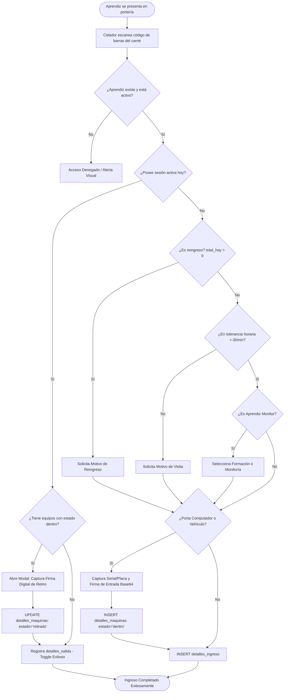
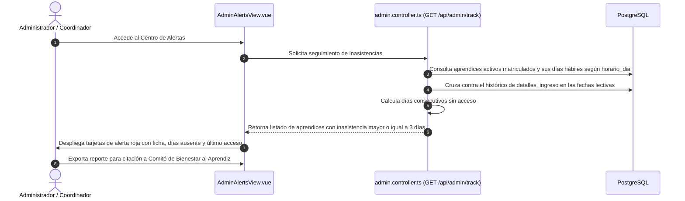
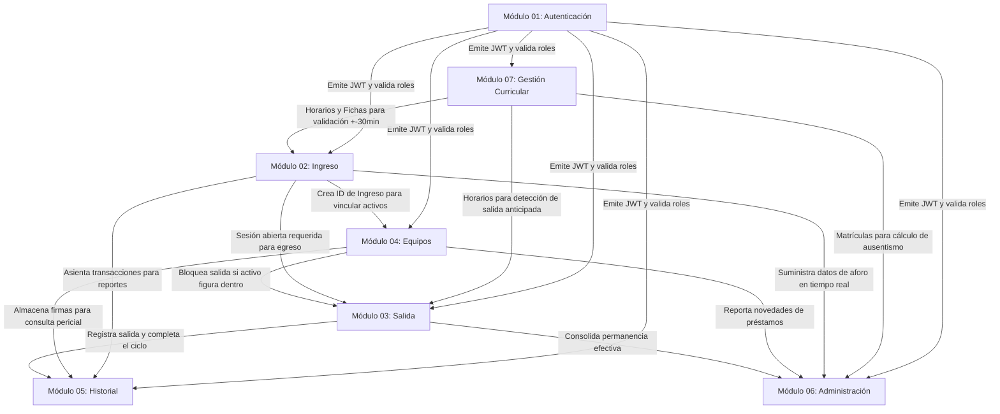

# GEDASC — Base de Conocimiento del Sistema

> **Gestión de Entradas y Salidas de Aprendices con Autenticación de Equipos y Doble Firma**  
> **Centro de Tecnología de la Amazonía (CTA) — SENA Regional Caquetá**  
> **Manual Maestro de Arquitectura, Dominio Institucional y Guía de Ingeniería del Software**

---

# 1. Introducción

### 1.1 Objetivo
El presente documento constituye la **Base de Conocimiento Definitiva** de **GEDASC**. Su propósito es concentrar todo el conocimiento conceptual, técnico, operativo y arquitectónico del sistema para que cualquier nuevo ingeniero de software, analista, auditor o líder técnico pueda comprender integralmente el funcionamiento, las decisiones de diseño (ADRs), los flujos de información y el dominio institucional sin necesidad de consultar a los autores originales del proyecto.

### 1.2 Alcance
Este documento abarca desde la justificación funcional en el contexto de la formación profesional del SENA hasta los detalles de bajo nivel de la base de datos relacional PostgreSQL, el protocolo de doble firma digital, la sincronización de terminales móviles mediante WebSockets, los esquemas de validación Zod y las directrices de despliegue en entornos de portería física.

### 1.3 Público Objetivo
- **Nuevos Desarrolladores Full-Stack**: Para incorporación ágil (*onboarding*), comprensión de estándares y mantenimiento evolutivo.
- **Líderes de TI y Arquitectos de Software**: Para evaluación de decisiones arquitectónicas, escalabilidad y gobierno de la plataforma.
- **Auditores de Seguridad y Control Interno**: Para verificación de la cadena de custodia de activos y trazabilidad de accesos.
- **Personal de Soporte Técnico y Operaciones**: Para despliegue de infraestructura, configuración de red local (LAN) y diagnóstico.

---

# 2. GEDASC: Visión del Negocio e Impacto Institucional

### 2.1 Qué Problema Resuelve
En los centros de formación técnica y tecnológica del SENA, el control de acceso peatonal y la custodia de activos personales y de formación (computadores portátiles y vehículos) tradicionalmente se han realizado mediante planillas físicas de papel (*minutas de vigilancia*). Este esquema manual presenta graves falencias:
1. **Cuellos de botella en horas pico**: Filas extensas de aprendices al inicio de jornada esperando el registro manual de seriales.
2. **Vulnerabilidad probatoria y suplantación**: Imposibilidad de verificar si un equipo que sale pertenece realmente al portador o fue retirado sin autorización.
3. **Desconexión con la programación académica**: Los celadores no tienen visibilidad en tiempo real de si un aprendiz tiene clase programada, si asiste en jornada contraria o si ya ha abandonado el centro repetidamente en el día.
4. **Deserción escolar inadvertida**: Falta de alertas tempranas cuando un aprendiz acumula inasistencias continuas que ameritan intervención de Bienestar al Aprendiz.

### 2.2 Por Qué Fue Construido
GEDASC fue concebido como una solución integral que digitaliza la portería del **Centro de Tecnología de la Amazonía (CTA)**, combinando:
- **Lectura óptica ultrarrápida** de códigos de barra de carnés institucionales ($< 2\text{ segundos}$ por registro).
- **Doble firma digital manuscrita** (al ingresar y al retirar activos) para valor probatorio y no repudio.
- **Validación curricular en tiempo real** contra los horarios de fichas formativas con margen de tolerancia ($\pm 30\text{ min}$).
- **Centro de Alertas de Ausentismo** para la prevención temprana de la deserción escolar.

### 2.3 Quiénes Utilizan el Sistema
```text
┌─────────────────────────────────────────────────────────────────────────────┐
│                           ECOSISTEMA DE ACTORES                             │
├────────────────────────────────┬────────────────────────────────────────────┤
│ CELADOR (Operador de Portería) │ Registra entradas, salidas, firmas de      │
│                                │ equipos y verifica horarios en pantalla.   │
├────────────────────────────────┼────────────────────────────────────────────┤
│ ADMINISTRADOR / COORDINADOR    │ Gestiona programas, fichas, horarios,      │
│                                │ auditorías, celadores y analiza aforos.    │
├────────────────────────────────┼────────────────────────────────────────────┤
│ APRENDIZ SENA                  │ Portador del carné físico; suscribe firmas │
│                                │ manuscritas de custodia de sus activos.    │
├────────────────────────────────┼────────────────────────────────────────────┤
│ TERMINAL VALIDADORA MÓVIL      │ Dispositivo móvil inalámbrico que asiste en│
│                                │ la lectura de códigos de barra y firmas.   │
└────────────────────────────────┴────────────────────────────────────────────┘
```

---

# 3. Conocimiento del Dominio Institucional (SENA / CTA)

Para comprender el código y las reglas de GEDASC, es indispensable dominar los conceptos propios del modelo de Formación Profesional Integral del SENA:

### 3.1 Centro de Formación (CTA)
El **Centro de Tecnología de la Amazonía (CTA)** es la sede regional del SENA en Caquetá. GEDASC opera como una instancia centralizada exclusiva para este centro de formación, gestionando el acceso a sus talleres, laboratorios y aulas.

### 3.2 Programa Curricular (`programa`)
Diseño curricular formal avalado por el SENA (ej. *Análisis y Desarrollo de Software - ADSO*, *Gestión Administrativa*, *Mantenimiento Mecatrónico*). Define el nivel de formación (*Técnico*, *Tecnólogo*, *Especialización*) y la versión curricular.

### 3.3 Ficha de Formación (`formaciones`)
Es una **cohorte académica específica** identificada por un número único oficial de 6 a 7 dígitos (ej. `Ficha 2694551`). Toda ficha pertenece a un programa y tiene asignado un horario semanal de funcionamiento.

### 3.4 Aprendiz (`aprendiz`)
Estudiante matriculado en el SENA. Se identifica universalmente mediante su número de documento de identidad. Un aprendiz puede pertenecer a una o más fichas activas (ej. doble formación complementaria).

### 3.5 Aprendiz Monitor (`es_monitor`)
Aprendiz destacado seleccionado para prestar servicios de apoyo técnico, administrativo o académico en el centro. Al ingresar, el sistema exige clasificar si su sesión corresponde a **Formación Lectiva** o a **Horas de Monitoría** para efectos de certificación institucional.

### 3.6 Horario Curricular y Jornada (`horario`, `horario_dia`)
Definición de horas de inicio y fin junto con los días habilitados de la semana (ej. Lunes a Viernes de 07:00 a 13:00). La jornada se clasifica automáticamente como:
- **Mañana**: Inicio antes de las `12:00:00`.
- **Tarde**: Inicio entre las `12:00:00` y las `17:59:59`.
- **Noche**: Inicio a partir de las `18:00:00`.

### 3.7 Ventana de Tolerancia Horaria ($\pm 30\text{ Minutos}$)
Margen de tiempo institucional que permite el acceso anticipado de aprendices para alistamiento de talleres (30 minutos antes del inicio) y la salida ordenada tras la clase (hasta 30 minutos después del fin).

### 3.8 Sesión de Acceso y Toggle de Salida
Una sesión representa la estancia física del aprendiz en el centro (`detalles_ingreso` completado con `detalles_salida`). Si un aprendiz con sesión activa es escaneado nuevamente en la portería, el sistema realiza un **Toggle automático de salida**, cerrando su sesión sin exigir conmutar de vista.

### 3.9 Reingreso Diario y Visita Extraordinaria
- **Reingreso**: Acceso de un aprendiz que ya completó al menos una entrada y salida en la misma fecha (`total_hoy > 0`). Requiere documentar el `motivo_reingreso` (ej. regreso de almuerzo).
- **Visita Extraordinaria**: Ingreso en días u horas no contempladas en el horario de sus fichas formativas. Exige documentar el `motivo_visita`.

### 3.10 Cadena de Custodia y Doble Firma Digital
Protocolo que exige registrar la firma manuscrita digital del portador al ingresar un equipo (`firma_ingreso` $\rightarrow$ `estado_equipo = 'dentro'`) y capturar una segunda firma al retirarlo físicamente (`firma_salida` $\rightarrow$ `estado_equipo = 'retirado'`).

### 3.11 Préstamo de Activo (Titular vs Portador Receptor)
Situación en la cual el serial o placa ingresada ya pertenece a un aprendiz distinto en el histórico del sistema. El software marca la sesión como **Préstamo**, vinculando a ambos aprendices para auditorías.

### 3.12 Ausentismo Prolongado y Centro de Alertas
Regla que detecta cuando un aprendiz no registra ingresos al CTA durante **3 o más días consecutivos** correspondientes a su horario lectivo, disparando alertas de riesgo de deserción.

---

# 4. Arquitectura del Sistema

GEDASC adopta una arquitectura desacoplada basada en el patrón **SPA + API RESTful Stateless + Real-Time WebSocket Hub**:

```text
┌─────────────────────────────────────────────────────────────────────────────┐
│                             VUE 3 SPA CLIENT                                │
│   • Composition API (<script setup>) • TypeScript • TailwindCSS • Pinia     │
│   • HTML5 Signature Pad • Quagga2 Barcode Scanner • jsPDF / SheetJS         │
└──────────────────────────────────────┬──────────────────────────────────────┘
                                       │ HTTPS / WSS
┌──────────────────────────────────────▼──────────────────────────────────────┐
│                        NODE.JS / EXPRESS 5 BACKEND                          │
│   • JWT Auth & RBAC Guard • Zod Validation Middleware • Socket.io Hub       │
│   • Entry/Exit Engines • Machine Loan Analyzer • Admin Automation Engine    │
└──────────────────────────────────────┬──────────────────────────────────────┘
                                       │ pg.Pool (SQL Parametrizado)
┌──────────────────────────────────────▼──────────────────────────────────────┐
│                         POSTGRESQL 18+ DATABASE                             │
│   • Tablas Relacionales • Constraints (FK, UNIQUE, CHECK) • B-Tree Indexes  │
│   • Integridad en Cascada Controlada • Tipos Timestamp sin Zona Horaria     │
└─────────────────────────────────────────────────────────────────────────────┘
```

### 4.1 Principios Arquitectónicos Fundamentales
1. **Autonomía Operativa Local**: El sistema está diseñado para operar en la red local institucional (LAN CTA) sin dependencias de servicios externos en la nube. Las firmas y reportes se generan y almacenan localmente.
2. **Stateless Authentication**: La API no almacena sesiones en memoria; cada petición transporta un token JWT firmado criptográficamente que contiene la identidad y el rol (`ADMIN` / `CELADOR`).
3. **Validación en Frontera**: Ninguna carga útil (*payload*) malformada o con tipos incongruentes alcanza la lógica de negocio; Zod intercepta y rechaza con `HTTP 400 Bad Request` en el middleware de entrada.
4. **Persistencia Dual en Tiempo Real**: Toda acción transaccional se escribe atómicamente en PostgreSQL y, de ser requerido, despacha eventos vía Socket.io a las terminales suscritas.

---

# 5. Decisiones Arquitectónicas (Architecture Decision Records - ADR)

---

### ADR-001: Adopción de Vue 3 con Composition API y Vite
- **Problema**: Se requería una interfaz de usuario extremadamente reactiva, con tiempos de respuesta instantáneos en puestos de vigilancia y soporte para dispositivos táctiles y móviles.
- **Alternativas consideradas**: React, Angular, Blade/Server-Side Rendering clásico.
- **Decisión**: Vue 3 con `<script setup lang="ts">`, Pinia para gestión de estado y Vite como herramienta de empaquetado.
- **Ventajas**:
  - Reactividad granular mediante `ref()` y `computed()` ideal para escáneres y firmas.
  - Tiempos de compilación ultrarrápidos con Vite (HMR instantáneo).
  - Tipado estricto extremo con TypeScript integrado.
- **Consecuencias**: Requiere mantener sincronizados los tipos del frontend con los contratos de la API.

---

### ADR-002: Backend en Express 5 sobre Node.js con TypeScript
- **Problema**: Necesidad de un servidor ligero, rápido, capaz de manejar peticiones concurrentes de escaneo y conexiones WebSocket simultáneas.
- **Alternativas consideradas**: NestJS, Django, Spring Boot.
- **Decisión**: Express 5 con TypeScript y `ts-node-dev`.
- **Ventajas**:
  - Curva de aprendizaje ágil y arquitectura modular limpia sin sobrecarga de abstracción.
  - Soporte nativo y directo para Socket.io en el mismo ciclo de eventos de Node.js.
  - Manejo simplificado de promesas y middlewares asíncronos nativos en Express 5.
- **Consecuencias**: El equipo debe mantener la disciplina arquitectónica organizando manualmente controladores, rutas y servicios.

---

### ADR-003: Motor de Base de Datos PostgreSQL con Conexión Nativa `pg`
- **Problema**: El sistema maneja relaciones complejas (aprendices, múltiples fichas, horarios por días, firmas en Base64 y sesiones de ingreso/salida) con necesidad de integridad transaccional estricta (ACID).
- **Alternativas consideradas**: MongoDB, MySQL, ORM completo (TypeORM/Prisma en runtime).
- **Decisión**: PostgreSQL 18+ utilizando el driver nativo de alto rendimiento `pg` (node-postgres) con pooling de conexiones y queries SQL parametrizadas. Prisma se utiliza como referencia de esquema.
- **Ventajas**:
  - Máxima velocidad de ejecución sin sobrecostos de serialización de ORM en consultas complejas con múltiples `JOINs`.
  - Integridad referencial sólida respaldada por constraints `FOREIGN KEY ... ON DELETE CASCADE / SET NULL` y checks nativos.
  - Seguridad absoluta contra inyección SQL mediante parámetros posicionales (`$1, $2, ...`).
- **Consecuencias**: Las migraciones estructurales complejas se gestionan mediante scripts SQL controlados en `DataBase/migrations/`.

---

### ADR-004: Modelo de Sesión Dinámica con Toggle de Salida Automático
- **Problema**: En horas de alta congestión en portería (ej. 06:45 a 07:15), conmutar manualmente entre una pantalla de "Entrada" y una de "Salida" duplica el tiempo de atención y genera errores de digitación.
- **Alternativas consideradas**: Vistas separadas obligatorias con botones manuales.
- **Decisión**: El backend detecta si el aprendiz escaneado ya posee una sesión abierta en la fecha actual (`detalles_salida.hora_salida IS NULL`); de ser así, ejecuta automáticamente el cierre de sesión (salida), a menos que existan activos retenidos.
- **Ventajas**: Permite operar puestos de control unificados con una sola pistola de escaneo óptico para entradas y salidas.
- **Consecuencias**: Si un aprendiz tiene equipos dentro, la salida automática se suspende y abre obligatoriamente el modal de retiro de activos.

---

### ADR-005: Almacenamiento de Firmas Digitales en Formato Base64 en la Base de Datos
- **Problema**: Las firmas capturadas deben ser legalmente vinculantes, inmutables y estar disponibles para reportes históricos sin riesgo de enlaces rotos o desincronización de sistemas de archivos.
- **Alternativas consideradas**: Guardar imágenes PNG en disco local o buckets S3 y almacenar la URL en base de datos.
- **Decisión**: Almacenar la firma directamente como cadena Base64 Data URL (`image/png`) en la columna `TEXT` de la tabla `detalles_maquinas`.
- **Ventajas**:
  - Respaldo atómico total: un dump de la base de datos contiene el 100% de las pruebas periciales de custodia.
  - Cero dependencias de servidores de almacenamiento externos o permisos de carpetas compartidas.
  - Inserción directa en reportes PDF cliente (`jsPDF`) sin peticiones de red adicionales.
- **Consecuencias**: Aumenta moderadamente el tamaño de la base de datos, lo cual se mitiga con índices optimizados y paginación en consultas históricas.

---

### ADR-006: Sincronización WebSocket (Socket.io) para Terminal Validadora Móvil
- **Problema**: En eventos de ingreso masivo, los celadores requieren desplazarse a lo largo de la fila con un teléfono móvil escaneando carnés y recolectando firmas táctiles sin tocar el computador de escritorio.
- **Alternativas consideradas**: Polling HTTP periódico cada 2 segundos, escáneres Bluetooth propietarios.
- **Decisión**: Canal bidireccional WebSocket con Socket.io en la ruta `/validador` sincronizando eventos en tiempo real entre el dispositivo móvil y la pantalla principal de portería.
- **Ventajas**:
  - Latencia cero: al firmar o escanear en el celular, el formulario de portería en el PC se completa al instante.
  - Independencia de hardware: funciona en cualquier smartphone estándar conectado a la red Wi-Fi del centro.
- **Consecuencias**: Requiere que ambos dispositivos permanezcan conectados a la misma red local del CTA.

---

### ADR-007: Validación Estricta con Zod en la Frontera de la API
- **Problema**: La recepción de tipos incompatibles o cadenas maliciosas puede comprometer la base de datos o generar comportamientos erráticos en los controladores.
- **Alternativas consideradas**: Validaciones manuales con `if/else`, Joi, class-validator.
- **Decisión**: Adopción de **Zod** con el middleware unificado `validateRequest({ body, params, query })`.
- **Ventajas**:
  - Inferencia estática de tipos en TypeScript (`z.infer<typeof schema>`).
  - Sanitización automática (`.trim()`, `.toLowerCase()`, `.transform()`).
  - Formato de errores estandarizado hacia el cliente.
- **Consecuencias**: Cualquier cambio en contratos de datos debe sincronizarse primero en los esquemas Zod.

---

### ADR-008: Tolerancia Horaria ($\pm 30\text{ min}$) y Cálculo Automático de Jornadas
- **Problema**: La rigidez horaria estricta bloqueaba el acceso de aprendices que llegaban 15 minutos antes a preparar maquinaria de talleres o salían 15 minutos después.
- **Alternativas consideradas**: Tolerancia cero o selección manual del celador.
- **Decisión**: Algoritmo de comparación horaria con ventana de $\pm 30\text{ minutos}$ e inferencia automática de la jornada a partir de la hora de inicio.
- **Ventajas**:
  - Elimina la fricción en portería para aprendices cumplidos.
  - Elimina el error humano en la clasificación de jornadas.
- **Consecuencias**: Accesos fuera de la ventana de tolerancia exigen capturar obligatoriamente el motivo de visita.

---

### ADR-009: Preservación Histórica mediante Baja Lógica (*Soft Delete*)
- **Problema**: Si un administrador eliminara físicamente a un aprendiz que ya registra movimientos pasados, se perdería la evidencia de quién estuvo dentro del centro en fechas anteriores.
- **Alternativas consideradas**: `ON DELETE CASCADE` destructivo total.
- **Decisión**: Si el aprendiz posee registros en `detalles_ingreso`, el sistema rechaza el borrado físico y aplica una baja lógica (`estado = false`).
- **Ventajas**: Garantiza la inmutabilidad histórica y el no repudio institucional.
- **Consecuencias**: Las consultas de búsqueda operativa deben filtrar explícitamente `WHERE estado = true`.

---

# 6. Catálogo Resumido de Módulos

```text
┌─────────────────────────────────────────────────────────────────────────────┐
│                            CATÁLOGO DE MÓDULOS                              │
├────┬─────────────────────────────┬──────────────────────────────────────────┤
│ #  │ Módulo                      │ Documentación Completa                   │
├────┼─────────────────────────────┼──────────────────────────────────────────┤
│ 01 │ Autenticación y Acceso      │ documentacion/modulos/01_autenticacion/  │
│ 02 │ Control de Ingreso          │ documentacion/modulos/02_control_ingreso/│
│ 03 │ Control de Salida           │ documentacion/modulos/03_control_salida/ │
│ 04 │ Equipos y Vehículos         │ documentacion/modulos/04_equipos_vehic/  │
│ 05 │ Historial y Reportes        │ documentacion/modulos/05_historial_rep/  │
│ 06 │ Administración y Monitoreo  │ documentacion/modulos/06_administracion/ │
│ 07 │ Gestión Curricular          │ documentacion/modulos/07_gestion_acad/   │
└────┴─────────────────────────────┴──────────────────────────────────────────┘
```

### Módulo 01: Autenticación, Sesión y Control de Acceso
- **Propósito**: Seguridad perimetral, emisión de JWT (24h) y control de perfiles RBAC (`ADMIN` / `CELADOR`).
- **Actor Principal**: `CELADOR`, `ADMIN`.
- **Reglas Clave**: `RN-AUTH-001` (Roles válidos), `RN-AUTH-003` (Hashing Bcrypt), `RN-AUTH-007` (Terminal validadora única).
- **Endpoints Clave**: `POST /api/auth/login`, `POST /api/validador/vincular`.
- 🔗 [Ver Documentación Completa del Módulo 01](file:///c:/Users/alejo/Downloads/primerProyecto/GEDASC/documentacion/modulos/01_autenticacion_acceso/README.md)

### Módulo 02: Control Operativo de Ingreso y Reingreso
- **Propósito**: Escaneo de carnés, verificación de horarios ($\pm 30\text{ min}$), toggle de egreso y justificaciones de visita/reingreso.
- **Actor Principal**: `CELADOR`.
- **Reglas Clave**: `RN-ING-001` (Existencia previa), `RN-ING-004` (Toggle de salida), `RN-ING-007` (Tolerancia $\pm 30\text{ min}$).
- **Endpoints Clave**: `GET /api/registroIngresos/verificarEntrada/:doc`, `POST /api/registroIngresos/addEntry/:doc`.
- 🔗 [Ver Documentación Completa del Módulo 02](file:///c:/Users/alejo/Downloads/primerProyecto/GEDASC/documentacion/modulos/02_control_ingreso/README.md)

### Módulo 03: Control Operativo de Salida de Aprendices
- **Propósito**: Cierre de sesión de permanencia, filtro antirrebote ($< 5\text{ min}$) y bloqueo por retención de activos no retirados.
- **Actor Principal**: `CELADOR`.
- **Reglas Clave**: `RN-SAL-001` (Ingreso previo obligatorio), `RN-SAL-002` (Filtro antirrebote), `RN-SAL-003` (Retiro obligatorio de activos).
- **Endpoints Clave**: `GET /api/registroSalidas/verificarSalida/:doc`, `POST /api/registroSalidas/addExit/:doc`.
- 🔗 [Ver Documentación Completa del Módulo 03](file:///c:/Users/alejo/Downloads/primerProyecto/GEDASC/documentacion/modulos/03_control_salida/README.md)

### Módulo 04: Gestión de Equipos de Cómputo y Vehículos
- **Propósito**: Custodia con doble firma digital, detección de préstamos y bloqueo de concurrencia física dentro de la sede.
- **Actor Principal**: `CELADOR`, `APRENDIZ`.
- **Reglas Clave**: `RN-ACT-001` (Detección de préstamos), `RN-ACT-003` (No concurrencia), `RN-ACT-005` (Doble firma digital obligatoria).
- **Endpoints Clave**: `POST /api/registroIngresos/ingresoMaquina/:id`, `POST /api/registroSalidas/retirarEquipo/:id`.
- 🔗 [Ver Documentación Completa del Módulo 04](file:///c:/Users/alejo/Downloads/primerProyecto/GEDASC/documentacion/modulos/04_equipos_vehiculos/README.md)

### Módulo 05: Historial y Reportes Exportables
- **Propósito**: Consultas cronológicas en solo lectura e informes exportables en PDF oficial y hojas de cálculo Excel.
- **Actor Principal**: `CELADOR` (Consulta), `ADMIN` (Exportación).
- **Reglas Clave**: `RN-HIST-001` (Solo lectura para operadores), `RN-HIST-002` (Inmutabilidad histórica), `RN-HIST-003` (Estándar de reportes).
- **Endpoints Clave**: `POST /api/historico/historialGeneral`, `POST /api/historico/historialMaquinas`.
- 🔗 [Ver Documentación Completa del Módulo 05](file:///c:/Users/alejo/Downloads/primerProyecto/GEDASC/documentacion/modulos/05_historial_reportes/README.md)

### Módulo 06: Administración, Monitoreo y Alertas
- **Propósito**: Tablero gerencial, centro de alertas de ausentismo ($\ge 3\text{ días}$), corrección justificada de registros y celadores.
- **Actor Principal**: `ADMIN`.
- **Reglas Clave**: `RN-ADM-001` (Exclusividad admin), `RN-ADM-002` (Doble factor de anulación), `RN-ADM-004` (Alerta ausentismo 3 días).
- **Endpoints Clave**: `GET /api/admin/track`, `DELETE /api/admin/ingresos/:id`, `POST /api/admin/celadores`.
- 🔗 [Ver Documentación Completa del Módulo 06](file:///c:/Users/alejo/Downloads/primerProyecto/GEDASC/documentacion/modulos/06_administracion_monitoreo/README.md)

### Módulo 07: Gestión Curricular y Horarios Académicos
- **Propósito**: Programas, fichas formativas, horarios con cálculo de jornada, bloqueo de cruces e importación masiva desde Excel.
- **Actor Principal**: `ADMIN`.
- **Reglas Clave**: `RN-ACAD-001` (Jerarquía curricular), `RN-ACAD-004` (Jornada automática), `RN-ACAD-008` (Bloqueo por cruce de horario).
- **Endpoints Clave**: `POST /api/admin/formaciones`, `POST /api/admin/horarios`, `POST /api/admin/formaciones/:id/aprendices/masivo`.
- 🔗 [Ver Documentación Completa del Módulo 07](file:///c:/Users/alejo/Downloads/primerProyecto/GEDASC/documentacion/modulos/07_gestion_academica/README.md)

---

# 7. Reglas Globales y Transversales

El sistema está regido por **33 Reglas de Negocio Generales** agrupadas en 10 categorías estructurales:

1. **Arquitectura Institucional**: Ámbito exclusivo de la sede CTA (`RN-GEN-001`) y sincronización de validador móvil (`RN-GEN-002`).
2. **Identidades y Cuentas**: Separación neta entre `usuarios` y `aprendiz` (`RN-GEN-003`), unicidad del documento (`RN-GEN-004`) y correo (`RN-GEN-005`).
3. **Roles y Seguridad**: Modelo RBAC estricto (`RN-GEN-006`), JWT stateless (`RN-GEN-007`) y prohibición de autocreación de administradores (`RN-GEN-008`).
4. **Gestión Curricular**: Programa 1 a N Fichas (`RN-GEN-009`), unicidad de ficha (`RN-GEN-010`), matrícula única (`RN-GEN-011`) y bloqueo de cruces de horario (`RN-GEN-012`).
5. **Horarios y Control Temporal**: Jornadas automáticas (`RN-GEN-013`), tolerancia $\pm 30\text{ min}$ (`RN-GEN-014`), bloqueo nocturno (`RN-GEN-015`) y simulación horaria (`RN-GEN-016`).
6. **Ciclo de Sesiones**: Estado activo obligatorio (`RN-GEN-017`), no egreso sin ingreso (`RN-GEN-018`), motivo de reingreso (`RN-GEN-019`), motivo de visita (`RN-GEN-020`), filtro antirrebote ($< 5\text{ min}$) (`RN-GEN-021`), salida anticipada (`RN-GEN-022`) y sesiones de monitor (`RN-GEN-023`).
7. **Custodia de Activos**: Doble firma digital obligatoria (`RN-GEN-024`), bloqueo de egreso con activos dentro (`RN-GEN-025`), detección de préstamos (`RN-GEN-026`) y no concurrencia física (`RN-GEN-027`).
8. **Estados e Inmutabilidad**: Máquinas de estado (`RN-GEN-028`), baja lógica preservando historial (`RN-GEN-029`) y anulación con doble confirmación (`RN-GEN-030`).
9. **Integridad Referencial**: Políticas en cascada `CASCADE / SET NULL` (`RN-GEN-031`) y validación Zod en frontera (`RN-GEN-032`).
10. **Consistencia Transversal**: Invariante de trazabilidad extremo a extremo (`RN-GEN-033`).

> 📘 Para la especificación exhaustiva de cada regla, consulte [`reglas_negocio_generales.md`](file:///c:/Users/alejo/Downloads/primerProyecto/GEDASC/documentacion/reglas_negocio_generales.md).

---

# 8. Flujos Completos del Sistema

### 8.1 Flujo Integral de Control de Acceso y Cadena de Custodia



### 8.2 Flujo de Detección y Monitoreo de Ausentismo Prolongado



---

# 9. Integración y Dependencias entre Módulos



### Eventos en Tiempo Real (Socket.io)
- `validator:scanned`: Emitido por el Validador Móvil al leer un código de barras; consumido por `GeneralEntryView.vue` para auto-completar el formulario.
- `validator:signature_saved`: Emitido por el Validador Móvil tras la firma en pantalla táctil; consumido por el PC de portería para inyectar la firma Base64.
- `validator:device_unlinked`: Notifica al móvil que la estación de control ha cerrado la vinculación.

---

# 10. Convenciones y Estándares Técnicos

### 10.1 Estructura del Monorepo
- `DataBase/`: Servidor backend Node.js / Express / TypeScript y scripts de base de datos.
- `src/`: Cliente frontend Vue 3 SPA con Pinia, Vue Router y TailwindCSS.
- `documentacion/`: Base documental centralizada con subcarpetas para los 7 módulos y documentos maestros.

### 10.2 Convenciones de Nomenclatura
- **Tablas y Columnas**: `snake_case` en minúsculas (`id_aprendiz`, `hora_ingreso`, `detalles_maquinas`).
- **Componentes Vue**: `PascalCase` (`ModalAssetOwnerDetails.vue`, `BaseButton.vue`).
- **Composables**: `camelCase` con prefijo `use` (`useJornada.ts`, `useScanAprendiz.ts`).
- **Controladores y Rutas**: `kebab-case` o `camelCase` modular (`entry.controller.ts`, `auth.routes.ts`).
- **Tipos y Esquemas**: `PascalCase` para interfaces y esquemas Zod (`CreateAprendizSchema`, `UserToken`).

---

# 11. Stack Tecnológico y Justificación

| Tecnología | Versión | Justificación Técnica en GEDASC |
| :--- | :---: | :--- |
| **Vue.js** | `3.5.x` | Reactividad ultrarrápida, Composition API y desacoplamiento limpio de vistas y modales. |
| **Vite** | `6.x` | Compilador moderno con Hot Module Replacement (HMR) y compilación optimizada para producción. |
| **Pinia** | `3.0.x` | Estado global tipado sin mutaciones complejas para autenticación y turnos de jornada. |
| **TailwindCSS** | `3.3.x` | Diseño utilitario responsivo adaptado a monitores de vigilancia y pantallas táctiles móviles. |
| **Express** | `5.2.x` | Framework HTTP robusto, probado, con middlewares asíncronos nativos para la API REST. |
| **Node.js** | `>=20.19.0` | Entorno de ejecución asíncrono no bloqueante con soporte para WebSockets concurrentes. |
| **TypeScript** | `5.9.x` | Seguridad estricta de tipos de datos, autocompletado y prevención de errores en compilación. |
| **PostgreSQL** | `18.x / 16.x` | Motor relacional transaccional ACID, soporte de integridad en cascada y consultas parametrizadas. |
| **Socket.io** | `4.8.x` | Protocolo WebSocket resiliente para comunicación en tiempo real entre el PC y el Validador Móvil. |
| **Zod** | `4.4.x` | Validación y sanitización estricta de esquemas en tiempo de ejecución en la frontera de la API. |
| **Quagga2** | `1.12.x` | Motor de procesamiento de imagen para lectura óptica de códigos de barra (Code 128 / EAN). |
| **Signature Pad** | `5.1.x` | Captura vectorial y rasterización Base64 de firmas digitales sobre elementos HTML5 Canvas. |
| **jsPDF / SheetJS** | `4.2.x / 0.18.x` | Generación y exportación cliente de informes oficiales en PDF y libros de cálculo Excel. |

---

# 12. Guía de Instalación y Puesta en Marcha

### 12.1 Requisitos Previos
- Node.js versión `20.19.0` o superior (LTS recomendada).
- PostgreSQL versión `16.x` o `18.x` instalado y en ejecución en el puerto `5432`.
- Git instalado en el sistema operativo.

### 12.2 Paso a Paso de Instalación Local

#### 1. Clonar el Repositorio
```bash
git clone https://github.com/DanExl24/GEDASC.git
cd GEDASC
git checkout GEDASC-V2
```

#### 2. Configurar y Levantar la Base de Datos
1. Acceder a PostgreSQL y crear la base de datos:
   ```sql
   CREATE DATABASE "GEDASC";
   ```
2. Ejecutar el DDL maestro ubicado en `DataBase/schema/gedascBD.sql`.

#### 3. Configurar y Ejecutar el Backend
```bash
cd DataBase
npm install
```
Crear archivo `.env` en la carpeta `DataBase/`:
```ini
PORT=3000
NODE_ENV=development
DB_USER=postgres
DB_PASSWORD=tu_password_postgres
DB_HOST=localhost
DB_PORT=5432
DB_NAME=GEDASC
JWT_SECRET=clave_secreta_jwt_gedasc_cta_2026
ALLOWED_ORIGINS=http://localhost:5173,*
```
Iniciar el servidor en modo desarrollo:
```bash
npm run dev
```

#### 4. Configurar y Ejecutar el Frontend
En otra terminal, en la raíz del proyecto:
```bash
npm install
npm run dev
```
La aplicación quedará disponible en `http://localhost:5173` y la API en `http://localhost:3000`.

---

# 13. Infraestructura y Despliegue en Producción

### 13.1 Configuración de Red Local (LAN CTA)
Para que los teléfonos móviles puedan actuar como terminales validadoras:
1. El servidor debe estar en una IP fija dentro de la red del CTA (ej. `192.168.1.50`).
2. Ejecutar el script auxiliar `node scripts/set-ip.mjs` para propagar automáticamente la IP a las variables de entorno del frontend y orígenes de CORS.
3. El frontend debe servirse bajo HTTPS local mediante certificados generados por Vite (`@vitejs/plugin-basic-ssl` o `mkcert`) para permitir que los navegadores móviles habiliten el acceso a la cámara web y al sensor táctil.

### 13.2 Despliegue con Docker
El backend cuenta con `Dockerfile` listo para producción:
```bash
cd DataBase
docker build -t gedasc-backend .
docker run -d -p 3000:3000 --env-file .env --name gedasc-api gedasc-backend
```

---

# 14. Guía para Nuevos Desarrolladores

### 14.1 Orden de Lectura Recomendado
1. **Paso 1**: Leer este documento ([`conocimiento_sistema.md`](file:///c:/Users/alejo/Downloads/primerProyecto/GEDASC/documentacion/conocimiento_sistema.md)) para asimilar el dominio y la arquitectura global.
2. **Paso 2**: Estudiar [`reglas_negocio_generales.md`](file:///c:/Users/alejo/Downloads/primerProyecto/GEDASC/documentacion/reglas_negocio_generales.md) para conocer las 33 invariantes que jamás deben romperse.
3. **Paso 3**: Revisar [`documento_funcional_maestro.md`](file:///c:/Users/alejo/Downloads/primerProyecto/GEDASC/documentacion/documento_funcional_maestro.md) y [`documento_tecnico_maestro.md`](file:///c:/Users/alejo/Downloads/primerProyecto/GEDASC/documentacion/documento_tecnico_maestro.md) para comprender la interacción entre frontend, controladores y base de datos.
4. **Paso 4**: Consultar la subcarpeta específica del módulo a intervenir dentro de [`documentacion/modulos/`](file:///c:/Users/alejo/Downloads/primerProyecto/GEDASC/documentacion/modulos/).

### 14.2 Errores Comunes que Deben Evitarse
- ❌ **No usar queries SQL desparametrizadas**: Siempre utilizar `$1, $2, ...` para evitar inyecciones.
- ❌ **No saltarse la validación Zod**: Todo nuevo endpoint debe tener su esquema de validación en `DataBase/src/schemas/` conectado al middleware `validateRequest`.
- ❌ **No permitir salida si hay activos dentro**: Todo flujo de egreso debe comprobar si existen equipos con `estado_equipo = 'dentro'`.
- ❌ **No eliminar físicamente aprendices con historial**: Aplicar siempre baja lógica (`estado = false`).
- ❌ **No olvidar sincronizar el repositorio**: Al terminar cualquier cambio, ejecutar secuencialmente `git add .`, `git commit` y `git push`.

---

# 15. Glosario Técnico y Funcional

- **ADR (Architecture Decision Record)**: Registro formal de una decisión de diseño de software.
- **Baja Lógica (*Soft Delete*)**: Marcación de un registro como inactivo (`estado = false`) sin destruirlo físicamente.
- **Bcrypt**: Función hash criptográfica unidireccional utilizada para almacenar contraseñas de usuarios.
- **Cadena de Custodia**: Registro cronológico y firmado que evidencia la tenencia de un bien físico.
- **CTA**: Centro de Tecnología de la Amazonía (SENA Regional Caquetá).
- **Doble Firma**: Mecanismo que captura una firma al ingresar un activo y una segunda firma al retirarlo.
- **Ficha**: Número identificador oficial de una cohorte académica de aprendices en el SENA.
- **JWT (JSON Web Token)**: Estándar abierto para la transmisión segura y compacta de identidades en JSON.
- **Quagga2**: Librería JavaScript para decodificación óptica de códigos de barra desde secuencias de video.
- **RBAC (Role-Based Access Control)**: Control de acceso basado en los roles predefinidos `ADMIN` y `CELADOR`.
- **Toggle de Salida**: Detección automática que convierte el escaneo de un aprendiz activo en un registro de egreso.
- **Zod**: Librería de validación y tipado de esquemas en tiempo de ejecución para TypeScript.

---

# 16. Referencias Documentales

- **Índice Maestro**: [`DOCUMENTACION_GENERAL.md`](file:///c:/Users/alejo/Downloads/primerProyecto/GEDASC/documentacion/DOCUMENTACION_GENERAL.md)
- **Documento Técnico Integral**: [`documento_tecnico_integral.md`](file:///c:/Users/alejo/Downloads/primerProyecto/GEDASC/documentacion/documento_tecnico_integral.md)
- **Documento Técnico Maestro**: [`documento_tecnico_maestro.md`](file:///c:/Users/alejo/Downloads/primerProyecto/GEDASC/documentacion/documento_tecnico_maestro.md)
- **Documento Funcional Maestro**: [`documento_funcional_maestro.md`](file:///c:/Users/alejo/Downloads/primerProyecto/GEDASC/documentacion/documento_funcional_maestro.md)
- **Reglas de Negocio Generales**: [`reglas_negocio_generales.md`](file:///c:/Users/alejo/Downloads/primerProyecto/GEDASC/documentacion/reglas_negocio_generales.md)
- **Documentación de los 7 Módulos**: Directorio [`documentacion/modulos/`](file:///c:/Users/alejo/Downloads/primerProyecto/GEDASC/documentacion/modulos/)
- **Repositorio Oficial**: `https://github.com/DanExl24/GEDASC.git` (Rama `GEDASC-V2`)
