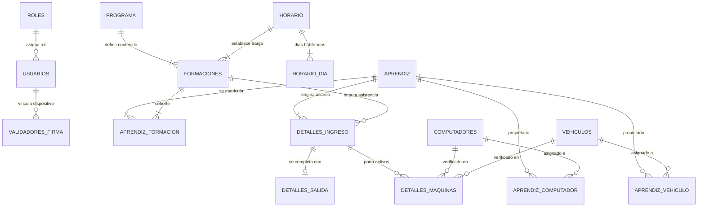

# GEDASC — Diccionario de Datos Oficial de la Base de Datos

> **Gestión de Entradas y Salidas de Aprendices con Autenticación de Equipos y Doble Firma**  
> **Centro de Tecnología de la Amazonía (CTA) — SENA Regional Caquetá**  
> **Referencia Técnica Exhaustiva del Esquema Relacional de Base de Datos**

---

## 1. Introducción

El presente documento constituye el **Diccionario de Datos Oficial** de **GEDASC**. Proporciona la especificación estructural, técnica y funcional detallada de cada una de las tablas, columnas, tipos de datos, restricciones de integridad referencial, índices y reglas de validación implementadas en la base de datos relacional del sistema.

Este catálogo sirve como la **fuente de verdad definitiva de persistencia** para desarrolladores de backend, administradores de bases de datos (DBA), ingenieros de datos y auditores de seguridad.

---

## 2. Motor y Versión de la Base de Datos

- **Motor de Base de Datos**: PostgreSQL.
- **Versión de Compatibilidad Oficial**: PostgreSQL 18.x / PostgreSQL 16.x.
- **Juego de Caracteres (Encoding)**: `UTF-8`.
- **Collation**: `es_CO.UTF-8` / `default`.
- **Manejo de Tiempos y Fechas**: `TIMESTAMP WITHOUT TIME ZONE` y `TIME WITHOUT TIME ZONE` basados en la zona horaria física de la sede (`America/Bogota` / UTC-5).
- **Controlador de Acceso**: `pg` (node-postgres) con Connection Pooling (`pg.Pool`) y consultas SQL parametrizadas.

---

## 3. Modelo Entidad-Relación (ERD)



---

## 4. Modelo Relacional

A continuación se presenta la definición formal del esquema relacional en notación matemática estándar (**PK** = Clave Primaria, **FK** = Clave Foránea, **UK** = Clave Única):

1. **`roles`** ($\underline{\text{id\_rol}}$, nombre$^{\text{UK}}$)
2. **`usuarios`** ($\underline{\text{id\_usuario}}$, nombre, email$^{\text{UK}}$, password, id\_rol$^{\text{FK}}$, activo, creado\_en, ultimo\_login)
3. **`validadores_firma`** ($\underline{\text{id\_validador}}$, device\_id$^{\text{UK}}$, id\_usuario$^{\text{FK}}$, nombre\_dispositivo, activo, fecha\_registro, ultimo\_ping)
4. **`programa`** ($\underline{\text{id\_programa}}$, nombre\_programa$^{\text{UK}}$, version, estado, nivel)
5. **`horario`** ($\underline{\text{id\_horario}}$, hora\_inicio, hora\_fin, jornada)
6. **`horario_dia`** ($\underline{\text{id\_horario}}^{\text{FK}}, \underline{\text{dia\_semana}}$)
7. **`formaciones`** ($\underline{\text{id\_formacion}}$, id\_programa$^{\text{FK}}$, id\_horario$^{\text{FK}}$, fecha\_inicio, fecha\_fin, estado)
8. **`aprendiz`** ($\underline{\text{id\_aprendiz}}$, documento$^{\text{UK}}$, nombre, apellido, fecha\_registro, estado, es\_monitor)
9. **`aprendiz_formacion`** ($\underline{\text{id}}$, id\_aprendiz$^{\text{FK}}$, id\_formacion$^{\text{FK}}$, estado, fecha\_inicio, fecha\_fin) $\rightarrow \text{UK(id\_aprendiz, id\_formacion)}$
10. **`computadores`** ($\underline{\text{id\_computador}}$, serial$^{\text{UK}}$, marca, activo)
11. **`vehiculos`** ($\underline{\text{id\_vehiculo}}$, tipo\_vehiculo, placa, modelo)
12. **`aprendiz_computador`** ($\underline{\text{id}}$, id\_aprendiz$^{\text{FK}}$, id\_computador$^{\text{FK}}$, principal, fecha\_asignacion)
13. **`aprendiz_vehiculo`** ($\underline{\text{id}}$, id\_aprendiz$^{\text{FK}}$, id\_vehiculo$^{\text{FK}}$, principal, fecha\_asignacion)
14. **`detalles_ingreso`** ($\underline{\text{id\_ingreso}}$, id\_aprendiz$^{\text{FK}}$, id\_detallemaquina, hora\_ingreso, tipo\_sesion, motivo\_reingreso, id\_formacion$^{\text{FK}}$, motivo\_visita)
15. **`detalles_maquinas`** ($\underline{\text{id\_detallemaquina}}$, id\_ingreso$^{\text{FK}}$, id\_computador$^{\text{FK}}$, id\_vehiculo$^{\text{FK}}$, firma\_ingreso, firma\_salida, estado\_equipo, hora\_retiro\_equipo)
16. **`detalles_salida`** ($\underline{\text{id\_salida}}$, id\_ingreso$^{\text{FK, UK}}$, hora\_salida, motivo\_salida\_anticipada, cierre\_automatico)

---

## 5. Diccionario de Datos Exhaustivo por Tablas

---

### 5.1 Tabla: `roles`
- **Descripción**: Catálogo de perfiles y niveles de autorización RBAC del sistema.

| Campo | Tipo de Dato | Nulable | Clave | Default | Descripción |
| :--- | :--- | :---: | :---: | :---: | :--- |
| `id_rol` | `INTEGER` | **NO** | **PK** | `nextval(...)` | Identificador autoincremental del rol. |
| `nombre` | `VARCHAR(50)` | **NO** | **UK** | *None* | Nombre único del perfil: `'ADMIN'`, `'CELADOR'`. |

---

### 5.2 Tabla: `usuarios`
- **Descripción**: Cuentas de operadores y directivos autorizados para acceder a la aplicación.

| Campo | Tipo de Dato | Nulable | Clave | Default | Descripción |
| :--- | :--- | :---: | :---: | :---: | :--- |
| `id_usuario` | `INTEGER` | **NO** | **PK** | `nextval(...)` | Identificador autoincremental del usuario. |
| `nombre` | `VARCHAR(100)` | **NO** | - | *None* | Nombre completo del operador. |
| `email` | `VARCHAR(120)` | **NO** | **UK** | *None* | Correo institucional único de acceso (login). |
| `password` | `TEXT` | **NO** | - | *None* | Contraseña encriptada con algoritmo `bcrypt` (10 rounds). |
| `id_rol` | `INTEGER` | **NO** | **FK** | *None* | Referencia al rol asignado (`roles.id_rol`). |
| `activo` | `BOOLEAN` | SÍ | - | `TRUE` | Estado de habilitación de la cuenta en el sistema. |
| `creado_en` | `TIMESTAMP` | SÍ | - | `now()` | Fecha y hora exacta de creación del registro. |
| `ultimo_login` | `TIMESTAMP` | SÍ | - | `NULL` | Fecha y hora del último inicio de sesión exitoso. |

---

### 5.3 Tabla: `validadores_firma`
- **Descripción**: Registro y control de dispositivos móviles vinculados por WebSocket para escaneo y firmas.

| Campo | Tipo de Dato | Nulable | Clave | Default | Descripción |
| :--- | :--- | :---: | :---: | :---: | :--- |
| `id_validador` | `INTEGER` | **NO** | **PK** | `nextval(...)` | Identificador autoincremental de la vinculación. |
| `device_id` | `VARCHAR(255)` | **NO** | **UK** | *None* | Identificador unívoco del dispositivo móvil (UUID/Token). |
| `id_usuario` | `INTEGER` | SÍ | **FK** | `NULL` | Operador que vinculó el dispositivo (`usuarios.id_usuario`). |
| `nombre_dispositivo`| `VARCHAR(255)` | SÍ | - | `NULL` | Nombre o alias del teléfono/tablet (ej. *Samsung A54 Portería*). |
| `activo` | `BOOLEAN` | SÍ | - | `TRUE` | Estado de conexión operativa de la terminal. |
| `fecha_registro`| `TIMESTAMP` | SÍ | - | `CURRENT_TIMESTAMP`| Momento del emparejamiento con el puesto de control. |
| `ultimo_ping` | `TIMESTAMP` | SÍ | - | `CURRENT_TIMESTAMP`| Marca temporal del último latido/actividad por socket. |

---

### 5.4 Tabla: `programa`
- **Descripción**: Catálogo de diseños curriculares institucionales del SENA.

| Campo | Tipo de Dato | Nulable | Clave | Default | Descripción |
| :--- | :--- | :---: | :---: | :---: | :--- |
| `id_programa` | `INTEGER` | **NO** | **PK** | `nextval(...)` | Identificador único del programa de formación. |
| `nombre_programa` | `VARCHAR(255)` | **NO** | **UK** | *None* | Denominación curricular (ej. *ADSO*). |
| `version` | `VARCHAR(50)` | **NO** | - | *None* | Versión del diseño curricular (ej. *V1*, *V2*). |
| `estado` | `VARCHAR(20)` | SÍ | - | `'activo'` | Estado: `'activo'`, `'inactivo'`. |
| `nivel` | `VARCHAR(50)` | **NO** | - | *None* | Nivel académico: *Técnico*, *Tecnólogo*, *Especialización*. |

---

### 5.5 Tabla: `horario`
- **Descripción**: Franjas horarias maestras asignadas a las formaciones académicas.

| Campo | Tipo de Dato | Nulable | Clave | Default | Descripción |
| :--- | :--- | :---: | :---: | :---: | :--- |
| `id_horario` | `INTEGER` | **NO** | **PK** | `nextval(...)` | Identificador autoincremental de la franja horaria. |
| `hora_inicio` | `TIME` | **NO** | - | *None* | Hora de inicio de la formación (ej. `07:00:00`). |
| `hora_fin` | `TIME` | **NO** | - | *None* | Hora de finalización de la formación (ej. `13:00:00`). |
| `jornada` | `VARCHAR(20)` | SÍ | - | *None* | Inferencia de jornada: `'Mañana'`, `'Tarde'`, `'Noche'`. |

---

### 5.6 Tabla: `horario_dia`
- **Descripción**: Días de la semana habilitados para cada franja horaria.

| Campo | Tipo de Dato | Nulable | Clave | Default | Descripción |
| :--- | :--- | :---: | :---: | :---: | :--- |
| `id_horario` | `INTEGER` | **NO** | **PK, FK** | *None* | Referencia al horario (`horario.id_horario`) con `ON DELETE CASCADE`. |
| `dia_semana` | `VARCHAR(20)` | **NO** | **PK** | *None* | Día lectivo: *Lunes*, *Martes*, *Miércoles*, *Jueves*, *Viernes*, *Sábado*, *Domingo*. |

---

### 5.7 Tabla: `formaciones`
- **Descripción**: Fichas de formación académica (cohortes) activas e históricas del CTA.

| Campo | Tipo de Dato | Nulable | Clave | Default | Descripción |
| :--- | :--- | :---: | :---: | :---: | :--- |
| `id_formacion` | `INTEGER` | **NO** | **PK** | *None* | Número oficial de ficha SENA de 6-7 dígitos (ej. `2823456`). |
| `id_programa` | `INTEGER` | **NO** | **FK** | *None* | Programa curricular asociado (`programa.id_programa`). |
| `id_horario` | `INTEGER` | **NO** | **FK** | *None* | Franja horaria asignada (`horario.id_horario`). |
| `fecha_inicio` | `DATE` | SÍ | - | `CURRENT_DATE` | Fecha de inicio oficial de la ficha. |
| `fecha_fin` | `DATE` | SÍ | - | `CURRENT_DATE + '2 years'` | Fecha estimada de finalización de la cohorte. |
| `estado` | `VARCHAR(20)` | SÍ | - | `'activa'` | Estado de la ficha: `'activa'`, `'finalizada'`. |

---

### 5.8 Tabla: `aprendiz`
- **Descripción**: Directorio maestro de aprendices registrados para control de acceso.

| Campo | Tipo de Dato | Nulable | Clave | Default | Descripción |
| :--- | :--- | :---: | :---: | :---: | :--- |
| `id_aprendiz` | `INTEGER` | **NO** | **PK** | `nextval(...)` | Identificador autoincremental interno del aprendiz. |
| `documento` | `VARCHAR(20)` | **NO** | **UK** | *None* | Cédula, TI, PEP o documento de identidad unívoco. |
| `nombre` | `VARCHAR(100)` | **NO** | - | *None* | Nombres del aprendiz. |
| `apellido` | `VARCHAR(100)` | **NO** | - | *None* | Apellidos del aprendiz. |
| `fecha_registro`| `TIMESTAMP` | SÍ | - | `now()` | Fecha de alta en el sistema. |
| `estado` | `BOOLEAN` | SÍ | - | `TRUE` | Estado activo / baja lógica (`FALSE` preserva historial). |
| `es_monitor` | `BOOLEAN` | SÍ | - | `FALSE` | Bandera que designa si el aprendiz ejerce como monitor. |

---

### 5.9 Tabla: `aprendiz_formacion`
- **Descripción**: Tabla relacional que asocia los aprendices a sus respectivas fichas formativas.

| Campo | Tipo de Dato | Nulable | Clave | Default | Descripción |
| :--- | :--- | :---: | :---: | :---: | :--- |
| `id` | `INTEGER` | **NO** | **PK** | `nextval(...)` | Identificador autoincremental de la matrícula. |
| `id_aprendiz` | `INTEGER` | **NO** | **FK** | *None* | Referencia al aprendiz (`aprendiz.id_aprendiz`). |
| `id_formacion`| `INTEGER` | **NO** | **FK** | *None* | Referencia a la ficha (`formaciones.id_formacion`). |
| `estado` | `VARCHAR(20)` | SÍ | - | `'activo'` | Estado de matrícula: `'activo'`, `'inactivo'`, `'finalizado'`. |
| `fecha_inicio`| `TIMESTAMP` | SÍ | - | `now()` | Fecha de vinculación a la ficha. |
| `fecha_fin` | `TIMESTAMP` | SÍ | - | `NULL` | Fecha de retiro o graduación de la cohorte. |

---

### 5.10 Tabla: `computadores`
- **Descripción**: Catálogo de computadores portátiles registrados por los aprendices.

| Campo | Tipo de Dato | Nulable | Clave | Default | Descripción |
| :--- | :--- | :---: | :---: | :---: | :--- |
| `id_computador`| `INTEGER` | **NO** | **PK** | `nextval(...)` | Identificador interno del equipo. |
| `serial` | `VARCHAR(50)` | **NO** | **UK** | *None* | Serial alfanumérico único del portátil. |
| `marca` | `VARCHAR(50)` | **NO** | - | *None* | Marca del equipo (ej. *Lenovo*, *HP*, *Dell*, *Asus*). |
| `activo` | `BOOLEAN` | SÍ | - | `TRUE` | Habilitación del equipo en el sistema. |

---

### 5.11 Tabla: `vehiculos`
- **Descripción**: Catálogo de vehículos y medios de transporte de aprendices.

| Campo | Tipo de Dato | Nulable | Clave | Default | Descripción |
| :--- | :--- | :---: | :---: | :---: | :--- |
| `id_vehiculo` | `INTEGER` | **NO** | **PK** | `nextval(...)` | Identificador interno del vehículo. |
| `tipo_vehiculo`| `VARCHAR(255)`| SÍ | - | *None* | Tipo: `'CARRO'`, `'MOTO'`, `'BICICLETA'`, `'PATINETA'`. |
| `placa` | `VARCHAR(10)` | **NO** | - | *None* | Placa o serial identificador del vehículo. |
| `modelo` | `VARCHAR(50)` | **NO** | - | *None* | Marca / Modelo / Color descriptivo del vehículo. |

---

### 5.12 Tabla: `aprendiz_computador`
- **Descripción**: Registro de titularidad y asignación de máquina principal para computadores.

| Campo | Tipo de Dato | Nulable | Clave | Default | Descripción |
| :--- | :--- | :---: | :---: | :---: | :--- |
| `id` | `INTEGER` | **NO** | **PK** | `nextval(...)` | Identificador autoincremental de la asignación. |
| `id_aprendiz` | `INTEGER` | SÍ | **FK** | `NULL` | Aprendiz titular propietario (`aprendiz.id_aprendiz`). |
| `id_computador`| `INTEGER` | SÍ | **FK** | `NULL` | Computador asignado (`computadores.id_computador`). |
| `principal` | `BOOLEAN` | SÍ | - | `FALSE` | `TRUE` si es el equipo primario habitual del aprendiz. |
| `fecha_asignacion`|`TIMESTAMP` | SÍ | - | `CURRENT_TIMESTAMP`| Fecha de registro de propiedad. |

---

### 5.13 Tabla: `aprendiz_vehiculo`
- **Descripción**: Registro de titularidad y asignación de vehículo principal.

| Campo | Tipo de Dato | Nulable | Clave | Default | Descripción |
| :--- | :--- | :---: | :---: | :---: | :--- |
| `id` | `INTEGER` | **NO** | **PK** | `nextval(...)` | Identificador autoincremental de la asignación. |
| `id_aprendiz` | `INTEGER` | SÍ | **FK** | `NULL` | Aprendiz titular propietario (`aprendiz.id_aprendiz`). |
| `id_vehiculo` | `INTEGER` | SÍ | **FK** | `NULL` | Vehículo asignado (`vehiculos.id_vehiculo`). |
| `principal` | `BOOLEAN` | SÍ | - | `FALSE` | `TRUE` si es el medio de transporte principal. |
| `fecha_asignacion`|`TIMESTAMP` | SÍ | - | `CURRENT_TIMESTAMP`| Fecha de registro de propiedad. |

---

### 5.14 Tabla: `detalles_ingreso`
- **Descripción**: Registro atómico de las sesiones de acceso peatonal en portería.

| Campo | Tipo de Dato | Nulable | Clave | Default | Descripción |
| :--- | :--- | :---: | :---: | :---: | :--- |
| `id_ingreso` | `INTEGER` | **NO** | **PK** | `nextval(...)` | Identificador único de la sesión de ingreso. |
| `id_aprendiz` | `INTEGER` | **NO** | **FK** | *None* | Aprendiz que realiza el acceso (`aprendiz.id_aprendiz`). |
| `id_detallemaquina`|`INTEGER` | SÍ | **FK** | `NULL` | Vínculo histórico legacy a detalles de máquinas. |
| `hora_ingreso` | `TIMESTAMP` | SÍ | - | `CURRENT_TIMESTAMP`| Fecha y hora exacta de registro del ingreso. |
| `tipo_sesion` | `VARCHAR(20)` | SÍ | - | `'formacion'` | Clasificación: `'formacion'`, `'monitoria'`. |
| `motivo_reingreso`| `TEXT` | SÍ | - | `NULL` | Justificación cuando el aprendiz reingresa (`total_hoy > 0`). |
| `id_formacion` | `INTEGER` | SÍ | **FK** | `NULL` | Ficha a la que asiste (`formaciones.id_formacion`). |
| `motivo_visita`| `VARCHAR(255)`| SÍ | - | `NULL` | Justificación ante acceso fuera de horario lectivo. |

---

### 5.15 Tabla: `detalles_maquinas`
- **Descripción**: Control de custodia y doble firma digital manuscrita para activos portados.

| Campo | Tipo de Dato | Nulable | Clave | Default | Descripción |
| :--- | :--- | :---: | :---: | :---: | :--- |
| `id_detallemaquina`|`INTEGER` | **NO** | **PK** | `nextval(...)` | Identificador único del movimiento del activo. |
| `id_ingreso` | `INTEGER` | SÍ | **FK** | `NULL` | Sesión de acceso asociada (`detalles_ingreso.id_ingreso`). |
| `id_computador`| `INTEGER` | SÍ | **FK** | `NULL` | Computador verificado (`computadores.id_computador`). |
| `id_vehiculo` | `INTEGER` | SÍ | **FK** | `NULL` | Vehículo verificado (`vehiculos.id_vehiculo`). |
| `firma_ingreso`| `TEXT` | **NO** | - | *None* | Firma manuscrita de entrada en Base64 (`image/png`). |
| `firma_salida` | `TEXT` | SÍ | - | `NULL` | Firma manuscrita de retiro en Base64 (`image/png`). |
| `estado_equipo`| `VARCHAR(20)` | SÍ | - | `'dentro'` | Estado de custodia: `'dentro'`, `'retirado'`. |
| `hora_retiro_equipo`|`TIMESTAMP`| SÍ | - | `NULL` | Momento exacto en que se firma y retira el activo. |

---

### 5.16 Tabla: `detalles_salida`
- **Descripción**: Cierre formal de la sesión de permanencia del aprendiz.

| Campo | Tipo de Dato | Nulable | Clave | Default | Descripción |
| :--- | :--- | :---: | :---: | :---: | :--- |
| `id_salida` | `INTEGER` | **NO** | **PK** | `nextval(...)` | Identificador único del egreso. |
| `id_ingreso` | `INTEGER` | **NO** | **FK, UK** | *None* | Sesión de ingreso correspondiente (relación $1:1$). |
| `hora_salida` | `TIMESTAMP` | SÍ | - | `CURRENT_TIMESTAMP`| Fecha y hora oficial del egreso de la sede. |
| `motivo_salida_anticipada`|`VARCHAR(255)`| SÍ | - | `NULL` | Justificación si egresa antes del fin de su clase. |
| `cierre_automatico`| `BOOLEAN` | SÍ | - | `FALSE` | `TRUE` si fue cerrada automáticamente por el sistema. |

---

## 6. Relaciones entre Tablas (Cardinalidad)

| Entidad Origen | Cardinalidad | Entidad Destino | Clave Foránea | Política ON UPDATE / ON DELETE |
| :--- | :---: | :--- | :--- | :--- |
| `roles` | $1 \rightarrow N$ | `usuarios` | `usuarios.id_rol` | `NO ACTION` (Restrict por defecto) |
| `usuarios` | $1 \rightarrow N$ | `validadores_firma` | `validadores_firma.id_usuario` | `NO ACTION` |
| `programa` | $1 \rightarrow N$ | `formaciones` | `formaciones.id_programa` | `NO ACTION` |
| `horario` | $1 \rightarrow N$ | `horario_dia` | `horario_dia.id_horario` | `ON DELETE CASCADE` |
| `horario` | $1 \rightarrow N$ | `formaciones` | `formaciones.id_horario` | `NO ACTION` |
| `aprendiz` | $1 \rightarrow N$ | `aprendiz_formacion` | `aprendiz_formacion.id_aprendiz`| `ON DELETE CASCADE` |
| `formaciones` | $1 \rightarrow N$ | `aprendiz_formacion` | `aprendiz_formacion.id_formacion`| `ON UPDATE CASCADE ON DELETE CASCADE` |
| `aprendiz` | $1 \rightarrow N$ | `aprendiz_computador` | `aprendiz_computador.id_aprendiz`| `NO ACTION` |
| `computadores` | $1 \rightarrow N$ | `aprendiz_computador` | `aprendiz_computador.id_computador`| `NO ACTION` |
| `aprendiz` | $1 \rightarrow N$ | `aprendiz_vehiculo` | `aprendiz_vehiculo.id_aprendiz`| `NO ACTION` |
| `vehiculos` | $1 \rightarrow N$ | `aprendiz_vehiculo` | `aprendiz_vehiculo.id_vehiculo`| `NO ACTION` |
| `aprendiz` | $1 \rightarrow N$ | `detalles_ingreso` | `detalles_ingreso.id_aprendiz` | `NO ACTION` |
| `formaciones` | $1 \rightarrow N$ | `detalles_ingreso` | `detalles_ingreso.id_formacion`| `ON UPDATE CASCADE ON DELETE SET NULL` |
| `detalles_ingreso`| $1 \rightarrow N$ | `detalles_maquinas` | `detalles_maquinas.id_ingreso` | `ON DELETE CASCADE` |
| `computadores` | $1 \rightarrow N$ | `detalles_maquinas` | `detalles_maquinas.id_computador`| `NO ACTION` |
| `vehiculos` | $1 \rightarrow N$ | `detalles_maquinas` | `detalles_maquinas.id_vehiculo` | `NO ACTION` |
| `detalles_ingreso`| $1 \rightarrow 1$ | `detalles_salida` | `detalles_salida.id_ingreso` | `ON DELETE CASCADE` |

---

## 7. Claves Primarias y Foráneas

### Claves Primarias (PK)
- `roles_pkey`: `PRIMARY KEY (id_rol)`
- `usuarios_pkey`: `PRIMARY KEY (id_usuario)`
- `validadores_firma_pkey`: `PRIMARY KEY (id_validador)`
- `programa_pkey`: `PRIMARY KEY (id_programa)`
- `horario_pkey`: `PRIMARY KEY (id_horario)`
- `horario_dia_pkey`: `PRIMARY KEY (id_horario, dia_semana)`
- `formaciones_pkey`: `PRIMARY KEY (id_formacion)`
- `aprendiz_pkey`: `PRIMARY KEY (id_aprendiz)`
- `aprendiz_formacion_pkey`: `PRIMARY KEY (id)`
- `computadores_pkey`: `PRIMARY KEY (id_computador)`
- `vehiculos_pkey`: `PRIMARY KEY (id_vehiculo)`
- `aprendiz_computador_pkey`: `PRIMARY KEY (id)`
- `aprendiz_vehiculo_pkey`: `PRIMARY KEY (id)`
- `detalles_ingreso_pkey`: `PRIMARY KEY (id_ingreso)`
- `detalles_maquinas_pkey`: `PRIMARY KEY (id_detallemaquina)`
- `detalles_salida_pkey`: `PRIMARY KEY (id_salida)`

---

## 8. Restricciones de Unicidad (UNIQUE) y Reglas de Integridad

- `roles_nombre_key`: `UNIQUE (nombre)` $\rightarrow$ Evita duplicar nombres de roles.
- `usuarios_email_key`: `UNIQUE (email)` $\rightarrow$ Garantiza correo único para login.
- `validadores_firma_device_id_key`: `UNIQUE (device_id)` $\rightarrow$ Terminal validadora única.
- `programa_nombre_programa_key`: `UNIQUE (nombre_programa)` $\rightarrow$ Nombres de programa irrepetibles.
- `aprendiz_documento_key`: `UNIQUE (documento)` $\rightarrow$ Unicidad del documento de identidad del aprendiz.
- `unique_id_aprendiz_id_formacion`: `UNIQUE (id_aprendiz, id_formacion)` $\rightarrow$ Impide doble matrícula del mismo aprendiz en la misma ficha.
- `computadores_serial_key`: `UNIQUE (serial)` $\rightarrow$ Serial único de portátil en el centro.
- `detalles_salida_id_ingreso_key`: `UNIQUE (id_ingreso)` $\rightarrow$ Garantiza relación 1 a 1 estricta entre entrada y salida.

---

## 9. Índices de Base de Datos (Optimización B-Tree)

| Nombre del Índice | Tabla | Columnas Indexadas | Tipo / Condición | Propósito |
| :--- | :--- | :--- | :---: | :--- |
| `idx_aprendiz_formacion_activo` | `aprendiz_formacion` | `(id_aprendiz, estado)` | B-Tree / `WHERE estado = 'activo'` | Optimiza la validación en tiempo real de aprendices matriculados activos. |
| `idx_aprendiz_formacion_aprendiz`| `aprendiz_formacion` | `(id_aprendiz)` | B-Tree | Acelera búsquedas de fichas por aprendiz. |
| `idx_aprendiz_formacion_formacion`| `aprendiz_formacion`| `(id_formacion)` | B-Tree | Acelera listados y desvinculaciones masivas de fichas. |
| `idx_detalles_ingreso_aprendiz_hora`| `detalles_ingreso` | `(id_aprendiz, hora_ingreso)` | B-Tree | Optimiza el conteo de ingresos diarios (`total_hoy`) y verificación de sesiones. |
| `idx_detalles_ingreso_formacion`| `detalles_ingreso` | `(id_formacion)` | B-Tree | Optimiza reportes de asistencia imputados por ficha. |
| `idx_detalles_salida_hora` | `detalles_salida` | `(hora_salida)` | B-Tree | Acelera filtros por rango de fechas en reportes históricos. |
| `idx_detalles_salida_id_ingreso`| `detalles_salida` | `(id_ingreso)` | B-Tree | Optimiza el `LEFT JOIN` para detectar sesiones abiertas (`hora_salida IS NULL`). |
| `idx_formaciones_horario` | `formaciones` | `(id_horario)` | B-Tree | Optimiza cruce entre fichas y horarios de clase. |
| `idx_formaciones_programa` | `formaciones` | `(id_programa)` | B-Tree | Acelera consultas de fichas por programa curricular. |
| `idx_horario_dia_busqueda` | `horario_dia` | `(id_horario, dia_semana)` | B-Tree | Permite comprobar en milisegundos si un horario aplica para el día de la semana actual. |

---

## 10. Triggers, Funciones y Procedimientos de Inicialización

### Procedimiento `initDbSchema()` (`DataBase/src/config/dbInit.ts`)
Procedimiento JavaScript/TypeScript ejecutado automáticamente al iniciar el servidor Express:
1. **Migración Estructural**: Verifica y añade la columna `id_ingreso` en `detalles_maquinas` con `REFERENCES detalles_ingreso(id_ingreso) ON DELETE CASCADE`.
2. **Normalización de Activos Combinados**: Separa registros históricos que contenían PC y vehículo en una sola tupla, dividiéndolos en filas independientes.
3. **Aprovisionamiento de Validadores**: Crea la tabla `validadores_firma` si no existe.
4. **Columnas de Salida**: Agrega `motivo_salida_anticipada` y `cierre_automatico` a `detalles_salida`.
5. **Ampliación de Longitud de Documento**: Modifica `aprendiz.documento` a `VARCHAR(20)` para soportar documentos extranjeros y PPT.

---

## 11. Enumeraciones y Valores Permitidos (CHECK Constraints)

```sql
-- 1. Estados válidos para Matrícula de Aprendiz
CONSTRAINT aprendiz_formacion_estado_check 
CHECK (estado IN ('activo', 'inactivo', 'finalizado'))

-- 2. Tipo de Sesión de Ingreso
CONSTRAINT detalles_ingreso_tipo_sesion_check 
CHECK (tipo_sesion IN ('formacion', 'monitoria'))

-- 3. Estado de Custodia de Activo
CONSTRAINT detalles_maquinas_estado_equipo_check 
CHECK (estado_equipo IN ('dentro', 'retirado'))

-- 4. Estados de Ficha Formativa
CONSTRAINT formaciones_estado_check 
CHECK (estado IN ('activa', 'finalizada'))

-- 5. Jornadas Oficiales de Horario
CONSTRAINT horario_jornada_check 
CHECK (jornada IN ('Mañana', 'Tarde', 'Noche'))

-- 6. Días de la Semana Habilitados
CONSTRAINT horario_dia_dia_semana_check 
CHECK (dia_semana IN ('Lunes', 'Martes', 'Miércoles', 'Jueves', 'Viernes', 'Sábado', 'Domingo'))

-- 7. Estado de Programa Curricular
CONSTRAINT programa_estado_check 
CHECK (estado IN ('activo', 'inactivo'))
```

---

## 12. Reglas de Negocio Implementadas en la Base de Datos

1. **Invariante de Custodia de Activos (`RN-ACT-005`)**: `detalles_maquinas.firma_ingreso` está definida como `NOT NULL`, obligando a que ningún portátil o vehículo pueda persistirse sin su respectiva firma digital de entrada.
2. **No Coexistencia de Sesiones de Salida (`RN-ING-004`)**: `detalles_salida.id_ingreso` es `UNIQUE`, impidiendo que un ingreso pueda cerrarse más de una vez.
3. **Preservación Histórica de Formación en Ingreso (`RN-HIST-002`)**: La clave foránea `fk_detalles_ingreso_id_formacion` aplica `ON DELETE SET NULL`, garantizando que si una ficha académica es eliminada, los registros históricos de acceso de los aprendices no se pierdan.
4. **Desvinculación Atómica de Cohortes (`RN-ACAD-007`)**: La clave foránea `fk_aprendiz_formacion_id_formacion` aplica `ON DELETE CASCADE`, permitiendo limpiar las matrículas de una cohorte sin borrar a los aprendices de la tabla maestra.
5. **Cascade Limpio en Horarios (`RN-ACAD-005`)**: `horario_dia.id_horario` aplica `ON DELETE CASCADE`, garantizando que al eliminar o recrear un horario no queden días huérfanos en la base de datos.
