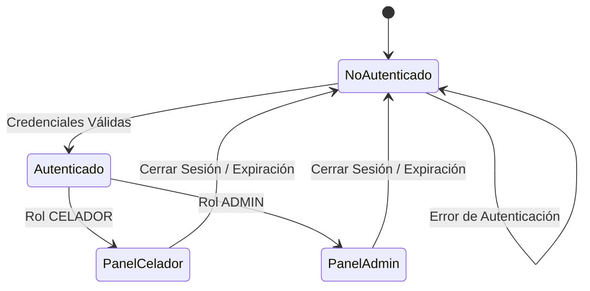
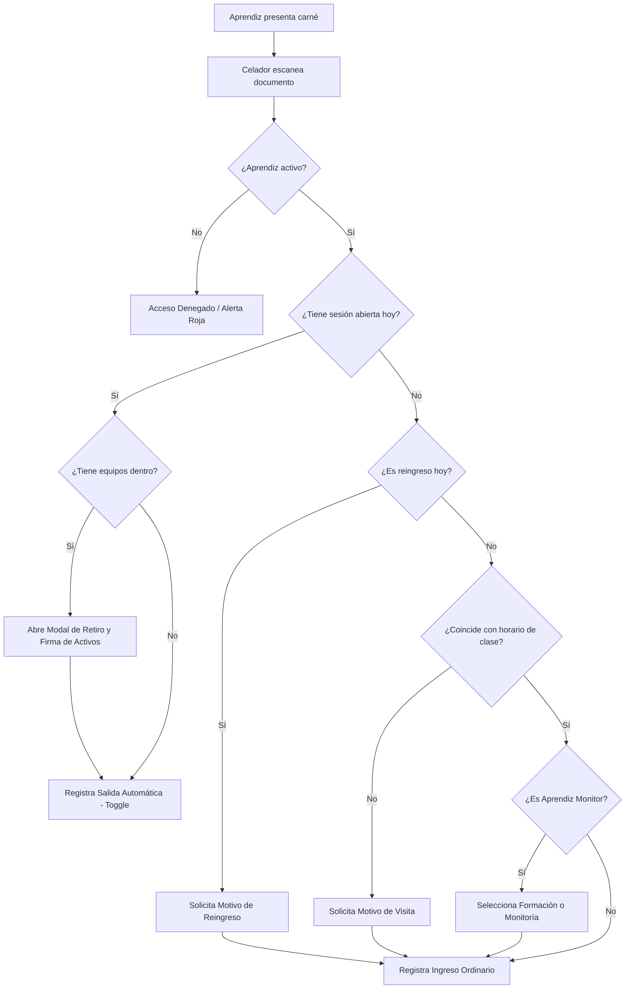
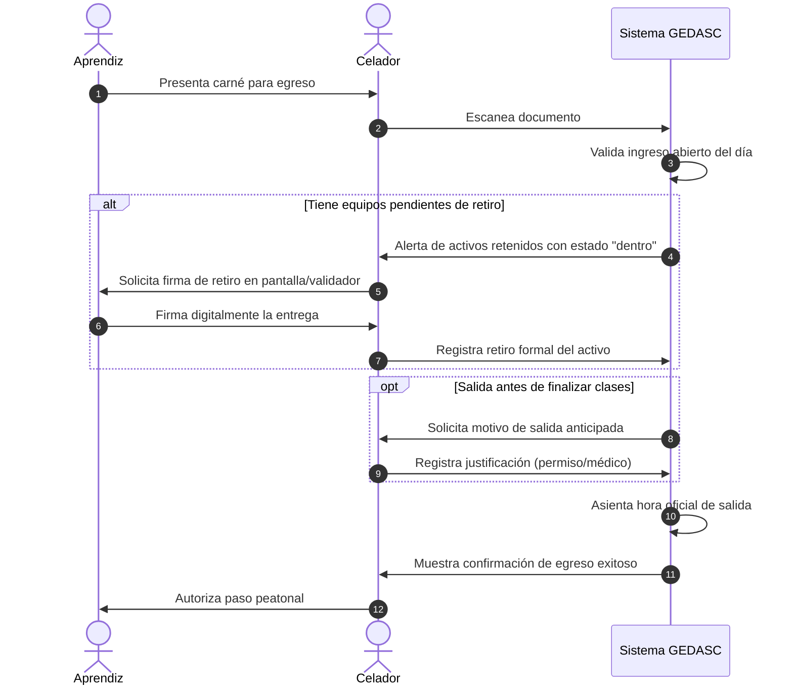
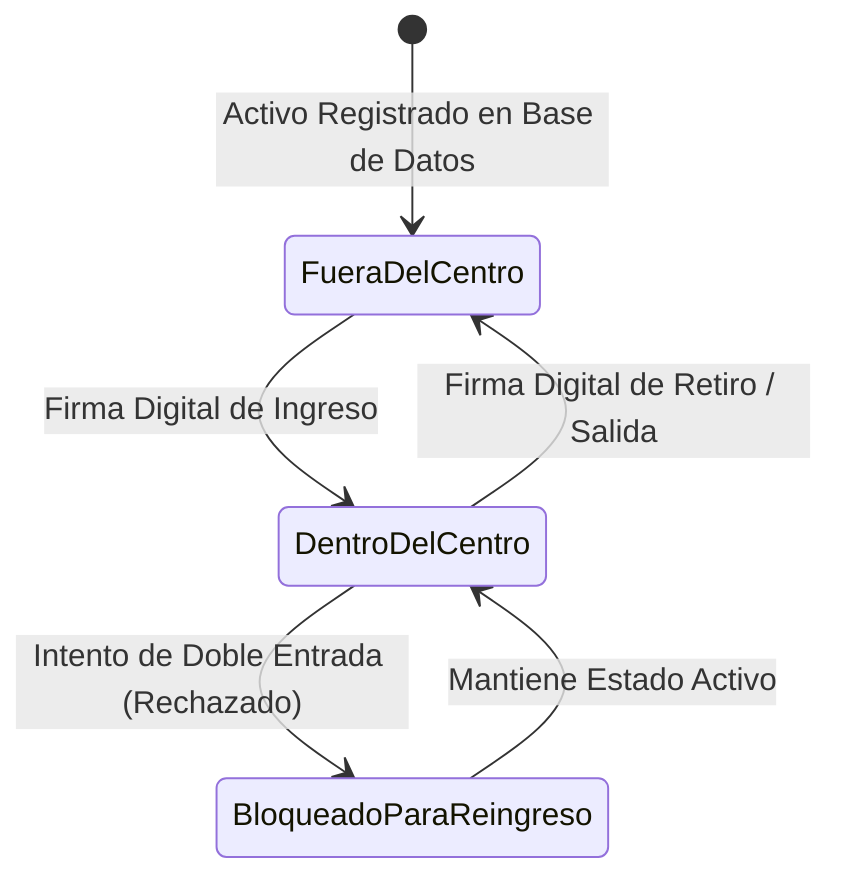

# GEDASC — Documento Funcional Maestro Modular

> **Gestión de Entradas y Salidas de Aprendices con Autenticación de Equipos y Doble Firma**  
> **Centro de Tecnología de la Amazonía (CTA) — SENA**  
> **Especificación Funcional, Procesos de Negocio y Casos de Uso de los 7 Módulos del Sistema**

---

## 1. Información General del Documento

### 1.1 Sistema
**GEDASC** — *Gestión de Entradas y Salidas de Aprendices con Autenticación de Equipos y Doble Firma*.

### 1.2 Versión
**Versión 2.8** (Modular y Transversal).

### 1.3 Estado
**Aprobado / Línea Base Oficial**.

### 1.4 Autor
Equipo de Análisis Funcional, Business Analyst y Technical Writer — CTA SENA.

### 1.5 Fecha
18 de agosto de 2026.

---

# Módulo 01: Autenticación, Sesión y Control de Acceso

---

## 1. Información del Documento
- **Módulo**: `01_autenticacion_acceso`.
- **Versión**: 2.8.
- **Estado**: Aprobado.

## 2. Descripción Funcional

### 2.1 Propósito
Garantizar que únicamente los usuarios autorizados (personal de vigilancia y coordinación) puedan ingresar y operar el sistema, asegurando la separación estricta de funciones entre la portería física y la administración académica.

### 2.2 Objetivo
Proveer un mecanismo ágil y seguro de inicio de sesión, control de privilegios operativos y vinculación de terminales móviles para labores de apoyo en portería.

### 2.3 Alcance
Comprende el inicio de sesión, cierre de sesión, navegación protegida por roles y enlace de dispositivos validadores inalámbricos.

### 2.4 Actores

| Actor | Descripción |
| :--- | :--- |
| **CELADOR** | Personal de seguridad de turno encargado del control de acceso diario en portería. |
| **ADMIN** | Coordinador o administrador del centro con atribuciones globales de gestión y auditoría. |

## 3. Funcionalidades Principales

### 3.1 Inicio de Sesión Seguro
- **Descripción**: Permite a los usuarios acceder al sistema ingresando sus credenciales oficiales.
- **Actor principal**: `CELADOR`, `ADMIN`.
- **Precondiciones**: El usuario debe estar previamente registrado y activo en el sistema.
- **Resultado esperado**: Acceso al panel correspondiente según el rol asignado.

### 3.2 Vinculación de Terminal Validadora Móvil
- **Descripción**: Permite emparejar un dispositivo móvil para realizar escaneo óptico y captura de firmas en apoyo al puesto principal de portería.
- **Actor principal**: `CELADOR`, `ADMIN`.
- **Precondiciones**: Dispositivo móvil conectado a la red local del CTA.
- **Resultado esperado**: Sincronización en tiempo real de datos escaneados y firmas en la terminal principal.

## 4. Historias de Usuario

### HU-AUTH-001 — Inicio de Sesión de Usuarios
- **Como:** Celador o Administrador del CTA.
- **Quiero:** Iniciar sesión con mi correo institucional y contraseña.
- **Para:** Acceder a las funciones autorizadas según mi rol operativo.
- **Criterios de Aceptación:**
  - [x] Si las credenciales son correctas, redirige al panel principal.
  - [x] Si las credenciales son incorrectas, muestra mensaje de error claro sin revelar si falló el correo o la contraseña.
  - [x] La sesión se mantiene activa durante el turno operativo (24 horas).

### HU-AUTH-002 — Cierre de Sesión Seguro
- **Como:** Usuario autenticado.
- **Quiero:** Cerrar mi sesión desde la barra superior.
- **Para:** Proteger el acceso al sistema al entregar el turno de portería.
- **Criterios de Aceptación:**
  - [x] Elimina todos los datos de sesión almacenados en el navegador.
  - [x] Redirige automáticamente a la pantalla de inicio de sesión.

## 5. Casos de Uso

### CU-AUTH-01 — Iniciar Sesión en el Sistema
- **Actor:** `CELADOR`, `ADMIN`.
- **Precondiciones:** Disponer de cuenta activa.
- **Flujo Principal:**
  1. El usuario abre la aplicación y visualiza el formulario de inicio de sesión.
  2. Ingresa correo electrónico y contraseña.
  3. Presiona el botón *"Iniciar Sesión"*.
  4. El sistema valida las credenciales y el estado activo del usuario.
  5. El sistema redirige al usuario al panel de inicio según su perfil.
- **Flujos Alternativos:**
  - *FA-01: Usuario con sesión previa activa*: El sistema detecta la sesión y redirige automáticamente al panel principal sin solicitar credenciales.
- **Flujos de Excepción:**
  - *FE-01: Credenciales inválidas*: El sistema muestra *"Correo o contraseña incorrectos"*, manteniendo limpios los campos de contraseña.
- **Postcondiciones:** Usuario autenticado con rol y permisos establecidos.

## 6. Reglas de Negocio Clave
- **RN-AUTH-001**: El acceso está restringido exclusivamente a los roles `CELADOR` y `ADMIN`.
- **RN-AUTH-002**: Las opciones de administración están estrictamente reservadas para el rol `ADMIN`.
- **RN-AUTH-007**: Solo puede existir una terminal validadora móvil activa por puesto de control.

## 7. Estados y Diagramas Funcionales

---

# Módulo 02: Control Operativo de Ingreso y Reingreso

---

## 1. Información del Documento
- **Módulo**: `02_control_ingreso`.
- **Versión**: 2.8.
- **Estado**: Aprobado.

## 2. Descripción Funcional

### 2.1 Propósito
Controlar y registrar el acceso peatonal de los aprendices al Centro de Tecnología de la Amazonía en tiempo real, garantizando la validación curricular, la gestión de reingresos y la captura de justificaciones obligatorias.

### 2.2 Objetivo
Minimizar tiempos de espera en portería, impedir el paso a personal no autorizado y asegurar que cada ingreso quede vinculado a su formación o justificado formalmente.

### 2.3 Alcance
Abarca el escaneo de carnés, ingreso manual, toggle automático de salida, verificación de horarios ($\pm 30\text{ min}$), captura de motivos de reingreso/visita y clasificación de monitores.

### 2.4 Actores
- **CELADOR**: Operador responsable de la lectura de carnés y confirmación de accesos.
- **APRENDIZ**: Estudiante que presenta su carné e ingresa a las instalaciones.

## 3. Funcionalidades Principales

### 3.1 Escaneo y Verificación de Carné
- **Descripción**: Permite leer el código de barras del carné institucional y verificar la situación académica del aprendiz.
- **Precondiciones**: Aprendiz previamente registrado y activo en el sistema.
- **Resultado esperado**: Identificación inmediata y validación de horario de clase.

### 3.2 Cierre Automático de Sesión (Toggle de Salida)
- **Descripción**: Si el aprendiz ya cuenta con un ingreso activo en el día, el escaneo procesa automáticamente el registro de su salida sin requerir cambio manual de pantalla.
- **Resultado esperado**: Sesión cerrada y liberación de permanencia en el centro.

### 3.3 Captura de Justificaciones Operativas
- **Descripción**: Si el aprendiz reingresa en el día (`total_hoy > 0`) o asiste fuera del horario curricular, el sistema exige capturar el motivo correspondiente antes de autorizar el paso.
- **Resultado esperado**: Justificación almacenada para trazabilidad y auditoría.

## 4. Historias de Usuario

### HU-ING-001 — Verificación y Registro de Ingreso
- **Como:** Celador de portería.
- **Quiero:** Escanear el carné del aprendiz.
- **Para:** Registrar su entrada de forma instantánea verificando su estado y horario.
- **Criterios de Aceptación:**
  - [x] Verifica si el aprendiz está activo y matriculado.
  - [x] Si no tiene clases en el horario actual, solicita el motivo de visita.
  - [x] Si es un reingreso en la misma fecha, solicita el motivo de reingreso.

### HU-ING-006 — Clasificación de Sesión para Monitores
- **Como:** Celador de portería.
- **Quiero:** Indicar si un aprendiz monitor ingresa a formación lectiva o a labores de monitoría.
- **Para:** Diferenciar sus horas de clase de sus horas de servicio institucional.
- **Criterios de Aceptación:**
  - [x] Muestra selector interactivo *"Formación"* / *"Monitoría"* solo si el aprendiz es monitor.

## 5. Casos de Uso

### CU-ING-01 — Registro Ordinario de Entrada
- **Actor:** `CELADOR`.
- **Flujo Principal:**
  1. El celador escanea el código de barras del carné del aprendiz.
  2. El sistema identifica al aprendiz y constata que no tiene sesión abierta.
  3. El sistema valida que la hora actual coincide con una formación activa dentro del margen de tolerancia ($\pm 30\text{ min}$).
  4. El sistema registra el ingreso asociándolo a la ficha correspondiente.
  5. Muestra confirmación visual en pantalla con foto/nombre del aprendiz y ficha.
- **Flujos Alternativos:**
  - *FA-01: Aprendiz fuera de horario curricular*: El sistema abre modal solicitando motivo de visita. El celador ingresa la justificación y confirma el acceso.
  - *FA-02: Aprendiz con reingreso en el día*: El sistema solicita el motivo de reingreso antes de completar el registro.
- **Flujos de Excepción:**
  - *FE-01: Aprendiz no registrado o inactivo*: El sistema bloquea el paso y muestra alerta visual roja.

## 6. Reglas de Negocio Clave
- **RN-ING-001**: Solo se permite el acceso a personas activas en el directorio maestro de aprendices.
- **RN-ING-004**: Si el aprendiz ya está dentro, el escaneo ejecuta el toggle de salida.
- **RN-ING-007**: Se aplica una ventana de tolerancia de 30 minutos antes y después del horario de clase.
- **RN-ING-010**: Si el aprendiz porta un equipo con estado dentro, la salida automática se suspende hasta capturar la firma de retiro.

## 7. Diagrama de Flujo Funcional de Ingreso

---

# Módulo 03: Control Operativo de Salida de Aprendices

---

## 1. Información del Documento
- **Módulo**: `03_control_salida`.
- **Versión**: 2.8.
- **Estado**: Aprobado.

## 2. Descripción Funcional

### 2.1 Propósito
Administrar y formalizar el egreso físico de los aprendices del centro, asegurando que ninguna persona abandone la sede con equipos no retirados formalmente ni sin registro de permanencia previo.

### 2.2 Objetivo
Cerrar el ciclo de asistencia del aprendiz, salvaguardar la custodia de activos y registrar justificaciones en casos de deserción o salidas antes del fin de la jornada escolar.

### 2.3 Alcance
Verificación de sesiones abiertas, filtro antirrebote de 5 minutos, retención y firma de salida de activos y justificación de salidas anticipadas.

### 2.4 Actores
- **CELADOR**: Operador que constata el egreso y solicita firmas de entrega de activos.
- **APRENDIZ**: Estudiante que finaliza su permanencia y retira sus pertenencias.

## 3. Funcionalidades Principales

### 3.1 Verificación y Registro de Egreso
- **Descripción**: Confirma la salida del aprendiz y asienta la hora exacta de finalización de su jornada.
- **Precondiciones**: Existencia de un ingreso previo no cerrado en la fecha actual.

### 3.2 Control de Retención de Activos
- **Descripción**: Si el aprendiz ingresó computadores o vehículos, el sistema bloquea el egreso hasta que se registre la firma manuscrita de retiro físico de cada activo.

### 3.3 Auditoría de Salida Anticipada
- **Descripción**: Si el aprendiz se retira antes de culminar su horario de formación, el sistema solicita un motivo justificado (salida médica, permiso institucional o personal).

## 4. Reglas de Negocio Clave
- **RN-SAL-001**: No puede registrarse salida sin una entrada previa abierta en el mismo día.
- **RN-SAL-002**: Se prohíbe registrar la salida si han transcurrido menos de 5 minutos desde el ingreso.
- **RN-SAL-003**: Es obligatorio capturar la firma de salida para todo activo vinculado antes de liberar la salida del portador.
- **RN-SAL-005**: Si la salida ocurre antes de la hora pactada de finalización curricular, se exige motivo de salida anticipada.

## 5. Diagrama de Secuencia Funcional de Egreso

---

# Módulo 04: Gestión de Equipos de Cómputo y Vehículos

---

## 1. Información del Documento
- **Módulo**: `04_equipos_vehiculos`.
- **Versión**: 2.8.
- **Estado**: Aprobado.

## 2. Descripción Funcional

### 2.1 Propósito
Establecer una estricta cadena de custodia para todos los computadores portátiles y vehículos ingresados al centro, mediante firmas digitales y control de titularidad.

### 2.2 Objetivo
Evitar pérdidas, hurtos y confusiones de equipos, identificando préstamos entre aprendices y garantizando respaldo probatorio para el centro y los portadores.

### 2.3 Alcance
Registro de seriales/placas, máquina principal vs secundaria, detección de préstamos, no concurrencia de activos y captura de doble firma manuscrita (ingreso y salida).

### 2.4 Actores
- **CELADOR**: Verifica seriales físicos y solicita firmas.
- **APRENDIZ TITULAR**: Propietario registrado del activo en el sistema.
- **APRENDIZ RECEPTOR**: Aprendiz que porta temporalmente un equipo prestado.

## 3. Funcionalidades Principales

### 3.1 Registro de Activo con Firma de Ingreso
- **Descripción**: Permite registrar el ingreso de un portátil o vehículo capturando la firma manuscrita digital del portador.
- **Resultado esperado**: Activo registrado con estado `'dentro'` y firma de entrada resguardada.

### 3.2 Detección Automática de Préstamos
- **Descripción**: Si un serial o placa ya está registrado a nombre de otro aprendiz, el sistema clasifica el movimiento como préstamo y asocia a ambos involucrados.

### 3.3 Retiro Físico con Firma de Salida
- **Descripción**: Al salir, el portador estampa su firma de salida, cambiando el estado del activo a `'retirado'` y habilitándolo para futuros ingresos.

## 4. Reglas de Negocio Clave
- **RN-ACT-001**: Todo activo de un tercero se registra automáticamente con novedad de préstamo.
- **RN-ACT-003**: Un equipo que ya figure dentro del centro no puede ser ingresado nuevamente en forma simultánea.
- **RN-ACT-005**: Todo activo requiere obligatoriamente doble firma digital (entrada y salida).

## 5. Ciclo de Vida del Activo

---

# Módulo 05: Historial y Reportes Exportables

---

## 1. Información del Documento
- **Módulo**: `05_historial_reportes`.
- **Versión**: 2.8.
- **Estado**: Aprobado.

## 2. Descripción Funcional

### 2.1 Propósito
Proveer acceso transparente e inmutable a los registros históricos de acceso y tenencia de activos, facilitando auditorías, estadísticas y reportes oficiales.

### 2.2 Objetivo
Permitir a los operadores y directivos consultar movimientos pasados y exportar informes impresos o en hojas de cálculo con validez institucional.

### 2.3 Alcance
Consultas históricas multicriterio en solo lectura, visualización de firmas de custodia y exportación de reportes tabulares en PDF y Excel.

## 3. Historias de Usuario y Casos de Uso

### HU-HIST-001 — Consulta Histórica de Accesos
- **Como:** Celador o Administrador.
- **Quiero:** Buscar movimientos de acceso por aprendiz, fecha, jornada o ficha.
- **Para:** Constatar la asistencia y permanencia en fechas determinadas.

### HU-HIST-004 — Exportación de Informes en PDF y Excel
- **Como:** Administrador del CTA.
- **Quiero:** Generar informes con membrete institucional aplicando filtros de fecha.
- **Para:** Presentar consolidados de aforo en comités de centro.

## 4. Reglas de Negocio Clave
- **RN-HIST-001**: Las consultas de historial operan estrictamente en modo de solo lectura para celadores.
- **RN-HIST-002**: Los datos históricos son inmutables y preservan los valores vigentes al momento del evento.
- **RN-HIST-003**: Todo reporte exportado debe incluir membrete oficial, rango de fechas, usuario emisor y totales al pie.

---

# Módulo 06: Administración, Monitoreo y Alertas

---

## 1. Información del Documento
- **Módulo**: `06_administracion_monitoreo`.
- **Versión**: 2.8.
- **Estado**: Aprobado.

## 2. Descripción Funcional

### 2.1 Propósito
Brindar control gerencial, seguimiento preventivo contra la deserción escolar, corrección justificada de registros erróneos y administración de cuentas de usuario.

### 2.2 Objetivo
Ofrecer visibilidad analítica del centro de formación, alertar ausentismos críticos y mantener la calidad e integridad de los datos de portería.

### 2.3 Alcance
Tablero de mando con métricas anuales/trimestrales, centro de alertas tempranas ($\ge 3\text{ días}$ sin asistir), anulación controlada de ingresos/salidas, baja lógica de aprendices y gestión de celadores.

### 2.4 Actores
- **ADMIN**: Coordinador o administrador general con permisos exclusivos sobre este módulo.

## 3. Funcionalidades Principales

### 3.1 Centro de Alertas por Inasistencia Prolongada
- **Descripción**: Identifica y lista a los aprendices que acumulan 3 o más días consecutivos sin registrar acceso al CTA en sus días de formación obligatoria.
- **Resultado esperado**: Alerta visual temprana para intervención de bienestar al aprendiz.

### 3.2 Corrección Justificada de Registros
- **Descripción**: Permite anular un registro erróneo de entrada o salida exigiendo reconfirmar la identidad del aprendiz y documentar el motivo formal de la corrección.

### 3.3 Gestión de Cuentas de Celador
- **Descripción**: Permite dar de alta, modificar y suspender cuentas de operadores de vigilancia sin permitir la creación de administradores adicionales.

## 4. Reglas de Negocio Clave
- **RN-ADM-001**: Acceso reservado exclusivamente para el perfil `ADMIN`.
- **RN-ADM-002**: Toda anulación exige confirmación de identidad y motivo mínimo de 5 caracteres.
- **RN-ADM-004**: El umbral de alerta por inasistencia prolongada es de 3 días lectivos continuos.
- **RN-ADM-006**: Solo se pueden crear o gestionar cuentas con rol `CELADOR`.
- **RN-ADM-008**: Los aprendices con historial de acceso solo pueden recibir baja lógica (`estado = false`).

---

# Módulo 07: Gestión Curricular y Horarios Académicos

---

## 1. Información del Documento
- **Módulo**: `07_gestion_academica`.
- **Versión**: 2.8.
- **Estado**: Aprobado.

## 2. Descripción Funcional

### 2.1 Propósito
Administrar la estructura curricular de soporte al control de acceso: diseños curriculares, cohortes/fichas formativas, franjas horarias y matriculación masiva de aprendices.

### 2.2 Objetivo
Asegurar que el sistema conozca con exactitud qué aprendices deben asistir en qué días y jornadas, detectando cruces de horario y facilitando la ingesta de listas de clase.

### 2.3 Alcance
Creación de programas, configuración de horarios semanales con jornadas automáticas, apertura de fichas formativas, desvinculación masiva y cargue de listas desde archivos Excel.

## 3. Funcionalidades Principales

### 3.1 Administración de Programas y Fichas
- **Descripción**: Define los títulos académicos y crea las fichas vinculándolas a un horario específico.
- **Precondiciones**: Horario y programa previamente configurados.

### 3.2 Detección de Cruces de Horario en Doble Formación
- **Descripción**: Impide que un aprendiz quede matriculado en dos fichas cuyas clases coincidan en el mismo día y franja horaria.

### 3.3 Importación Masiva Tolerante a Fallos
- **Descripción**: Carga listas de aprendices desde archivos `.xlsx`, vinculando los válidos, creando nuevos si se solicita y reportando detalladamente los conflictivos sin frenar el lote.

## 4. Reglas de Negocio Clave
- **RN-ACAD-001**: Toda ficha formativa debe pertenecer a un programa y a un horario.
- **RN-ACAD-002**: El número de ficha (`id_formacion`) es único en la institución.
- **RN-ACAD-004**: La jornada (Mañana, Tarde, Noche) se calcula automáticamente según la hora de inicio.
- **RN-ACAD-008**: Se bloquea la asignación de horarios que causen solapamiento temporal en aprendices matriculados.
- **RN-ACAD-010**: En importación masiva, los registros conflictivos se omiten informando el motivo exacto en un resumen final.

---

## 5. Matriz de Trazabilidad Funcional Global

| Requisito General | Módulo | Historia de Usuario | Regla de Negocio | Caso de Uso |
| :--- | :---: | :---: | :---: | :---: |
| **Control de Acceso de Usuarios** | `01` | `HU-AUTH-001`, `HU-AUTH-003` | `RN-AUTH-001`, `RN-AUTH-002` | `CU-AUTH-01` |
| **Escaneo Peatonal en Portería** | `02` | `HU-ING-001`, `HU-ING-002` | `RN-ING-001`, `RN-ING-007` | `CU-ING-01` |
| **Toggle Automático Entrada/Salida** | `02`, `03` | `HU-ING-003`, `HU-SAL-001` | `RN-ING-004`, `RN-SAL-001` | `CU-ING-01`, `CU-SAL-01` |
| **Doble Firma de Activos** | `04` | `HU-ACT-001`, `HU-ACT-005` | `RN-ACT-005`, `RN-ACT-008` | `CU-ACT-01`, `CU-ACT-02` |
| **Detección de Préstamos** | `04` | `HU-ACT-003`, `HU-ACT-007` | `RN-ACT-001`, `RN-ACT-007` | `CU-ACT-01` |
| **Consultas y Reportes PDF/Excel** | `05` | `HU-HIST-001`, `HU-HIST-004` | `RN-HIST-001`, `RN-HIST-003` | `CU-HIST-01` |
| **Alertas de Ausentismo (3 Días)** | `06` | `HU-ADM-004`, `HU-ADM-005` | `RN-ADM-004` | `CU-ADM-02` |
| **Corrección con Doble Factor** | `06` | `HU-ADM-002` | `RN-ADM-002`, `RN-ADM-003` | `CU-ADM-01` |
| **Gestión Curricular y Horarios** | `07` | `HU-ACAD-001`, `HU-ACAD-002` | `RN-ACAD-001`, `RN-ACAD-004` | `CU-ACAD-01` |
| **Carga Masiva desde Excel** | `07` | `HU-ACAD-006` | `RN-ACAD-009`, `RN-ACAD-010` | `CU-ACAD-02` |

---

## 6. Referencias Documentales

- **Documento Técnico Integral**: [`documentacion/documento_tecnico_integral.md`](file:///c:/Users/alejo/Downloads/primerProyecto/GEDASC/documentacion/documento_tecnico_integral.md)
- **Documento Técnico Maestro**: [`documentacion/documento_tecnico_maestro.md`](file:///c:/Users/alejo/Downloads/primerProyecto/GEDASC/documentacion/documento_tecnico_maestro.md)
- **Reglas de Negocio Generales y Transversales**: [`documentacion/reglas_negocio_generales.md`](file:///c:/Users/alejo/Downloads/primerProyecto/GEDASC/documentacion/reglas_negocio_generales.md)
- **Índice Modular**: [`documentacion/DOCUMENTACION_GENERAL.md`](file:///c:/Users/alejo/Downloads/primerProyecto/GEDASC/documentacion/DOCUMENTACION_GENERAL.md)
