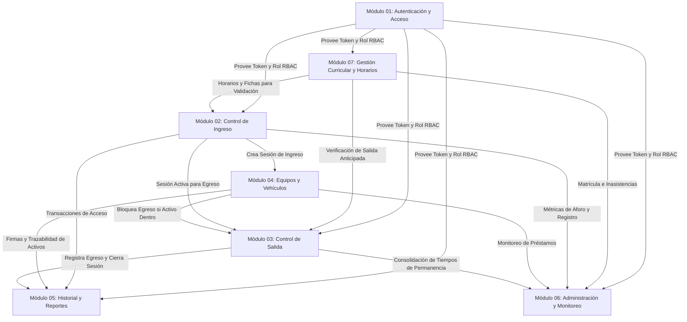
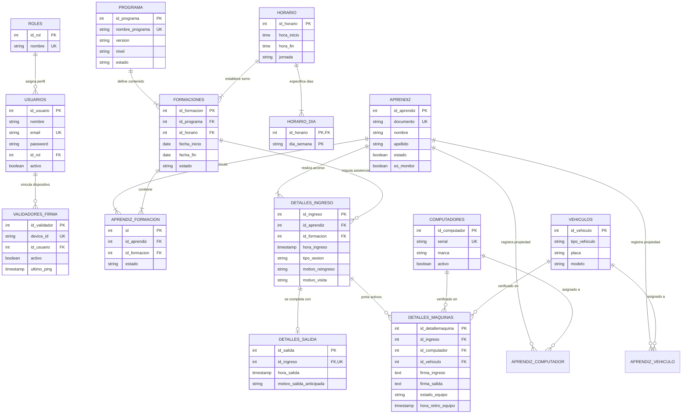
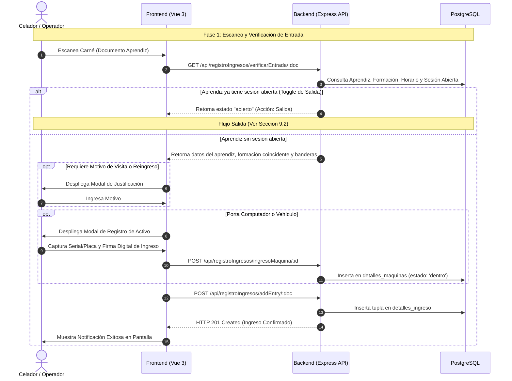
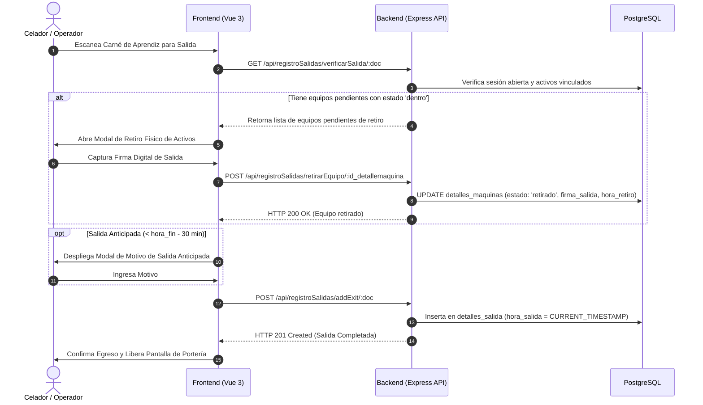

# GEDASC — Documento Técnico Integral

> **Gestión de Entradas y Salidas de Aprendices con Autenticación de Equipos y Doble Firma**  
> **Centro de Tecnología de la Amazonía (CTA) — SENA**  
> **Arquitectura Global, Visión Técnica y Modelo de Operación del Sistema**

---

## 1. Información General

### 1.1 Nombre del Sistema
**GEDASC** — *Gestión de Entradas y Salidas de Aprendices con Autenticación de Equipos y Doble Firma*.

### 1.2 Descripción
GEDASC es una plataforma web y móvil distribuida para el control de acceso físico, gestión de permanencia institucional, trazabilidad de activos portados (computadores portátiles y vehículos) y seguimiento de cumplimiento horario de aprendices en el **Centro de Tecnología de la Amazonía (CTA)** del SENA. El sistema opera mediante un modelo de sesiones dinámicas, tolerancia horaria curricular ($\pm 30\text{ min}$), captura de justificaciones obligatorias para eventos extraordinarios y un protocolo de **doble firma digital manuscrita** (ingreso y egreso) para asegurar la cadena de custodia de equipos.

### 1.3 Versión
**Versión 2.8** (Arquitectura Modular y Reactiva en Tiempo Real).

### 1.4 Estado del Documento
**Aprobado / Línea Base Oficial**.

### 1.5 Autores
- Equipo de Desarrollo e Infraestructura de Software — CTA SENA.
- Analista Funcional, Business Analyst y Technical Writer.

### 1.6 Fecha de Elaboración
18 de agosto de 2026.

---

## 2. Introducción

### 2.1 Objetivo del Documento
Proporcionar una visión técnica y arquitectónica integral del sistema GEDASC. Este documento actúa como la **fuente de verdad global y punto de partida de ingeniería**, permitiendo a nuevos desarrolladores, arquitectos, analistas y personal de operaciones comprender la estructura de capas, decisiones de diseño, modelo de datos, flujo de información, mecanismos de seguridad e infraestructura sin necesidad de inspeccionar individualmente cada componente o módulo.

### 2.2 Alcance
El documento cubre la arquitectura integral del frontend (Single Page Application y terminal móvil con Vue 3), backend (API REST y WebSocket con Express/Node.js/TypeScript), capa de persistencia (PostgreSQL 18+), modelos relacionales, esquemas de validación Zod, protocolos de seguridad RBAC/JWT, directrices de despliegue e infraestructura.

### 2.3 Público Objetivo
- **Desarrolladores Full-Stack y Backend/Frontend**: Para incorporación rápida, mantenimiento evolutivo y corrección técnica.
- **Arquitectos de Software y Líderes Técnicos**: Para evaluación de escalabilidad, integración de nuevos servicios y gobierno de API.
- **Analistas Funcionales y QA / Testers**: Para comprensión de las invariantes del sistema y formulación de planes de prueba de extremo a extremo.
- **Administradores de TI y DevOps**: Para despliegue de infraestructura, aprovisionamiento de bases de datos y monitoreo de terminales.

### 2.4 Documentación Relacionada
- [`DOCUMENTACION_GENERAL.md`](file:///c:/Users/alejo/Downloads/primerProyecto/GEDASC/documentacion/DOCUMENTACION_GENERAL.md): Mapa maestro de módulos y matriz de trazabilidad.
- [`reglas_negocio_generales.md`](file:///c:/Users/alejo/Downloads/primerProyecto/GEDASC/documentacion/reglas_negocio_generales.md): Catálogo de reglas de negocio globales y transversales (`RN-GEN-001` a `RN-GEN-033`).
- Directorio de Módulos Específicos: [`documentacion/modulos/`](file:///c:/Users/alejo/Downloads/primerProyecto/GEDASC/documentacion/modulos/).

---

## 3. Descripción General del Sistema

### 3.1 Propósito del Sistema
Reemplazar los registros manuales de minuta en papel y torniquetes desvinculados por una solución digital centralizada en tiempo real que garantice la autenticación biométrica/manuscrita de portadores de activos, evite el ingreso no autorizado al centro de formación, detecte préstamos de equipos no declarados y alerte tempranamente riesgos de deserción escolar por ausentismo prolongado.

### 3.2 Objetivos Principales
1. **Control de Acceso Ágil y Unificado**: Permitir la verificación en portería mediante escaneo de código de barras de carnés en menos de 2 segundos por aprendiz.
2. **Cadena de Custodia con Doble Firma**: Capturar firma digital manuscrita al ingreso y egreso de equipos de cómputo y vehículos, almacenándolas en base de datos para respaldo probatorio institucional.
3. **Validación Curricular en Tiempo Real**: Evaluar la concordancia del acceso contra la programación horaria de las fichas formativas aplicando ventana de tolerancia ($\pm 30\text{ min}$) y exigiendo justificación ante visitas no curriculares.
4. **Trazabilidad y Prevención de Pérdidas**: Detectar activos en préstamo, impedir la coexistencia duplicada de un equipo dentro del centro y bloquear la salida física de aprendices que porten equipos no retirados formalmente.
5. **Analítica y Auditoría Gerencial**: Suministrar tableros de control con métricas de aforo, reportes exportables en PDF/Excel y alertas automáticas de aprendices con 3 o más días continuos de inasistencia.

### 3.3 Alcance Funcional General
```text
┌─────────────────────────────────────────────────────────────────────────────┐
│                            ALCANCE FUNCIONAL                                │
├─────────────────────────┬─────────────────────────┬─────────────────────────┤
│    OPERACIÓN PORTERÍA   │   SEGURIDAD DE ACTIVOS  │  ADMINISTRACIÓN Y TI    │
│ • Escaneo de carné      │ • Registro PC/Vehículo  │ • Gestión de Fichas/Prog│
│ • Toggle entrada/salida │ • Doble firma digital   │ • Horarios y Jornadas   │
│ • Reingresos justificados│• Detección de préstamos│ • Monitoreo de Alertas  │
│ • Motivos de visita     │ • Bloqueo antirrobo     │ • Gestión de Celadores  │
│ • Validador móvil Wi-Fi │ • Historial de custodia │ • Simulación de Reloj   │
└─────────────────────────┴─────────────────────────┴─────────────────────────┘
```

### 3.4 Actores y Roles Principales

| Actor / Rol | Tipo de Acceso | Responsabilidad y Atribuciones |
| :--- | :--- | :--- |
| **CELADOR** *(Operador de Portería)* | Interfaz Web SPA / Validador Móvil | Operación continua de escaneo en puesto de control, registro de ingresos, salidas, verificación de pertenencia de equipos, toma de firmas digitales y consultas en modo solo lectura. |
| **ADMIN** *(Coordinador / Administrador)* | Interfaz Web SPA | Control total del sistema: gestión de programas, fichas y horarios, matriculación masiva, anulación justificada de registros erróneos, centro de alertas y creación de cuentas de celadores. |
| **APRENDIZ** *(Sujeto de Control)* | Físico (Carné / Firma) | Portador del documento de identidad escaneado; titular o receptor de equipos de cómputo/vehículos; suscriptor de firmas digitales manuscritas. |
| **VALIDADOR MÓVIL** *(Dispositivo)* | Navegador Web Móvil | Terminal complementaria vinculada por WebSocket para escaneo óptico de códigos de barra mediante cámara y recolección de firmas táctiles en pantalla. |

---

## 4. Arquitectura del Sistema

### 4.1 Estilo Arquitectónico
GEDASC implementa una arquitectura **Cliente-Servidor Desacoplada**, basada en:
- **Frontend SPA (Single Page Application)**: Desarrollada en Vue 3 con TypeScript, Composition API y TailwindCSS.
- **Backend API RESTful & WebSocket**: Construido sobre Node.js y Express 5 con TypeScript, proveyendo endpoints stateless y canales bidireccionales en tiempo real con Socket.io.
- **Capa de Persistencia Relacional**: PostgreSQL 18+ gestionado mediante pool de conexiones nativo (`pg`) para alto rendimiento y consultas analíticas parametrizadas.

### 4.2 Arquitectura General
El sistema desacopla completamente la interfaz de usuario de la lógica de procesamiento. Las terminales fijas de portería y los dispositivos móviles se comunican con el servidor central mediante HTTPS/WSS a través de una red local o corporativa.

### 4.3 Capas del Sistema
```text
┌───────────────────────────────────────────────────────────────────────────────┐
│ CAPA DE PRESENTACIÓN (CLIENTE)                                                │
│  • Vue 3 (Composition API) • Pinia Store • Vue Router • Vue Signature Pad     │
│  • TailwindCSS • Socket.io Client • Quagga2 (Lector de Código de Barras)      │
└──────────────────────────────────────┬────────────────────────────────────────┘
                                       │ HTTPS (JSON REST) / WSS (WebSockets)
┌──────────────────────────────────────▼────────────────────────────────────────┐
│ CAPA DE FRONTERA Y SEGURIDAD (BACKEND)                                        │
│  • CORS Handler • Express Middleware • JWT Auth Guard • Role Guard (RBAC)     │
│  • Zod Validation Middleware (Body, Params, Query)                            │
└──────────────────────────────────────┬────────────────────────────────────────┘
                                       │
┌──────────────────────────────────────▼────────────────────────────────────────┐
│ CAPA DE LÓGICA DE NEGOCIO Y CONTROLADORES                                     │
│  • Entry/Exit Controllers • Machine Services • Admin Controllers              │
│  • Academic/Schedule Engines • Event Dispatchers (Socket Sinks)               │
└──────────────────────────────────────┬────────────────────────────────────────┘
                                       │ Conexiones Pool Parametrizadas
┌──────────────────────────────────────▼────────────────────────────────────────┐
│ CAPA DE PERSISTENCIA Y DATOS (POSTGRESQL)                                     │
│  • Tablas Relacionales • Constraints (FK, UNIQUE, CHECK) • Índices B-Tree     │
│  • Triggers y DDL de Migración • Consultas ACID Optimizadas                   │
└───────────────────────────────────────────────────────────────────────────────┘
```

### 4.4 Componentes Principales
1. **API Server (`DataBase/src/index.ts`)**: Servidor HTTP/WebSocket que expone las rutas modulares y administra el ciclo de vida de la aplicación.
2. **Auth & RBAC Guards (`DataBase/src/middlewares/admin.middleware.ts`)**: Módulo de intercepción que valida la autenticidad del JWT y restringe accesos por rol (`ADMIN` / `CELADOR`).
3. **Zod Validator (`DataBase/src/middlewares/validate.middleware.ts`)**: Motor de validación declarativa que garantiza que ninguna petición con tipos inválidos alcance la lógica de controladores.
4. **Machine & Asset Engine (`DataBase/src/services/machines/`)**: Servicios de detección de préstamos, verificación de máquinas secundarias y bloqueo de equipos duplicados dentro de la sede.
5. **Real-Time Socket Hub (`DataBase/src/sockets/`)**: Gestor de canales WebSocket para sincronización instantánea entre la terminal del celador y el dispositivo validador móvil.
6. **State Management (`src/stores/`)**: Stores de Pinia que mantienen el estado reactivo del usuario autenticado, alertas activas y turnos de jornada.

### 4.5 Comunicación entre Componentes
- **Frontend $\leftrightarrow$ Backend (Transaccional)**: Peticiones HTTP asíncronas vía Fetch/Axios estructuradas en payloads JSON.
- **Frontend $\leftrightarrow$ Terminal Móvil (Tiempo Real)**: Eventos emitidos por Socket.io (`validator:scanned`, `validator:signature_saved`, `validator:device_unlinked`).
- **Backend $\leftrightarrow$ Base de Datos**: Conexión TCP directa mediante pool `pg.Pool` con pooling de conexiones y transacciones SQL protegidas contra inyecciones mediante parámetros posicionales (`$1, $2, ...`).

### 4.6 Dependencias Externas
- **Motor de Base de Datos**: PostgreSQL 18.x / 16.x.
- **Librería Criptográfica**: `bcryptjs` para hashing irreversible de contraseñas.
- **Generador de Reportes**: `jspdf` y `jspdf-autotable` para compilación cliente de PDF, y `xlsx` para ingesta/exportación de hojas de cálculo.

### 4.7 Diagrama de Arquitectura

```mermaid
flowchart TD
    subgraph CLIENTE["Capa de Presentación (Frontend)"]
        UI_DESKTOP["Terminal Portería (Vue 3 Desktop)"]
        UI_MOBILE["Validador Móvil (Vue 3 Mobile)"]
        STORE["Pinia Stores (Auth, Jornada, UI)"]
        ROUTER["Vue Router (RBAC Guards)"]
        
        UI_DESKTOP <--> STORE
        UI_MOBILE <--> STORE
        STORE <--> ROUTER
    end

    subgraph SERVIDOR["Capa de Servidor (Node.js / Express 5 / TypeScript)"]
        API_GATEWAY["Express Router / CORS / Middlewares"]
        JWT_GUARD["Auth Guard (JWT Verification)"]
        ZOD_GUARD["Validate Middleware (Zod Schemas)"]
        WS_SERVER["Socket.io Server (Real-Time Hub)"]
        
        subgraph CONTROLLERS["Lógica de Controladores"]
            AUTH_CTRL["auth.controller"]
            ENTRY_CTRL["entry.controller"]
            EXIT_CTRL["exit.controller"]
            ADMIN_CTRL["admin.controller"]
            HIST_CTRL["history.controller"]
            MACH_SRV["machine.services"]
        end
    end

    subgraph PERSISTENCIA["Capa de Persistencia (PostgreSQL)"]
        DB[(Base de Datos GEDASC)]
        TABLES["Tablas Relacionales\n(aprendiz, formaciones, horario,\ndetalles_ingreso, detalles_maquinas,\ndetalles_salida, usuarios)"]
        CONSTRAINTS["Constraints & Checks\n(FKs, UNIQUE, CHECK, Cascades)"]
        
        DB --- TABLES
        TABLES --- CONSTRAINTS
    end

    UI_DESKTOP -- "HTTPS (REST)" --> API_GATEWAY
    UI_MOBILE -- "HTTPS (REST)" --> API_GATEWAY
    UI_DESKTOP <-->| "WSS (Socket.io)" | WS_SERVER
    UI_MOBILE <-->| "WSS (Socket.io)" | WS_SERVER

    API_GATEWAY --> JWT_GUARD
    JWT_GUARD --> ZOD_GUARD
    ZOD_GUARD --> CONTROLLERS
    CONTROLLERS <--> MACH_SRV
    CONTROLLERS -- "pg.Pool (SQL Parametrizado)" --> DB
```

---

## 5. Módulos del Sistema

| # | Módulo | Propósito | Responsabilidad Principal | Documentación |
| :-: | :--- | :--- | :--- | :--- |
| **01** | [Autenticación, Sesión y Acceso](file:///c:/Users/alejo/Downloads/primerProyecto/GEDASC/documentacion/modulos/01_autenticacion_acceso/README.md) | Gestión de identidad de operadores y seguridad perimetral. | Login seguro, emisión/validación de tokens JWT, control RBAC (`ADMIN`/`CELADOR`), enlace y sincronización de validador móvil. | [`01_autenticacion_acceso`](file:///c:/Users/alejo/Downloads/primerProyecto/GEDASC/documentacion/modulos/01_autenticacion_acceso/README.md) |
| **02** | [Control Operativo de Ingreso](file:///c:/Users/alejo/Downloads/primerProyecto/GEDASC/documentacion/modulos/02_control_ingreso/README.md) | Registro y validación ágil de acceso peatonal de aprendices. | Escaneo de código de barras, toggle automático de salida, captura de motivos de reingreso y visita, verificación horaria ($\pm 30\text{ min}$) y clasificación de monitores. | [`02_control_ingreso`](file:///c:/Users/alejo/Downloads/primerProyecto/GEDASC/documentacion/modulos/02_control_ingreso/README.md) |
| **03** | [Control Operativo de Salida](file:///c:/Users/alejo/Downloads/primerProyecto/GEDASC/documentacion/modulos/03_control_salida/README.md) | Cierre seguro de sesiones de permanencia. | Validación de sesión activa previa, filtro antirrebote ($< 5\text{ min}$), bloqueo por retención de activos no retirados y registro de salidas anticipadas. | [`03_control_salida`](file:///c:/Users/alejo/Downloads/primerProyecto/GEDASC/documentacion/modulos/03_control_salida/README.md) |
| **04** | [Gestión de Equipos y Vehículos](file:///c:/Users/alejo/Downloads/primerProyecto/GEDASC/documentacion/modulos/04_equipos_vehiculos/README.md) | Control de cadena de custodia de activos físicos. | Registro de seriales/placas, gestión de máquina principal vs secundaria, detección automática de préstamos, no concurrencia y doble firma digital. | [`04_equipos_vehiculos`](file:///c:/Users/alejo/Downloads/primerProyecto/GEDASC/documentacion/modulos/04_equipos_vehiculos/README.md) |
| **05** | [Historial y Reportes](file:///c:/Users/alejo/Downloads/primerProyecto/GEDASC/documentacion/modulos/05_historial_reportes/README.md) | Auditoría, consulta cronológica y exportación documental. | Consultas históricas multicriterio en solo lectura, trazabilidad forense de firmas y exportación estructurada en formatos PDF y Excel. | [`05_historial_reportes`](file:///c:/Users/alejo/Downloads/primerProyecto/GEDASC/documentacion/modulos/05_historial_reportes/README.md) |
| **06** | [Administración y Monitoreo](file:///c:/Users/alejo/Downloads/primerProyecto/GEDASC/documentacion/modulos/06_administracion_monitoreo/README.md) | Gobierno general, analítica y seguridad de datos. | Tablero de mando gerencial, anulación justificada con confirmación de identidad, centro de alertas de ausentismo ($\ge 3\text{ días}$) y gestión de celadores. | [`06_administracion_monitoreo`](file:///c:/Users/alejo/Downloads/primerProyecto/GEDASC/documentacion/modulos/06_administracion_monitoreo/README.md) |
| **07** | [Gestión Curricular y Horarios](file:///c:/Users/alejo/Downloads/primerProyecto/GEDASC/documentacion/modulos/07_gestion_academica/README.md) | Configuración académica y soporte a la operación. | Administración de programas, fichas formativas, horarios con cálculo de jornada, detección de cruces en doble formación y matrícula masiva. | [`07_gestion_academica`](file:///c:/Users/alejo/Downloads/primerProyecto/GEDASC/documentacion/modulos/07_gestion_academica/README.md) |

### 5.1 Dependencias entre Módulos



---

## 6. Modelo General de Datos

### 6.1 Motor de Base de Datos
- **Motor**: PostgreSQL 18.x / 16.x Relacional.
- **Codificación**: UTF-8.
- **Zona Horaria / Timestamps**: `TIMESTAMP WITHOUT TIME ZONE` con hora local del servidor CTA.

### 6.2 Entidades Principales
1. **`roles`**: Catálogo maestro de perfiles de acceso (`ADMIN`, `CELADOR`).
2. **`usuarios`**: Cuentas con credenciales para acceder a la aplicación.
3. **`aprendiz`**: Registro maestro de aprendices identificados por su documento.
4. **`programa`**: Diseños curriculares institucionales (Técnico, Tecnólogo, etc.).
5. **`horario`** y **`horario_dia`**: Franjas horarias y días de clase habilitados.
6. **`formaciones`**: Fichas académicas específicas vinculadas a un programa y horario.
7. **`aprendiz_formacion`**: Matrículas de aprendices en fichas formativas.
8. **`computadores`** y **`vehiculos`**: Catálogo de activos físicos.
9. **`aprendiz_computador`** y **`aprendiz_vehiculo`**: Vínculos de titularidad y máquina principal.
10. **`detalles_ingreso`**: Sesiones de acceso registradas en portería.
11. **`detalles_maquinas`**: Registro de activos ingresados con firma de entrada y salida.
12. **`detalles_salida`**: Registro de egreso que complementa y cierra la sesión.
13. **`validadores_firma`**: Registro de dispositivos móviles vinculados por socket.

### 6.3 Relaciones Principales
- Un **Programa** tiene muchas **Formaciones** ($1 \rightarrow N$).
- Un **Horario** tiene muchos **Horario_Dia** ($1 \rightarrow N$) y muchas **Formaciones** ($1 \rightarrow N$).
- Un **Aprendiz** puede estar matriculado en muchas **Formaciones** ($N \leftrightarrow M$ mediante `aprendiz_formacion`).
- Un **Aprendiz** tiene muchas **Sesiones de Ingreso** ($1 \rightarrow N$).
- Una **Sesión de Ingreso** (`detalles_ingreso`) tiene exactamente una **Salida** (`detalles_salida`) ($1 \rightarrow 1$) y puede tener muchos **Activos Ingresados** (`detalles_maquinas`) ($1 \rightarrow N$).

### 6.4 Consideraciones de Integridad
- **Unicidad Obligatoria**: `aprendiz(documento)`, `usuarios(email)`, `formaciones(id_formacion)`, `computadores(serial)`, `aprendiz_formacion(id_aprendiz, id_formacion)`.
- **Integridad Referencial en Cascada**:
  - `aprendiz_formacion` $\rightarrow$ `formaciones`: `ON UPDATE CASCADE ON DELETE CASCADE`.
  - `detalles_ingreso` $\rightarrow$ `formaciones`: `ON UPDATE CASCADE ON DELETE SET NULL` (preserva historial).
  - `detalles_maquinas` $\rightarrow$ `detalles_ingreso`: `ON DELETE CASCADE`.
  - `horario_dia` $\rightarrow$ `horario`: `ON DELETE CASCADE`.

### 6.5 Diagrama Entidad-Relación



---

## 7. Seguridad General

### 7.1 Autenticación
- Mecanismo **Stateless mediante JWT (JSON Web Tokens)** firmado criptográficamente con HMAC-SHA256 y secreto `JWT_SECRET`.
- Hashing unidireccional de contraseñas de usuarios con algoritmo `bcrypt` (10 rondas de salt).
- Expiración de tokens configurada en **24 horas (`1d`)** para cubrir turnos operativos.

### 7.2 Autorización
- Modelo **RBAC (Role-Based Access Control)** con dos roles mutuamente excluyentes: `ADMIN` y `CELADOR`.
- Middleware de autorización en backend (`requireRole(['ADMIN'])`) protegiendo las rutas `/api/admin/*`.
- Guardias de navegación en frontend (`router.beforeEach`) que interceptan rutas protegidas y validan la existencia y rol del token decodificado en Pinia.

### 7.3 Protección de Datos
- **Firmas Digitales**: Almacenadas en formato Base64 Data URL (`image/png`) como campos `TEXT` en PostgreSQL, impidiendo enlaces rotos o accesos no autenticados a sistemas de archivos.
- **SQL Injection Prevention**: Todas las consultas a la base de datos se ejecutan mediante consultas parametrizadas (`$1, $2, ...`) del driver nativo `pg`.
- **CORS Configurable**: Middleware que restringe los orígenes permitidos según la variable `ALLOWED_ORIGINS` para prevenir accesos no autorizados desde navegadores externos.

### 7.4 Validación de Entradas
- Validación estricta en tiempo de ejecución en la frontera de la API mediante **Zod**.
- Middleware unificado `validateRequest({ body, params, query })` que intercepta cargas maliciosas o malformadas retornando `HTTP 400 Bad Request` antes de invocar la capa de persistencia.

### 7.5 Auditoría
- **Preservación Histórica (Baja Lógica)**: Los aprendices con movimientos de ingreso no pueden ser borrados físicamente; se desactivan con `estado = false`.
- **Doble Factor en Corrección de Registros**: La anulación administrativa de ingresos/salidas exige confirmación exacta de la identidad del aprendiz y una justificación técnica obligatoria de al menos 5 caracteres.

### 7.6 Gestión de Sesiones
- Cierre de sesión atómico en frontend con purga completa de tokens en `localStorage`, reseteo del store de Pinia y desconexión limpia de sockets.
- Terminales validadoras móviles protegidas por identificador único `device_id` y monitoreo de actividad por `ultimo_ping`.

---

## 8. Reglas Globales del Sistema

### 8.1 Reglas Transversales
- **Ámbito Institucional (`RN-GEN-001`)**: Todos los registros pertenecen al Centro de Tecnología de la Amazonía (CTA).
- **Separación de Identidades (`RN-GEN-003`)**: Los usuarios del sistema (`usuarios`) y los sujetos de control (`aprendiz`) son entidades completamente independientes.
- **Tolerancia Horaria Académica (`RN-GEN-014`)**: Se admite una ventana de $\pm 30\text{ minutos}$ respecto al horario de la ficha para imputar asistencia lectiva ordinaria.
- **Doble Firma Obligatoria (`RN-GEN-024`)**: Todo equipo o vehículo registrado requiere firma manuscrita digital al entrar y al salir.

### 8.2 Restricciones Generales
- **Bloqueo de Coexistencia de Activos (`RN-GEN-027`)**: Un equipo con `estado_equipo = 'dentro'` no puede ser ingresado nuevamente por ningún usuario.
- **Bloqueo de Egreso con Activos Pendientes (`RN-GEN-025`)**: No se puede registrar la salida de un aprendiz si este tiene equipos vinculados que no hayan sido retirados y firmados.
- **Filtro Antirrebote de Salida (`RN-GEN-021`)**: Se prohíbe registrar la salida si han transcurrido menos de 5 minutos desde el ingreso.
- **Bloqueo Nocturno (`RN-GEN-015`)**: Entre `00:00:00` y `05:59:59` el sistema permanece cerrado para operaciones de portería.

### 8.3 Políticas de Integridad
- **Invariante de Sesión Única Diaria (`RN-GEN-018`)**: No puede registrarse salida sin entrada previa abierta.
- **Justificaciones Obligatorias**:
  - Reingreso diario múltiple (`total_hoy > 0`) $\rightarrow$ `motivo_reingreso` (`RN-GEN-019`).
  - Acceso fuera de horario curricular $\rightarrow$ `motivo_visita` (`RN-GEN-020`).
  - Egreso antes de finalizar clases $\rightarrow$ `motivo_salida_anticipada` (`RN-GEN-022`).
- **No Traslape de Horarios (`RN-GEN-012`)**: No se permite matricular a un aprendiz en fichas con horarios coincidentes en el mismo día.

> Para el detalle exhaustivo, consulte el documento [`reglas_negocio_generales.md`](file:///c:/Users/alejo/Downloads/primerProyecto/GEDASC/documentacion/reglas_negocio_generales.md).

---

## 9. Flujos Generales del Sistema

### 9.1 Flujo Principal: Ciclo Completo de Acceso Peatonal y Custodia



### 9.2 Flujos Transversales: Retiro de Activos y Cierre de Sesión



### 9.3 Integraciones Externas y Validador Móvil

```mermaid
flowchart LR
    subgraph PUESTO_CONTROL["Puesto de Control (Portería)"]
        PC_BROWSER["Navegador PC Principal\n(GeneralEntryView.vue)"]
    end

    subgraph TERMINAL_MOVIL["Dispositivo Móvil (Wi-Fi)"]
        PHONE["Celular / Tablet Operario\n(MobileValidatorView.vue)"]
        CAMERA["Cámara (Quagga2 Barcode)"]
        TOUCH["Pantalla Táctil (SignaturePad)"]
        
        PHONE --- CAMERA
        PHONE --- TOUCH
    end

    subgraph BACKEND_SERVER["Servidor GEDASC (Node.js)"]
        WS["Socket.io Server\n(Canal: /validador)"]
        API["REST Endpoints\n(/api/validador)"]
    end

    PHONE -- "1. Vinculación (device_id)" --> API
    PHONE <-->| "2. WebSocket Handshake" | WS
    PC_BROWSER <-->| "2. WebSocket Handshake" | WS
    
    CAMERA -.->| "3. Emite 'validator:scanned'" | WS
    WS -.->| "4. Rellena documento en tiempo real" | PC_BROWSER
    
    TOUCH -.->| "5. Emite 'validator:signature_saved'" | WS
    WS -.->| "6. Pasa firma Base64 al formulario" | PC_BROWSER
```

---

## 10. Estándares y Convenciones Técnicas

### 10.1 Estructura del Proyecto
El repositorio está estructurado como un monorepo modular con separación neta entre frontend cliente y backend de datos:

```text
GEDASC/
├── .agents/                      # Reglas de desarrollo y convenciones del proyecto
├── DataBase/                     # Backend Node.js / Express / PostgreSQL
│   ├── migrations/               # Scripts SQL de evolución de base de datos
│   ├── schema/                   # DDL maestro (gedascBD.sql)
│   ├── src/
│   │   ├── config/               # Conexión pg.Pool, Swagger y dbInit
│   │   ├── controllers/          # Controladores REST de la API
│   │   ├── middlewares/          # JWT Auth, RBAC y validación Zod
│   │   ├── routes/               # Declaración de rutas Express
│   │   ├── schemas/              # Esquemas declarativos Zod
│   │   ├── services/             # Lógica de dominio de máquinas y activos
│   │   ├── sockets/              # Hub de eventos Socket.io
│   │   └── index.ts              # Entry point del servidor
│   ├── package.json              # Dependencias del backend
│   └── tsconfig.json             # Configuración TypeScript Backend
├── documentacion/                # Documentación técnica y funcional
│   ├── modulos/                  # 7 carpetas de módulos autocontenidos
│   ├── DOCUMENTACION_GENERAL.md  # Índice maestro
│   ├── documento_tecnico_integral.md # Este documento
│   └── reglas_negocio_generales.md   # Reglas transversales
├── src/                          # Frontend Vue 3 SPA
│   ├── assets/                   # Estilos Tailwind y recursos estáticos
│   ├── components/               # Componentes UI, modales y firmas
│   ├── composables/              # Lógica reactiva reutilizable
│   ├── router/                   # Enrutamiento Vue Router y Navigation Guards
│   ├── Services/                 # Clientes API HTTP y generadores de reportes
│   ├── stores/                   # Stores de estado global con Pinia
│   ├── views/                    # Vistas principales de celador y administrador
│   ├── App.vue                   # Raíz de componentes Vue
│   └── main.ts                   # Entry point del frontend
├── package.json                  # Dependencias del frontend
└── vite.config.ts                # Configuración de empaquetado Vite
```

### 10.2 Convenciones de Código
- **Lenguaje**: TypeScript estricto (`strict: true`) en frontend y backend.
- **Frontend Paradigm**: Vue 3 con Composition API (`<script setup lang="ts">`).
- **Inmutabilidad y Tipado**: Prohibición de tipo `any` en esquemas críticos; tipado estricto mediante interfaces y tipos inferidos de Zod (`z.infer<typeof schema>`).

### 10.3 Nomenclatura
- **Archivos Backend**: `[modulo].controller.ts`, `[modulo].routes.ts`, `[modulo].schema.ts`.
- **Componentes Frontend**: PascalCase (`ModalAddCelador.vue`, `BaseButton.vue`).
- **Composables**: camelCase prefijado con `use` (`useJornada.ts`, `useExitAprendiz.ts`).
- **Base de Datos**: snake_case para tablas y columnas (`id_aprendiz`, `hora_ingreso`, `detalles_maquinas`).

### 10.4 Gestión de Errores
- Manejador centralizado de errores (`DataBase/src/middlewares/error.middleware.ts`).
- Respuestas de error estandarizadas en JSON:
  ```json
  {
    "success": false,
    "message": "Descripción amigable del error",
    "errors": [
      { "field": "documento", "message": "El documento debe contener al menos 5 caracteres" }
    ]
  }
  ```

### 10.5 Logging
- Logs estructurados con contexto en consola del backend para auditoría de conexiones y depuración de inicialización (`[DBInit]`, `[Socket]`, `[CORS]`).

### 10.6 Control de Versiones
- **Modelo de Ramas**: `main` / `master` (Producción), `GEDASC-V2` (Rama principal de desarrollo y consolidación modular).
- **Convención de Commits**: Conventional Commits (`feat:`, `fix:`, `docs:`, `refactor:`, `chore:`).
- **Política de Sincronización**: Commits atómicos seguidos de `git push` tras verificar cambios funcionales.

---

## 11. Stack Tecnológico

| Capa | Tecnología | Versión | Propósito en el Sistema |
| :--- | :--- | :--- | :--- |
| **Frontend Framework** | **Vue.js** | `3.5.x` | Construcción de la Single Page Application reactiva y modular. |
| **Frontend Build Tool** | **Vite** | `6.x` / Beta | Compilador ultrarrápido y servidor de desarrollo HMR. |
| **State Management** | **Pinia** | `3.0.x` | Almacenamiento centralizado y reactivo del estado de autenticación y UI. |
| **Frontend Routing** | **Vue Router** | `5.0.x` | Enrutamiento del cliente con protección de rutas por roles (RBAC). |
| **Estilos y Diseño** | **TailwindCSS** | `3.3.x` | Sistema de diseño utilitario responsivo para pantallas táctiles y escritorio. |
| **Captura de Firmas** | **Signature Pad / Vue-Signature** | `5.1.x` / `3.0.x` | Lienzo HTML5 Canvas para captura y serialización Base64 de firmas. |
| **Lector Código Barras** | **Quagga2** | `1.12.x` | Decodificación óptica de códigos de barra Code 128 / EAN desde la cámara. |
| **Backend Runtime** | **Node.js** | `>=20.19.0` | Entorno de ejecución asíncrono para el servidor y la API. |
| **Lenguaje Backend** | **TypeScript** | `5.9.x` | Tipado estricto y seguridad en tiempo de compilación para la lógica de API. |
| **API Framework** | **Express** | `5.2.x` | Servidor HTTP RESTful para endpoints transaccionales y de consulta. |
| **Comunicación Real-Time**| **Socket.io** | `4.8.x` | WebSocket bidireccional para enlace del validador móvil y portería. |
| **Validación de Schemas** | **Zod** | `4.4.x` | Validación y sanitización estricta de payloads en frontend y backend. |
| **Seguridad Criptográfica**| **bcryptjs / JWT** | `3.0.x` / `9.0.x` | Hashing de contraseñas de usuarios y emisión de tokens de autorización. |
| **Motor de Base de Datos** | **PostgreSQL** | `18.x` / `16.x` | Almacenamiento relacional transaccional, ACID e integridad referencial. |
| **Conector de BD** | **pg (node-postgres)** | `8.18.x` | Pool de conexiones nativas y cliente SQL de alto rendimiento. |
| **Exportación Documental** | **jsPDF / SheetJS (xlsx)** | `4.2.x` / `0.18.x` | Generación en cliente de reportes PDF vectoriales y archivos Excel. |

---

## 12. Infraestructura y Despliegue

### 12.1 Entorno de Desarrollo
- **Backend**: Ejecución mediante `ts-node-dev --respawn src/index.ts` en puerto `3000`.
- **Frontend**: Servidor Vite local en puerto `5173` con soporte HTTPS (`@vitejs/plugin-basic-ssl` / `mkcert`) para permitir acceso a la cámara y pantalla táctil en terminales móviles dentro de la LAN.
- **Herramienta de Configuración IP**: Script interactivo `node scripts/set-ip.mjs` para propagar automáticamente la IP local a los orígenes CORS y endpoints del frontend.

### 12.2 Entorno de Producción
- **Backend Compilado**: Transpilación a JavaScript puro en directorio `dist/` ejecutado con `node dist/index.js` o gestor de procesos `PM2`.
- **Frontend Bundle**: Compilado mediante `vite build` generando activos estáticos optimizados en `dist/` servidos mediante Nginx o contenedor Docker.

### 12.3 Infraestructura y Contenedores
El proyecto dispone de configuración **Docker** para despliegues reproducibles:
- `DataBase/Dockerfile` y `DataBase/Dockerfile.dev`: Contenedorización del backend Node.js.
- Red local institucional (LAN CTA) configurada para permitir el tráfico HTTP/WSS entre los puestos de vigilancia y el servidor central.

### 12.4 Servicios Externos
GEDASC está diseñado bajo el principio de **autonomía de red institucional**:
- No depende de servicios en la nube para su funcionamiento crítico (las firmas, reportes y bases de datos residen localmente en la infraestructura del CTA).

### 12.5 Variables de Entorno

#### Backend (`DataBase/.env`)
```ini
# Configuración del Servidor
PORT=3000
NODE_ENV=development

# Conexión a Base de Datos PostgreSQL
DB_USER=postgres
DB_PASSWORD=postgres
DB_HOST=localhost
DB_PORT=5432
DB_NAME=GEDASC

# Seguridad y Autenticación
JWT_SECRET=super_secret_jwt_key_gedasc_cta_2026

# Orígenes Permitidos (CORS)
ALLOWED_ORIGINS=http://localhost:5173,https://192.168.1.50:5173,*
```

#### Frontend (`.env`)
```ini
# Endpoint Base de la API
VITE_API_URL=http://localhost:3000/api

# Endpoint del Servidor Socket.io
VITE_SOCKET_URL=http://localhost:3000
```

### 12.6 Proceso General de Despliegue
1. **Aprovisionamiento de Base de Datos**:
   - Crear base de datos `GEDASC` en PostgreSQL.
   - Ejecutar script DDL maestro [`DataBase/schema/gedascBD.sql`](file:///c:/Users/alejo/Downloads/primerProyecto/GEDASC/DataBase/schema/gedascBD.sql) y migraciones en [`DataBase/migrations/`](file:///c:/Users/alejo/Downloads/primerProyecto/GEDASC/DataBase/migrations/).
2. **Despliegue del Backend**:
   - Instalar dependencias: `cd DataBase && npm install`.
   - Compilar código: `npm run build`.
   - Inicializar esquemas y semillas: `npm start` (ejecuta `initDbSchema()` automáticamente).
3. **Despliegue del Frontend**:
   - Instalar dependencias: `npm install`.
   - Generar paquete de producción: `npm run build-only`.
   - Publicar el contenido de `dist/` en el servidor web (Nginx/Apache).

---

## 13. Referencias Documentales

### 13.1 Documentos Técnicos
- **Índice Maestro de Documentación**: [`documentacion/DOCUMENTACION_GENERAL.md`](file:///c:/Users/alejo/Downloads/primerProyecto/GEDASC/documentacion/DOCUMENTACION_GENERAL.md)
- **Documento Técnico Integral**: [`documentacion/documento_tecnico_integral.md`](file:///c:/Users/alejo/Downloads/primerProyecto/GEDASC/documentacion/documento_tecnico_integral.md) (Este documento)
- **Reglas de Negocio Generales y Transversales**: [`documentacion/reglas_negocio_generales.md`](file:///c:/Users/alejo/Downloads/primerProyecto/GEDASC/documentacion/reglas_negocio_generales.md)

### 13.2 Documentos Funcionales por Módulo
- **Módulo 01**: [`01_autenticacion_acceso`](file:///c:/Users/alejo/Downloads/primerProyecto/GEDASC/documentacion/modulos/01_autenticacion_acceso/) (`README.md`, `historias_usuario.md`, `reglas_negocio.md`, `casos_uso.md`).
- **Módulo 02**: [`02_control_ingreso`](file:///c:/Users/alejo/Downloads/primerProyecto/GEDASC/documentacion/modulos/02_control_ingreso/) (`README.md`, `historias_usuario.md`, `reglas_negocio.md`, `casos_uso.md`).
- **Módulo 03**: [`03_control_salida`](file:///c:/Users/alejo/Downloads/primerProyecto/GEDASC/documentacion/modulos/03_control_salida/) (`README.md`, `historias_usuario.md`, `reglas_negocio.md`, `casos_uso.md`).
- **Módulo 04**: [`04_equipos_vehiculos`](file:///c:/Users/alejo/Downloads/primerProyecto/GEDASC/documentacion/modulos/04_equipos_vehiculos/) (`README.md`, `historias_usuario.md`, `reglas_negocio.md`, `casos_uso.md`).
- **Módulo 05**: [`05_historial_reportes`](file:///c:/Users/alejo/Downloads/primerProyecto/GEDASC/documentacion/modulos/05_historial_reportes/) (`README.md`, `historias_usuario.md`, `reglas_negocio.md`, `casos_uso.md`).
- **Módulo 06**: [`06_administracion_monitoreo`](file:///c:/Users/alejo/Downloads/primerProyecto/GEDASC/documentacion/modulos/06_administracion_monitoreo/) (`README.md`, `historias_usuario.md`, `reglas_negocio.md`, `casos_uso.md`).
- **Módulo 07**: [`07_gestion_academica`](file:///c:/Users/alejo/Downloads/primerProyecto/GEDASC/documentacion/modulos/07_gestion_academica/) (`README.md`, `historias_usuario.md`, `reglas_negocio.md`, `casos_uso.md`).

### 13.3 Documentación de API
- **Swagger / OpenAPI UI**: Accesible en entorno de ejecución bajo la ruta `http://localhost:3000/api-docs`.
- **Definición de Rutas**: [`DataBase/src/routes/`](file:///c:/Users/alejo/Downloads/primerProyecto/GEDASC/DataBase/src/routes/).

### 13.4 Documentación de Base de Datos
- **DDL Maestro Oficial**: [`DataBase/schema/gedascBD.sql`](file:///c:/Users/alejo/Downloads/primerProyecto/GEDASC/DataBase/schema/gedascBD.sql).
- **Esquema Prisma (Referencia ORM)**: [`DataBase/prisma/schema.prisma`](file:///c:/Users/alejo/Downloads/primerProyecto/GEDASC/DataBase/prisma/schema.prisma).
- **Módulo de Inicialización Dinámica**: [`DataBase/src/config/dbInit.ts`](file:///c:/Users/alejo/Downloads/primerProyecto/GEDASC/DataBase/src/config/dbInit.ts).

### 13.5 Repositorio
- **Repositorio Oficial en GitHub**: `https://github.com/DanExl24/GEDASC.git`
- **Rama Oficial de Trabajo**: `GEDASC-V2`
