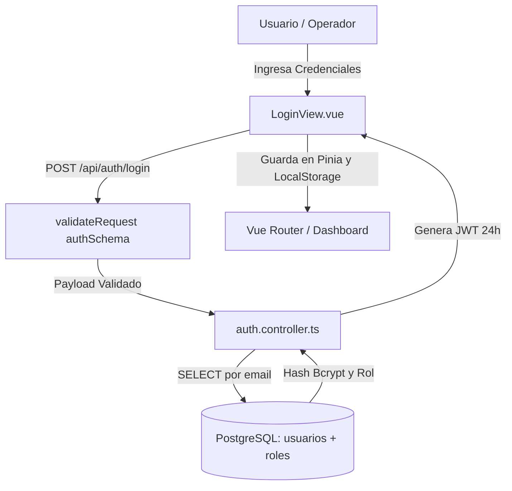
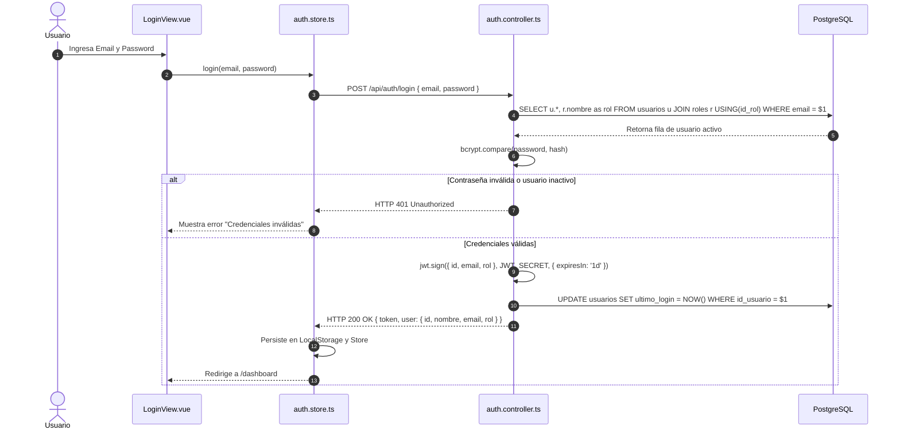
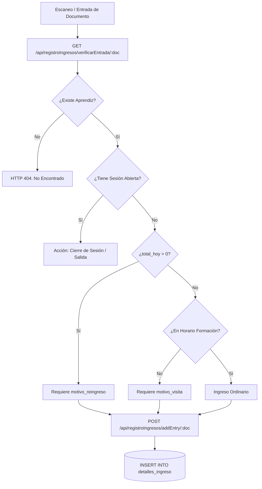
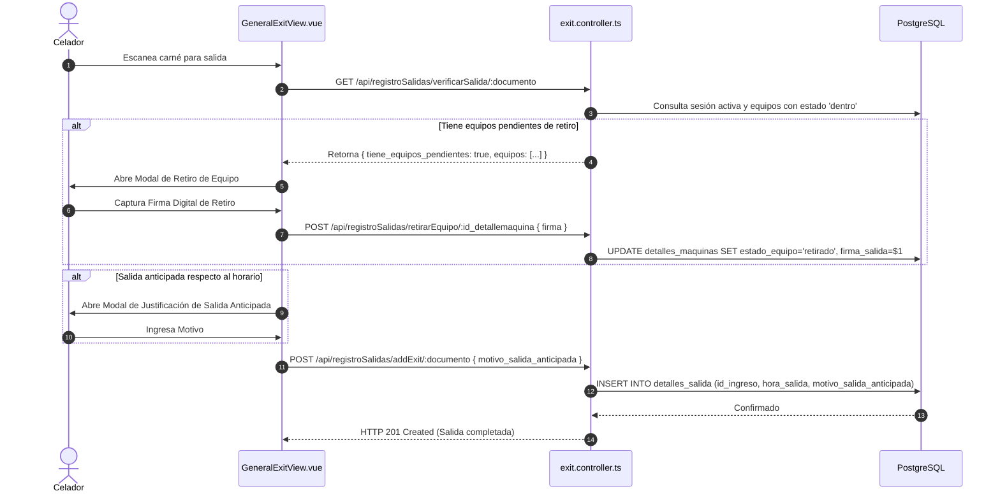
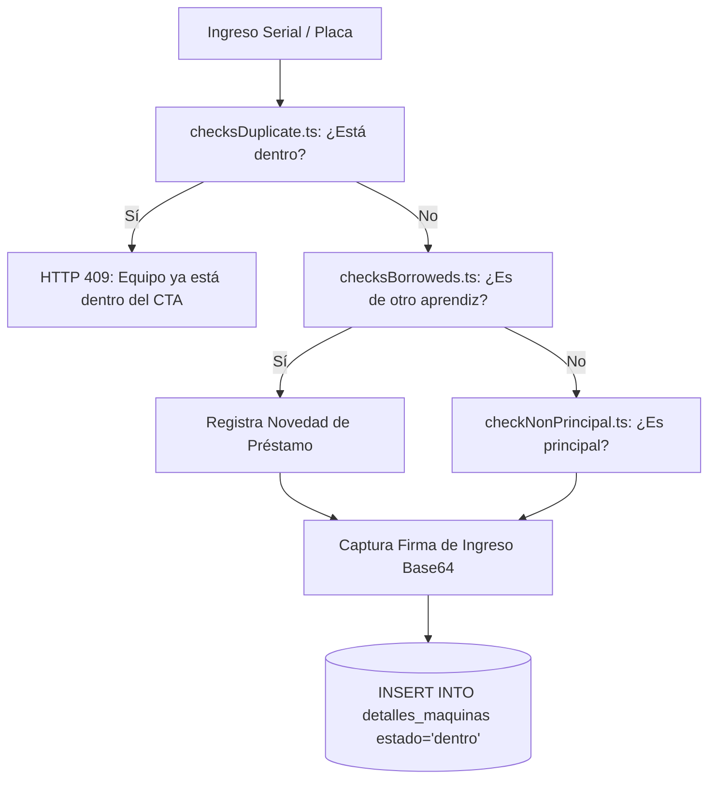
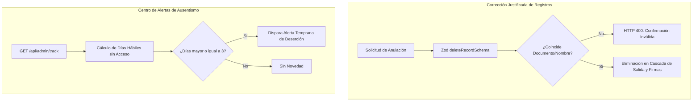
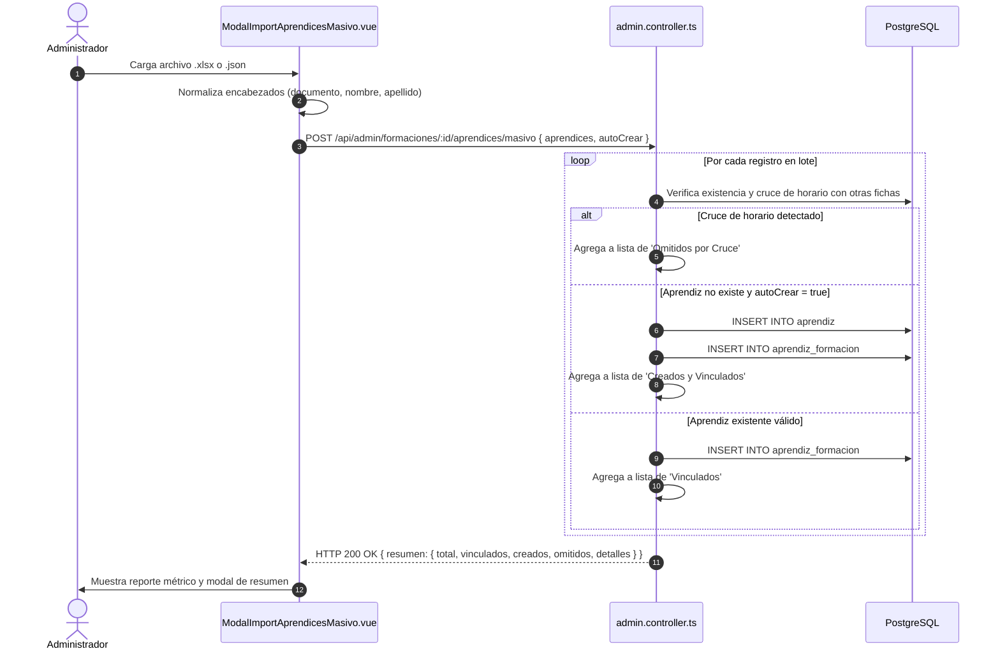

# GEDASC — Documento Técnico Maestro Modular

> **Gestión de Entradas y Salidas de Aprendices con Autenticación de Equipos y Doble Firma**  
> **Centro de Tecnología de la Amazonía (CTA) — SENA**  
> **Especificación Técnica Profunda de los 7 Módulos del Sistema**

---

## 1. Información del Documento

### 1.1 Sistema y Alcance
- **Sistema**: GEDASC (Versión 2.8).
- **Documento**: Documento Técnico Maestro Modular (Especificación Técnica Integral de los 7 Módulos Funcionales).
- **Módulos Cubiertos**:
  1. `Módulo 01: Autenticación, Sesión y Control de Acceso`
  2. `Módulo 02: Control Operativo de Ingreso y Reingreso`
  3. `Módulo 03: Control Operativo de Salida de Aprendices`
  4. `Módulo 04: Gestión de Equipos de Cómputo y Vehículos`
  5. `Módulo 05: Historial y Reportes Exportables`
  6. `Módulo 06: Administración, Monitoreo y Alertas`
  7. `Módulo 07: Gestión Curricular y Horarios Académicos`

### 1.2 Versión y Estado
- **Versión**: 2.8.0.
- **Estado**: Aprobado / Línea Base Técnica.
- **Fecha**: 18 de agosto de 2026.

---

# Módulo 01: Autenticación, Sesión y Control de Acceso

---

## 1. Información del Componente
- **Componente**: `MOD-01: Autenticación, Sesión y Control de Acceso`.
- **Versión**: 2.8.
- **Estado**: Producción / Estable.
- **Autor**: Equipo de Desarrollo GEDASC — CTA SENA.
- **Fecha**: 18 de agosto de 2026.

## 2. Descripción Técnica

### 2.1 Propósito
Gestionar la identidad, autenticación criptográfica, autorización basada en roles (RBAC) y la sincronización en tiempo real de terminales de validación móvil para el personal de vigilancia y coordinación.

### 2.2 Responsabilidad
- Validar credenciales de operadores de portería y administradores mediante contraseñas con hash Bcrypt.
- Generar y verificar tokens de acceso stateless JWT con caducidad de 24 horas (`1d`).
- Proteger rutas de API y vistas SPA mediante middlewares y Navigation Guards.
- Mantener la vinculación exclusiva y sesiones socket con terminales validadoras móviles.

### 2.3 Alcance
Afecta el inicio de sesión, cierre de sesión, guardias de ruta frontend, enlace de validador y autorización en todos los endpoints de la API.

### 2.4 Dependencias
- `jsonwebtoken`, `bcryptjs`, `zod`, `socket.io`, `pinia`, `vue-router`.

## 3. Arquitectura del Componente

### 3.1 Estructura y Capas Involucradas
```text
[Cliente: LoginView.vue / MobileValidatorView.vue]
       ↓ (HTTP REST / WebSocket)
[Frontera: Express Router + CORS + Zod validateRequest]
       ↓
[Middleware: authMiddleware + requireRole]
       ↓
[Controlador: auth.controller.ts / validator.controller.ts]
       ↓
[Persistencia: PostgreSQL (usuarios, roles, validadores_firma)]
```

### 3.2 Componentes Relacionados
- Store: `src/stores/auth.store.ts`.
- Enrutador: `src/router/index.ts`.
- Sockets: `DataBase/src/sockets/index.ts`.

### 3.3 Diagrama del Módulo



## 4. Estructura del Código

### 4.1 Archivos Principales

| Archivo | Responsabilidad |
| :--- | :--- |
| `DataBase/src/routes/auth.routes.ts` | Enrutamiento público de login y validación. |
| `DataBase/src/controllers/auth.controller.ts` | Lógica de verificación Bcrypt, generación de JWT y perfil. |
| `DataBase/src/controllers/validator.controller.ts` | Registro, vinculación, ping y desvinculación de terminales móviles. |
| `DataBase/src/middlewares/admin.middleware.ts` | Verificación de firma JWT y filtro estricto RBAC (`requireRole`). |
| `DataBase/src/schemas/auth.schema.ts` | Esquema Zod de validación para correo y contraseña. |
| `src/stores/auth.store.ts` | Estado reactivo Pinia (`token`, `user`, `role`, `isAuthenticated`). |
| `src/views/LoginView.vue` | Formulario de autenticación con feedback visual de errores. |

## 5. Flujo Técnico



## 6. API del Módulo

### 6.1 Endpoints

| Método | Ruta | Propósito | Autenticación | Roles |
| :--- | :--- | :--- | :---: | :--- |
| `POST` | `/api/auth/login` | Autenticación de usuarios y entrega de JWT. | No | Público |
| `GET` | `/api/validador/estado` | Consulta estado de vinculación del validador. | Sí | `CELADOR`, `ADMIN` |
| `POST` | `/api/validador/vincular` | Registra/asocia dispositivo validador móvil. | Sí | `CELADOR`, `ADMIN` |
| `POST` | `/api/validador/desvincular`| Libera terminal móvil asociada. | Sí | `ADMIN` |

### 6.2 Schemas (Request / Response)
- **Login Request**:
  ```json
  {
    "email": "celador@sena.edu.co",
    "password": "Password123*"
  }
  ```
- **Login Response (200 OK)**:
  ```json
  {
    "success": true,
    "token": "eyJhbGciOiJIUzI1NiIsInR5cCI6IkpXVCJ9...",
    "user": {
      "id": 2,
      "nombre": "Carlos Pérez",
      "email": "celador@sena.edu.co",
      "rol": "CELADOR"
    }
  }
  ```

## 7. Modelo de Datos y Seguridad
- **Tablas**: `usuarios`, `roles`, `validadores_firma`.
- **Restricciones**: `usuarios.email UNIQUE`, `validadores_firma.device_id UNIQUE`.
- **Seguridad**: Passwords con `bcrypt` (10 rounds), tokens JWT con payload tipificado `{ id, email, rol }`.

---

# Módulo 02: Control Operativo de Ingreso y Reingreso

---

## 1. Información del Componente
- **Componente**: `MOD-02: Control Operativo de Ingreso y Reingreso`.
- **Versión**: 2.8.
- **Estado**: Producción / Estable.

## 2. Descripción Técnica

### 2.1 Propósito
Procesar el acceso peatonal de aprendices mediante escaneo óptico o digitación de documento, evaluando en tiempo real sesiones abiertas (toggle de egreso), tolerancias horarias académicas ($\pm 30\text{ min}$), reingresos diarios y requerimientos de justificación.

### 2.2 Responsabilidad
- Verificar la existencia y estado activo del aprendiz en la tabla `aprendiz`.
- Detectar si el aprendiz ya está dentro para ejecutar el cierre automático de sesión (toggle).
- Determinar si la entrada coincide con el horario y día de una formación activa.
- Exigir motivo de visita si no hay clase programada o motivo de reingreso si `total_hoy > 0`.
- Asignar tipo de sesión (`formacion` vs `monitoria`) para aprendices monitores.

## 3. Arquitectura y Código

### 3.1 Diagrama de Procesamiento de Ingreso



### 3.2 Archivos Principales

| Archivo | Responsabilidad |
| :--- | :--- |
| `DataBase/src/routes/entry.routes.ts` | Definición de rutas `/api/registroIngresos/*`. |
| `DataBase/src/controllers/entry.controller.ts` | Lógica central de verificación, cálculo de horario y persistencia de ingreso. |
| `DataBase/src/schemas/entry.schema.ts` | Esquema Zod para validación de parámetros de documento y payload de entrada. |
| `src/views/GeneralEntryView.vue` | Vista de control operativo de portería con escáner Quagga2 y modales. |
| `src/composables/useScanAprendiz.ts` | Composable reactivo para manejo del buffer de código de barras y debounce. |

## 4. API del Módulo

### 4.1 Endpoints

| Método | Ruta | Propósito | Autenticación |
| :--- | :--- | :--- | :---: |
| `GET` | `/api/registroIngresos/verificarEntrada/:documento` | Evalúa estado del aprendiz, horarios y requisitos de justificación. | Sí |
| `POST` | `/api/registroIngresos/addEntry/:documento` | Registra formalmente el ingreso en base de datos. | Sí |
| `POST` | `/api/registroIngresos/ingresoMaquina/:id` | Vincula activo y firma digital de entrada a la sesión de ingreso. | Sí |
| `GET` | `/api/registroIngresos/maquinaPrincipal/:id_aprendiz` | Consulta equipos asignados como principales al aprendiz. | Sí |

### 4.2 Esquemas (Request / Response)
- **POST `/api/registroIngresos/addEntry/:documento` Request**:
  ```json
  {
    "tipo_sesion": "formacion",
    "motivo_reingreso": "Regreso de almuerzo",
    "motivo_visita": null,
    "id_formacion": 2694551
  }
  ```
- **Response (201 Created)**:
  ```json
  {
    "success": true,
    "message": "Ingreso registrado correctamente",
    "id_ingreso": 1042
  }
  ```

---

# Módulo 03: Control Operativo de Salida de Aprendices

---

## 1. Información del Componente
- **Componente**: `MOD-03: Control Operativo de Salida de Aprendices`.
- **Versión**: 2.8.
- **Estado**: Producción / Estable.

## 2. Descripción Técnica

### 2.1 Propósito
Garantizar el egreso seguro y ordenado de aprendices, validando que exista una sesión de ingreso abierta en el día, verificando la no retención de activos no retirados y auditando salidas anticipadas.

### 2.2 Responsabilidad
- Bloquear salidas sin ingreso previo (`ds.hora_salida IS NULL`).
- Aplicar filtro antirrebote de 5 minutos desde el ingreso (`RN-SAL-002`).
- Suspender la salida si el aprendiz posee activos en `detalles_maquinas` con `estado_equipo = 'dentro'` hasta que se capture la firma de salida.
- Exigir `motivo_salida_anticipada` si la hora de egreso es anterior a la finalización curricular.

## 3. Arquitectura y Flujo



## 4. API del Módulo

| Método | Ruta | Propósito | Autenticación |
| :--- | :--- | :--- | :---: |
| `GET` | `/api/registroSalidas/verificarSalida/:documento` | Verifica sesión abierta y equipos pendientes de retiro. | Sí |
| `POST` | `/api/registroSalidas/addExit/:documento` | Registra el egreso definitivo e inserta en `detalles_salida`. | Sí |
| `POST` | `/api/registroSalidas/retirarEquipo/:id_detallemaquina` | Registra firma de salida y marca equipo como `'retirado'`. | Sí |

---

# Módulo 04: Gestión de Equipos de Cómputo y Vehículos

---

## 1. Información del Componente
- **Componente**: `MOD-04: Gestión de Equipos de Cómputo y Vehículos`.
- **Versión**: 2.8.
- **Estado**: Producción / Estable.

## 2. Descripción Técnica

### 2.1 Propósito
Asegurar la cadena de custodia de computadores portátiles y vehículos que ingresan a la sede mediante el protocolo de doble firma digital manuscrita, detección de préstamos y bloqueo de duplicidad concurrente.

### 2.2 Responsabilidad
- Mantener el catálogo maestro de computadores (`serial`, `marca`) y vehículos (`placa`, `tipo_vehiculo`).
- Gestionar la máquina principal vs secundaria de los aprendices.
- Detectar automáticamente si un activo pertenece a otro aprendiz y marcar el registro como préstamo (`RN-ACT-001`).
- Impedir que un activo que figure con `estado_equipo = 'dentro'` sea ingresado nuevamente (`RN-ACT-003`).
- Almacenar firmas digitales en formato Base64 (`image/png`).

## 3. Arquitectura del Servicio de Máquinas



## 4. API del Módulo

| Método | Ruta | Propósito | Autenticación |
| :--- | :--- | :--- | :---: |
| `POST` | `/api/registroIngresos/ingresoMaquina/:id_ingreso` | Registra activo, firma de entrada y estado `'dentro'`. | Sí |
| `POST` | `/api/registroSalidas/retirarEquipo/:id_detallemaquina` | Captura firma de salida y cambia estado a `'retirado'`. | Sí |
| `GET` | `/api/HistorialComputadores/propietario/:id_detallemaquina` | Consulta evidencia dual de firmas y titulares de préstamo. | Sí |
| `GET` | `/api/HistorialVehiculos/propietario/:id_detallemaquina` | Consulta trazabilidad de vehículos y firmas de custodia. | Sí |

---

# Módulo 05: Historial y Reportes Exportables

---

## 1. Información del Componente
- **Componente**: `MOD-05: Historial y Reportes Exportables`.
- **Versión**: 2.8.
- **Estado**: Producción / Estable.

## 2. Descripción Técnica

### 2.1 Propósito
Suministrar herramientas de consulta cronológica, auditoría forense y exportación estructurada en PDF y Excel para la toma de decisiones institucionales y comités de centro.

### 2.2 Responsabilidad
- Ejecutar consultas históricas de movimientos de aprendices y activos en modo solo lectura para celadores (`RN-HIST-001`).
- Preservar la inmutabilidad histórica reflejando los datos exactos del momento de la transacción (`RN-HIST-002`).
- Compilar reportes PDF vectoriales con membrete oficial del CTA SENA, tablas paginadas y totales al pie.
- Generar libros de Excel formateados utilizando `xlsx (SheetJS)`.

## 3. Arquitectura de Exportación Documental

```mermaid
flowchart LR
    FILTERS[Filtros de Búsqueda\n(Fecha, Jornada, Ficha, Tipo)] --> API_CALL[POST /api/historico/historialGeneral]
    API_CALL --> DB_QUERY[(PostgreSQL: SELECT con JOINs)]
    DB_QUERY --> DATA_RESPONSE[Payload JSON con Historial Completo]
    
    DATA_RESPONSE --> PDF_ENGINE[usePdfExport.ts / jsPDF]
    DATA_RESPONSE --> EXCEL_ENGINE[useRecordReport.ts / SheetJS]
    
    PDF_ENGINE --> DOWNLOAD_PDF[Descarga Documento .PDF]
    EXCEL_ENGINE --> DOWNLOAD_XLS[Descarga Hoja de Cálculo .XLSX]
```

## 4. API del Módulo

| Método | Ruta | Propósito | Autenticación |
| :--- | :--- | :--- | :---: |
| `POST` | `/api/historico/historialGeneral` | Consulta registros históricos de acceso con filtros dinámicos. | Sí |
| `POST` | `/api/historico/historialMaquinas` | Consulta movimientos históricos de computadores y vehículos. | Sí |
| `GET` | `/api/historico/historialMaquinas/:id` | Obtiene el detalle gráfico de firmas de una sesión de máquina. | Sí |

---

# Módulo 06: Administración, Monitoreo y Alertas

---

## 1. Información del Componente
- **Componente**: `MOD-06: Administración, Monitoreo y Alertas`.
- **Versión**: 2.8.
- **Estado**: Producción / Estable.

## 2. Descripción Técnica

### 2.1 Propósito
Proveer las herramientas de control gerencial, auditoría de inasistencias prolongadas, corrección justificada de registros erróneos y administración de cuentas de celadores.

### 2.2 Responsabilidad
- Monitorear en tiempo real el aforo y las métricas trimestrales/anuales del centro (`RN-ADM-005`).
- Detectar y alertar aprendices con 3 o más días consecutivos sin ingreso dentro de sus días lectivos (`RN-ADM-004`).
- Permitir la anulación segura de registros mediante confirmación de identidad y motivo obligatorio (`RN-ADM-002`).
- Administrar el directorio maestro de aprendices aplicando baja lógica (`RN-ADM-008`).
- Gestionar exclusivamente cuentas con rol `CELADOR` (`RN-ADM-006`).

## 3. Arquitectura del Flujo de Corrección y Alertas



## 4. API del Módulo

| Método | Ruta | Propósito | Roles |
| :--- | :--- | :--- | :--- |
| `GET` | `/api/admin/statsQuarter` | Retorna estadísticas de aforo agrupadas por trimestre. | `ADMIN` |
| `GET` | `/api/admin/track` | Consulta aprendices con inasistencia prolongada ($\ge 3\text{ días}$). | `ADMIN` |
| `DELETE`| `/api/admin/ingresos/:id` | Anulación justificada de ingreso con eliminación en cascada. | `ADMIN` |
| `DELETE`| `/api/admin/salidas/:id` | Anulación justificada de registro de salida. | `ADMIN` |
| `POST` | `/api/admin/celadores` | Creación de cuentas operativas de celador (`id_rol = 2`). | `ADMIN` |
| `DELETE`| `/api/admin/aprendices/:id` | Baja lógica de aprendices preservando historial de acceso. | `ADMIN` |

---

# Módulo 07: Gestión Curricular y Horarios Académicos

---

## 1. Información del Componente
- **Componente**: `MOD-07: Gestión Curricular y Horarios Académicos`.
- **Versión**: 2.8.
- **Estado**: Producción / Estable.

## 2. Descripción Técnica

### 2.1 Propósito
Administrar la estructura curricular de soporte a la operación: programas de formación, fichas académicas, franjas horarias y matriculación masiva tolerante a fallos.

### 2.2 Responsabilidad
- Administrar programas de formación (`programa`) y cohortes/fichas (`formaciones`).
- Inferir automáticamente la jornada a partir de la hora de inicio (`RN-ACAD-004`).
- Normalizar los días habilitados en la tabla relacional `horario_dia` (`RN-ACAD-005`).
- Detectar y bloquear cruces de horario en aprendices con doble formación (`RN-ACAD-008`).
- Ejecutar desvinculaciones masivas atómicas de cohortes (`RN-ACAD-007`).
- Procesar importación masiva de aprendices desde Excel con reporte detallado de novedades (`RN-ACAD-009`, `RN-ACAD-010`).

## 3. Arquitectura de Ingesta Masiva y Horarios



## 4. API del Módulo

| Método | Ruta | Propósito | Roles |
| :--- | :--- | :--- | :--- |
| `GET` | `/api/admin/programas` | Lista programas curriculares vigentes. | `ADMIN` |
| `POST` | `/api/admin/programas` | Crea nuevo programa curricular institucional. | `ADMIN` |
| `GET` | `/api/admin/horarios` | Consulta horarios con días y jornada calculada. | `ADMIN` |
| `POST` | `/api/admin/horarios` | Crea franja horaria e inserta tuplas en `horario_dia`. | `ADMIN` |
| `PUT` | `/api/admin/horarios/:id` | Modifica horario con validación estricta de cruces. | `ADMIN` |
| `POST` | `/api/admin/formaciones` | Crea ficha formativa vinculada a programa y horario. | `ADMIN` |
| `DELETE`| `/api/admin/formaciones/:id/aprendices/todos` | Desvinculación atómica de cohorte. | `ADMIN` |
| `POST` | `/api/admin/formaciones/:id/aprendices/masivo` | Ingesta masiva tolerante a fallos desde Excel. | `ADMIN` |

---

## 5. Matriz Técnica Comparativa de Módulos

| Módulo | Tablas de Persistencia | Endpoints Clave | Controladores Principales | Schemas Zod |
| :--- | :--- | :--- | :--- | :--- |
| **01. Autenticación** | `usuarios`, `roles`, `validadores_firma` | `/api/auth/login`, `/api/validador/*` | `auth.controller.ts`, `validator.controller.ts` | `auth.schema.ts` |
| **02. Control Ingreso** | `detalles_ingreso`, `aprendiz`, `horario` | `/api/registroIngresos/*` | `entry.controller.ts`, `jornada.controller.ts` | `entry.schema.ts` |
| **03. Control Salida** | `detalles_salida`, `detalles_ingreso` | `/api/registroSalidas/*` | `exit.controller.ts` | `exit.schema.ts` |
| **04. Equipos/Vehículos**| `computadores`, `vehiculos`, `detalles_maquinas` | `/api/HistorialComputadores/*`, `/api/HistorialVehiculos/*` | `computer.controller.ts`, `vehicle.controller.ts`, `services/machines/*` | `machine.schema.ts` |
| **05. Historial/Reportes**| Vistas relacionales con `JOIN` | `/api/historico/*` | `history.controller.ts` | Validación en Query |
| **06. Administración** | Auditoría y agregaciones | `/api/admin/stats*`, `/api/admin/track`, `/api/admin/ingresos/*` | `admin.controller.ts`, `stats.controller.ts` | `admin.schema.ts` |
| **07. Gestión Académica**| `programa`, `formaciones`, `horario`, `horario_dia`, `aprendiz_formacion` | `/api/admin/formaciones/*`, `/api/admin/horarios/*`, `/api/admin/programas/*` | `admin.controller.ts` | `admin.schema.ts` |

---

## 6. Referencias Documentales

- **Documento Técnico Integral**: [`documentacion/documento_tecnico_integral.md`](file:///c:/Users/alejo/Downloads/primerProyecto/GEDASC/documentacion/documento_tecnico_integral.md)
- **Reglas de Negocio Generales y Transversales**: [`documentacion/reglas_negocio_generales.md`](file:///c:/Users/alejo/Downloads/primerProyecto/GEDASC/documentacion/reglas_negocio_generales.md)
- **Índice General de Módulos**: [`documentacion/DOCUMENTACION_GENERAL.md`](file:///c:/Users/alejo/Downloads/primerProyecto/GEDASC/documentacion/DOCUMENTACION_GENERAL.md)
- **Repositorio Oficial**: `https://github.com/DanExl24/GEDASC.git` (Rama `GEDASC-V2`)
