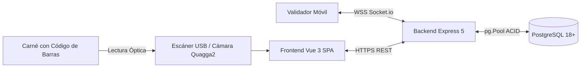

# Especificación de Requisitos de Software (SRS) — Norma IEEE Std 830-1998

---

## Proyecto: GEDASC
**Gestión de Entradas y Salidas de Aprendices con Autenticación de Equipos y Doble Firma**  
**Centro de Tecnología de la Amazonía (CTA) — SENA Regional Caquetá**  
**Versión de Revisión**: 2.8 Oficial

---

# Ficha del Documento

| Fecha | Revisión | Autor | Verificado Dep. Calidad |
| :--- | :---: | :--- | :--- |
| 18/08/2026 | 2.8 | Equipo de Ingeniería de Software — GEDASC | Aprobado — Comité Técnico CTA |

### Documento validado por las partes en fecha: 18 de agosto de 2026

| Por el Cliente (SENA — CTA) | Por el Equipo de Desarrollo |
| :--- | :--- |
| **Fdo.** Coordinación Académica y de Formación | **Fdo.** Líder Técnico y Arquitecto de Software |

---

# Contenido

- [1 Introducción](#1-introducción)
  - [1.1 Propósito](#11-propósito)
  - [1.2 Alcance](#12-alcance)
  - [1.3 Personal involucrado](#13-personal-involucrado)
  - [1.4 Definiciones, acrónimos y abreviaturas](#14-definiciones-acrónimos-y-abreviaturas)
  - [1.5 Referencias](#15-referencias)
  - [1.6 Resumen](#16-resumen)
- [2 Descripción general](#2-descripción-general)
  - [2.1 Perspectiva del producto](#21-perspectiva-del-producto)
  - [2.2 Funcionalidad del producto](#22-funcionalidad-del-producto)
  - [2.3 Características de los usuarios](#23-características-de-los-usuarios)
  - [2.4 Restricciones](#24-restricciones)
  - [2.5 Suposiciones y dependencias](#25-suposiciones-y-dependencias)
  - [2.6 Evolución previsible del sistema](#26-evolución-previsible-del-sistema)
- [3 Requisitos específicos](#3-requisitos-específicos)
  - [3.1 Requisitos comunes de los interfaces](#31-requisitos-comunes-de-los-interfaces)
  - [3.2 Requisitos funcionales](#32-requisitos-funcionales)
  - [3.3 Requisitos no funcionales](#33-requisitos-no-funcionales)
  - [3.4 Otros requisitos](#34-otros-requisitos)
- [4 Apéndices](#4-apéndices)

---

# 1 Introducción

## 1.1 Propósito
El presente documento de **Especificación de Requisitos de Software (SRS)** tiene como objetivo formalizar y definir de manera no ambigua, completa y verificable todos los requisitos funcionales, no funcionales, interfaces y restricciones del sistema **GEDASC**, de conformidad con el estándar internacional **IEEE Std 830-1998**.

Este documento está dirigido a:
- Desarrolladores y arquitectos de software encargados del mantenimiento e implementación.
- Equipo de Aseguramiento de Calidad (QA) para el diseño y ejecución de matrices de prueba.
- Coordinadores académicos, supervisores de seguridad y auditores del SENA Regional Caquetá.

## 1.2 Alcance
El software a desarrollar se denomina **GEDASC** (*Gestión de Entradas y Salidas de Aprendices con Autenticación de Equipos y Doble Firma*).

El sistema cubre:
- El registro y validación en tiempo real del acceso peatonal de los aprendices mediante escaneo óptico de carnés.
- La custodia digital con valor probatorio de computadores portátiles y vehículos mediante captura de **doble firma digital manuscrita** (ingreso y egreso).
- La validación curricular con margen de tolerancia ($\pm 30\text{ min}$) y clasificación automática de jornadas lectivas.
- La gestión de reingresos diarios, visitas extraordinarias y clasificación de sesiones para aprendices monitores.
- El monitoreo analítico de aforo y centro de alertas tempranas por inasistencia prolongada ($\ge 3\text{ días}$).
- La sincronización inalámbrica en tiempo real con terminales validadoras móviles vía WebSockets.

## 1.3 Personal Involucrado

| Nombre | Rol | Categoría Profesional | Responsabilidades | Información de Contacto | Aprobación |
| :--- | :--- | :--- | :--- | :--- | :---: |
| **Jorge Alejandro Peña** | Product Owner / Arquitecto | Ingeniero de Software | Definición de arquitectura, validación de reglas de negocio | `jorge_apena3@soy.sena.edu.co` | ✅ |
| **Equipo de Desarrollo** | Equipo Scrum | Desarrolladores Full-Stack | Construcción de frontend, backend, APIs y pruebas | `devs@gedasc.sena.edu.co` | ✅ |
| **Coordinación CTA** | Stakeholder / Cliente | Coordinador Académico | Validación de normatividad SENA y aprobación funcional | `coordinacion_cta@sena.edu.co` | ✅ |
| **Personal de Vigilancia** | Usuario Final | Operador de Seguridad | Pruebas de campo en portería y validación operativa | `vigilancia_cta@sena.edu.co` | ✅ |

## 1.4 Definiciones, Acrónimos y Abreviaturas
- **CTA**: Centro de Tecnología de la Amazonía (SENA Regional Caquetá).
- **Ficha**: Identificador numérico oficial de 6 o 7 dígitos asignado a una cohorte académica.
- **Aprendiz**: Estudiante matriculado en el Servicio Nacional de Aprendizaje (SENA).
- **Toggle de Salida**: Mecanismo que convierte automáticamente el escaneo de un aprendiz con sesión abierta en un registro de egreso.
- **Doble Firma**: Registro de una firma digital al entrar un activo y una segunda firma al retirarlo físicamente.
- **RBAC**: *Role-Based Access Control* (Control de acceso basado en roles `ADMIN` y `CELADOR`).
- **JWT**: *JSON Web Token* (Estándar de token criptográfico para autenticación stateless).
- **SRS**: *Software Requirements Specification* (Especificación de Requisitos de Software).

## 1.5 Referencias
1. **IEEE Std 830-1998**: *IEEE Recommended Practice for Software Requirements Specifications*.
2. **Documento Técnico Integral**: [`documentacion/tecnico_integral/documento_tecnico_integral.md`](file:///c:/Users/alejo/Downloads/primerProyecto/GEDASC/documentacion/tecnico_integral/documento_tecnico_integral.md).
3. **Reglas de Negocio Generales**: [`documentacion/reglas_generales/reglas_negocio_generales.md`](file:///c:/Users/alejo/Downloads/primerProyecto/GEDASC/documentacion/reglas_generales/reglas_negocio_generales.md).
4. **Diccionario de Datos Oficial**: [`documentacion/dic/diccionario_datos.md`](file:///c:/Users/alejo/Downloads/primerProyecto/GEDASC/documentacion/dic/diccionario_datos.md).
5. **Manual Técnico del Desarrollador**: [`documentacion/manual_tecnico/manual_tecnico_desarrollador.md`](file:///c:/Users/alejo/Downloads/primerProyecto/GEDASC/documentacion/manual_tecnico/manual_tecnico_desarrollador.md).

## 1.6 Resumen
El resto del documento se estructura en:
- **Sección 2**: Visión general, perspectiva del producto, factores de usuario y restricciones.
- **Sección 3**: Requisitos específicos de interfaces, catálogo de Requisitos Funcionales (RF) estructurados en fichas normalizadas, y Requisitos No Funcionales (RNF) de rendimiento, seguridad y disponibilidad.
- **Sección 4**: Apéndices con matrices de trazabilidad y diagramas de soporte.

---

# 2 Descripción General

## 2.1 Perspectiva del Producto
GEDASC es un sistema autónomo e independiente implementado para operar en la red de área local (LAN) del Centro de Tecnología de la Amazonía. Se comunica bidireccionalmente entre estaciones fijas de portería y dispositivos móviles mediante WebSockets.

## 2.2 Funcionalidad del Producto
1. **Control de Acceso Inmediato**: Validación óptica de identidad en $< 2\text{ segundos}$.
2. **Toggle Automático de Sesión**: Cierre de sesión automático si el aprendiz ya está dentro.
3. **Cadena de Custodia con Doble Firma**: Bloqueo de egreso para portadores de activos sin firma de retiro.
4. **Validación de Horarios**: Tolerancia de $\pm 30\text{ minutos}$ y solicitud de motivos ante excepciones.
5. **Prevención de Deserción**: Alerta temprana ante 3 días continuos de inasistencia lectiva.
6. **Importación Masiva**: Carga de matrículas desde archivos Excel `.xlsx`.
7. **Reportes Exportables**: Emisión de documentos oficiales en PDF y Excel con filtros multicriterio.

## 2.3 Características de los Usuarios

| Tipo de Usuario | Nivel Educacional / Formación | Habilidades Técnicas | Actividades Principales |
| :--- | :--- | :--- | :--- |
| **CELADOR** | Bachiller / Técnico en Seguridad | Operación básica de computadores y pantallas táctiles | Escaneo de carnés, solicitud de firmas, verificación física de seriales y consulta histórica. |
| **ADMINISTRADOR** | Profesional / Tecnólogo en Sistemas / Coordinador | Gestión de software, hojas de cálculo y bases de datos | Administración curricular, control de horarios, carga masiva, auditoría, anulación y alertas. |
| **APRENDIZ** | Estudiante Técnico / Tecnólogo | Usuario común de dispositivos móviles | Presentación de carné físico y suscripción de firma manuscrita digital. |

## 2.4 Restricciones
- **Motor de Base de Datos**: PostgreSQL 16.x o superior obligatorio.
- **Compatibilidad Web**: La aplicación debe ejecutarse en navegadores compatibles con HTML5 Canvas y WebSockets.
- **Entorno de Red**: Funcionamiento autónomo en red local LAN sin requerir conexión a internet pública.
- **Seguridad en Captura**: El validador móvil requiere HTTPS local para habilitar permisos de cámara web.

## 2.5 Suposiciones y Dependencias
- Se asume que los carnés de los aprendices disponen de códigos de barras legibles bajo estándar Code 128 o EAN.
- Se asume disponibilidad continua del suministro eléctrico y red local en el puesto de portería.

## 2.6 Evolución Previsible del Sistema
- Integración futura con torniquetes y talanqueras físicas mediante microcontroladores (ESP32 / Arduino).
- Reconocimiento biométrico facial complementario.

---

# 3 Requisitos Específicos

## 3.1 Requisitos Comunes de los Interfaces

### 3.1.1 Interfaces de Usuario
- Interfaz web responsiva construida con TailwindCSS, adaptada tanto a pantallas de alta resolución ($1920 \times 1080$) como a tablets y smartphones ($360 \times 640$).
- Modal interactivo con Canvas HTML5 para captura de firmas manuscritas con botón de limpieza y guardado.

### 3.1.2 Interfaces de Hardware
- Soporte para pistolas lectoras de código de barras USB en emulación de teclado (*HID Keyboard Emulation*).
- Soporte para cámaras web integradas y sensores de cámara trasera de teléfonos móviles.

### 3.1.3 Interfaces de Software
- Motor de base de datos relacional PostgreSQL conectado mediante driver nativo `pg`.

### 3.1.4 Interfaces de Comunicación
- Protocolo HTTP/1.1 y HTTPS para intercambio de mensajes JSON RESTful.
- Protocolo WebSocket seguro (`wss://`) mediante Socket.io para comunicación en tiempo real.

---

## 3.2 Requisitos Funcionales

---

### RF-01: Autenticación y Control de Sesión RBAC

| Número de Requisito | **RF-01** |
| :--- | :--- |
| **Nombre de Requisito** | Autenticación de Usuarios y Control de Acceso Basado en Roles |
| **Tipo** | Requisito Funcional |
| **Fuente del Requisito** | Módulo 01 (`HU-AUTH-001`, `RN-AUTH-001`, `RN-AUTH-002`) |
| **Prioridad** | **Alta / Esencial** |

**Descripción**:  
El sistema debe autenticar a celadores y administradores mediante correo institucional y contraseña encriptada con Bcrypt, emitiendo un token JWT con vigencia de 24 horas y restringiendo las vistas según el rol asignado (`ADMIN` o `CELADOR`).

---

### RF-02: Escaneo Peatonal y Verificación de Horario

| Número de Requisito | **RF-02** |
| :--- | :--- |
| **Nombre de Requisito** | Verificación y Registro de Ingreso Peatonal con Tolerancia Horaria |
| **Tipo** | Requisito Funcional |
| **Fuente del Requisito** | Módulo 02 (`HU-ING-001`, `RN-ING-001`, `RN-ING-007`) |
| **Prioridad** | **Alta / Esencial** |

**Descripción**:  
El sistema debe identificar al aprendiz al escanear su código de barras o digitar su documento, verificar que su estado sea activo y constatar si la hora actual se encuentra dentro del rango de clase de su ficha formativa considerando una ventana de tolerancia de $\pm 30\text{ minutos}$.

---

### RF-03: Toggle Automático de Salida

| Número de Requisito | **RF-03** |
| :--- | :--- |
| **Nombre de Requisito** | Cierre Automático de Sesión por Re-escaneo (Toggle de Salida) |
| **Tipo** | Requisito Funcional |
| **Fuente del Requisito** | Módulo 02 y Módulo 03 (`HU-ING-003`, `RN-ING-004`, `RN-SAL-001`) |
| **Prioridad** | **Alta / Esencial** |

**Descripción**:  
Si un aprendiz que ya posee un ingreso registrado en el día y cuya salida no ha sido asentada (`hora_salida IS NULL`) es escaneado nuevamente en portería, el sistema debe registrar automáticamente su egreso formal sin requerir que el celador cambie manualmente de pantalla.

---

### RF-04: Cadena de Custodia con Doble Firma Digital

| Número de Requisito | **RF-04** |
| :--- | :--- |
| **Nombre de Requisito** | Registro y Retiro de Activos con Firma Digital Manuscrita |
| **Tipo** | Requisito Funcional |
| **Fuente del Requisito** | Módulo 04 (`HU-ACT-001`, `RN-ACT-005`, `RN-ACT-008`) |
| **Prioridad** | **Alta / Esencial** |

**Descripción**:  
El sistema debe permitir asociar computadores portátiles y vehículos a la sesión de ingreso del aprendiz, capturando obligatoriamente su firma manuscrita digital de entrada (`estado_equipo = 'dentro'`). Al registrar el egreso, el sistema debe exigir una segunda firma manuscrita de retiro para cambiar el estado a `'retirado'`.

---

### RF-05: Bloqueo de Egreso por Activos Retenidos

| Número de Requisito | **RF-05** |
| :--- | :--- |
| **Nombre de Requisito** | Suspensión y Bloqueo de Salida por Activos No Retirados |
| **Tipo** | Requisito Funcional |
| **Fuente del Requisito** | Módulo 03 y Módulo 04 (`HU-SAL-003`, `RN-SAL-003`, `RN-GEN-025`) |
| **Prioridad** | **Alta / Esencial** |

**Descripción**:  
El sistema debe impedir el cierre de la sesión de permanencia y el paso peatonal de cualquier aprendiz que figure con uno o más activos en estado `'dentro'`, abriendo obligatoriamente el modal de retiro y captura de firma.

---

### RF-06: Detección Automática de Préstamos y No Concurrencia

| Número de Requisito | **RF-06** |
| :--- | :--- |
| **Nombre de Requisito** | Clasificación de Préstamos y Control de Duplicidad de Activos |
| **Tipo** | Requisito Funcional |
| **Fuente del Requisito** | Módulo 04 (`HU-ACT-003`, `RN-ACT-001`, `RN-ACT-003`) |
| **Prioridad** | **Media / Deseado** |

**Descripción**:  
El sistema debe detectar si el serial o placa ingresado pertenece a un titular distinto para marcar la sesión como préstamo, y debe bloquear el registro si el equipo ya figura físicamente dentro de las instalaciones.

---

### RF-07: Captura de Justificaciones Operativas

| Número de Requisito | **RF-07** |
| :--- | :--- |
| **Nombre de Requisito** | Captura Obligatoria de Motivos de Reingreso, Visita y Salida Anticipada |
| **Tipo** | Requisito Funcional |
| **Fuente del Requisito** | Módulo 02 y Módulo 03 (`RN-ING-008`, `RN-ING-009`, `RN-SAL-005`) |
| **Prioridad** | **Alta / Esencial** |

**Descripción**:  
El sistema debe exigir la captura de texto descriptivo justificativo cuando:
1. El aprendiz reingresa en el mismo día (`motivo_reingreso`).
2. El aprendiz asiste fuera de su horario lectivo (`motivo_visita`).
3. El aprendiz abandona el centro antes de la hora final de su clase (`motivo_salida_anticipada`).

---

### RF-08: Sincronización en Tiempo Real del Validador Móvil

| Número de Requisito | **RF-08** |
| :--- | :--- |
| **Nombre de Requisito** | Enlace y Despacho de Eventos Móviles vía WebSockets |
| **Tipo** | Requisito Funcional |
| **Fuente del Requisito** | Módulo 01 (`HU-AUTH-004`, `RN-AUTH-007`) |
| **Prioridad** | **Media / Deseado** |

**Descripción**:  
El sistema debe permitir vincular un smartphone mediante código QR/token y transmitir instantáneamente los códigos de barra leídos por la cámara y las firmas capturadas en pantalla táctil hacia el puesto de control principal.

---

### RF-09: Centro de Alertas de Ausentismo Prolongado

| Número de Requisito | **RF-09** |
| :--- | :--- |
| **Nombre de Requisito** | Detección Automática de Inasistencias Consecutivas ($\ge 3\text{ Días}$) |
| **Tipo** | Requisito Funcional |
| **Fuente del Requisito** | Módulo 06 (`HU-ADM-004`, `RN-ADM-004`) |
| **Prioridad** | **Alta / Esencial** |

**Descripción**:  
El sistema debe calcular y listar en tiempo real a los aprendices matriculados en fichas activas que acumulen 3 o más días continuos sin registrar acceso en sus días lectivos obligatorios.

---

### RF-10: Anulación Justificada de Registros con Doble Confirmación

| Número de Requisito | **RF-10** |
| :--- | :--- |
| **Nombre de Requisito** | Corrección y Anulación Controlada de Movimientos Erróneos |
| **Tipo** | Requisito Funcional |
| **Fuente del Requisito** | Módulo 06 (`HU-ADM-002`, `RN-ADM-002`, `RN-ADM-003`) |
| **Prioridad** | **Alta / Esencial** |

**Descripción**:  
El sistema debe permitir al administrador anular registros erróneos de entrada o salida, exigiendo redigitar el número de documento exacto del aprendiz y documentar el motivo formal ($\ge 5\text{ caracteres}$), ejecutando el borrado en cascada atómico.

---

### RF-11: Gestión Curricular y Detección de Cruces de Horario

| Número de Requisito | **RF-11** |
| :--- | :--- |
| **Nombre de Requisito** | Administración de Fichas, Horarios y Prevención de Cruces |
| **Tipo** | Requisito Funcional |
| **Fuente del Requisito** | Módulo 07 (`HU-ACAD-001`, `RN-ACAD-004`, `RN-ACAD-008`) |
| **Prioridad** | **Alta / Esencial** |

**Descripción**:  
El sistema debe permitir la creación de programas, horarios con inferencia automática de jornada (Mañana, Tarde, Noche) y fichas formativas, impidiendo que un aprendiz sea matriculado en dos fichas con horarios solapados en el mismo día.

---

### RF-12: Importación Masiva de Aprendices desde Excel

| Número de Requisito | **RF-12** |
| :--- | :--- |
| **Nombre de Requisito** | Carga Masiva de Matrículas desde Archivos `.xlsx` |
| **Tipo** | Requisito Funcional |
| **Fuente del Requisito** | Módulo 07 (`HU-ACAD-006`, `RN-ACAD-009`, `RN-ACAD-010`) |
| **Prioridad** | **Alta / Esencial** |

**Descripción**:  
El sistema debe procesar listas masivas de aprendices desde archivos Excel, registrando a los nuevos, vinculándolos a la ficha seleccionada y emitiendo un reporte final de registros conflictivos sin detener la transacción de los válidos.

---

### RF-13: Exportación de Reportes Oficiales en PDF y Excel

| Número de Requisito | **RF-13** |
| :--- | :--- |
| **Nombre de Requisito** | Generación de Informes Oficiales Vectoriales y Tabulares |
| **Tipo** | Requisito Funcional |
| **Fuente del Requisito** | Módulo 05 (`HU-HIST-004`, `RN-HIST-003`) |
| **Prioridad** | **Alta / Esencial** |

**Descripción**:  
El sistema debe compilar reportes en formato PDF con membrete institucional del SENA, numeración de página, usuario emisor y totales al pie, así como libros de cálculo Excel `.xlsx` aplicando los filtros de fecha y ficha seleccionados.

---

## 3.3 Requisitos No Funcionales

### 3.3.1 Requisitos de Rendimiento
- **RNF-01 (Tiempo de Respuesta en Portería)**: El 95% de las lecturas y verificaciones de carné deben completarse en un tiempo inferior a $2\text{ segundos}$.
- **RNF-02 (Concurrencia)**: El backend debe soportar al menos 50 peticiones simultáneas concurrentes sin degradación de latencia ($< 100\text{ ms}$).

### 3.3.2 Seguridad
- **RNF-03 (Protección Criptográfica)**: Las contraseñas deben almacenarse obligatoriamente hasheadas con algoritmo `bcrypt` (factor de costo 10).
- **RNF-04 (Protección contra Inyección SQL)**: El 100% de las consultas a la base de datos deben utilizar queries parametrizadas (`$1, $2, ...`).
- **RNF-05 (Validación Estricta)**: Toda carga útil entrante en la API debe ser validada contra esquemas Zod en la frontera de la aplicación.

### 3.3.3 Fiabilidad
- **RNF-06 (Transaccionalidad ACID)**: Toda operación compleja (ingreso con activos o anulación) debe ejecutarse bajo transacciones SQL (`BEGIN ... COMMIT / ROLLBACK`).

### 3.3.4 Disponibilidad
- **RNF-07 (Disponibilidad Operativa)**: El sistema debe garantizar un $99.5\%$ de disponibilidad durante las jornadas de formación presencial del centro (06:00 a 22:30 horas, Lunes a Sábado).

### 3.3.5 Mantenibilidad
- **RNF-08 (Tipado y Arquitectura Modular)**: El monorepo debe mantener tipado estricto en TypeScript en frontend y backend, con arquitectura de controladores y servicios desacoplados.

### 3.3.6 Portabilidad
- **RNF-09 (Independencia de Navegador y OS)**: El frontend debe funcionar de manera idéntica en Windows, Linux, macOS, Android e iOS a través de navegadores estándar basados en Chromium, Gecko o WebKit.

## 3.4 Otros Requisitos

### 3.4.1 Requisitos Legales y de Custodia Probatoria
- Las firmas manuscritas digitales almacenadas en Base64 deben conservarse de manera inmutable para responder ante investigaciones internas o requerimientos judiciales de pérdida de bienes.

### 3.4.2 Habeas Data y Protección de Datos Personales
- Los datos de aprendices y registros de asistencia deben tratarse con estricta confidencialidad institucional conforme a la Ley 1581 de 2012 de la República de Colombia.

---

# 4 Apéndices

### 4.1 Matriz de Trazabilidad de Requisitos (IEEE 830 $\longleftrightarrow$ Reglas $\longleftrightarrow$ Módulos)

| Requisito IEEE | Nombre del Requisito | Regla de Negocio | Historia de Usuario | Módulo del Sistema |
| :---: | :--- | :---: | :---: | :---: |
| **RF-01** | Autenticación y RBAC | `RN-AUTH-001`, `RN-AUTH-002` | `HU-AUTH-001` | `01_autenticacion_acceso` |
| **RF-02** | Verificación Peatonal y Horario | `RN-ING-001`, `RN-ING-007` | `HU-ING-001` | `02_control_ingreso` |
| **RF-03** | Toggle Automático de Salida | `RN-ING-004`, `RN-SAL-001` | `HU-ING-003` | `02_control_ingreso`, `03_control_salida` |
| **RF-04** | Doble Firma Digital de Activos | `RN-ACT-005`, `RN-ACT-008` | `HU-ACT-001` | `04_equipos_vehiculos` |
| **RF-05** | Bloqueo por Activos Retenidos | `RN-SAL-003`, `RN-GEN-025` | `HU-SAL-003` | `03_control_salida`, `04_equipos_vehiculos` |
| **RF-06** | Detección de Préstamos | `RN-ACT-001`, `RN-ACT-003` | `HU-ACT-003` | `04_equipos_vehiculos` |
| **RF-07** | Captura de Justificaciones | `RN-ING-008`, `RN-SAL-005` | `HU-ING-004` | `02_control_ingreso`, `03_control_salida` |
| **RF-08** | Validador Móvil en Tiempo Real | `RN-AUTH-007` | `HU-AUTH-004` | `01_autenticacion_acceso` |
| **RF-09** | Alertas de Ausentismo (3 Días) | `RN-ADM-004` | `HU-ADM-004` | `06_administracion_monitoreo` |
| **RF-10** | Anulación con Doble Factor | `RN-ADM-002`, `RN-ADM-003` | `HU-ADM-002` | `06_administracion_monitoreo` |
| **RF-11** | Gestión Curricular y Horarios | `RN-ACAD-001`, `RN-ACAD-008` | `HU-ACAD-001` | `07_gestion_academica` |
| **RF-12** | Carga Masiva desde Excel | `RN-ACAD-009`, `RN-ACAD-010` | `HU-ACAD-006` | `07_gestion_academica` |
| **RF-13** | Reportes en PDF y Excel | `RN-HIST-003`, `RN-HIST-004` | `HU-HIST-004` | `05_historial_reportes` |
