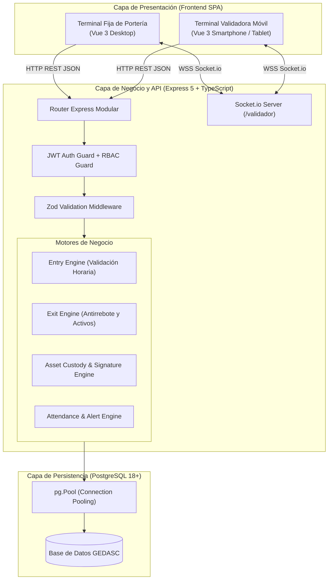
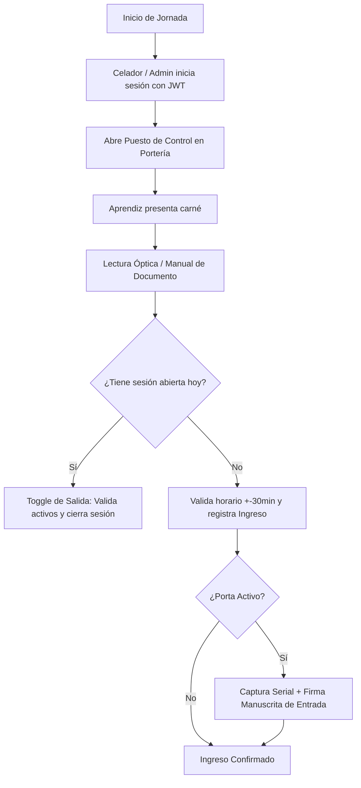

# MANUAL TÉCNICO — GEDASC

> **Gestión de Entradas y Salidas de Aprendices con Autenticación de Equipos y Doble Firma**  
> **Centro de Tecnología de la Amazonía (CTA) — SENA Regional Caquetá**  
> **Guía Oficial de Ingeniería y Manual de Referencia para Desarrolladores**

---

# 1. Introducción

### 1.1 Objetivo del Documento
El presente **Manual Técnico** tiene como propósito guiar a los ingenieros de software, desarrolladores full-stack y personal de soporte que asumirán el mantenimiento, evolución y despliegue del sistema **GEDASC**. Proporciona una explicación detallada de la arquitectura, patrones de diseño, estructura del código fuente, modelos de datos, contratos de la API RESTful, procedimientos de instalación, pruebas y protocolos de seguridad.

### 1.2 Alcance
Este manual abarca la totalidad del monorepo de GEDASC:
- **Frontend SPA**: Desarrollado con Vue 3 (Composition API), Vite, Pinia y TailwindCSS.
- **Backend API & Real-Time Hub**: Desarrollado con Node.js, Express 5, TypeScript, Zod y Socket.io.
- **Persistencia Relacional**: Base de datos PostgreSQL con transaccionalidad ACID y pooling de alto rendimiento.
- **Mecanismos de Hardware y Captura**: Integración de cámaras para lectura óptica de códigos de barras (Quagga2) y paneles táctiles para firmas digitales manuscritas (Signature Pad).

### 1.3 Descripción General del Sistema
GEDASC es una plataforma de misión crítica diseñada para digitalizar y automatizar el control de acceso peatonal, la gestión de permanencia lectiva y la cadena de custodia de equipos de cómputo y vehículos en el **Centro de Tecnología de la Amazonía (CTA)** del SENA. Reemplaza las tradicionales minutas de papel por un sistema en tiempo real basado en sesiones dinámicas, validación curricular horaria ($\pm 30\text{ min}$) y doble firma digital manuscrita con respaldo probatorio.

---

# 2. Arquitectura del Sistema

### 2.1 Arquitectura General
GEDASC adopta una arquitectura desacoplada basada en el patrón **SPA + API REST Stateless + WebSocket Real-Time Hub**:



### 2.2 Arquitectura del Frontend
El frontend es una Single Page Application (SPA) modular estructurada bajo la Composition API de Vue 3:
- **Gestión de Vistas y Layouts**: Vistas divididas por rol (`Admin*.vue`, `GeneralEntryView.vue`, `GeneralExitView.vue`, `MobileValidatorView.vue`).
- **Estado Global con Pinia**: Manejo desacoplado de la autenticación (`useAuthStore`), información del usuario logueado y estado de la jornada.
- **Enrutador Blindado**: `Vue Router` intercepta la navegación mediante Navigation Guards globales (`router.beforeEach`), verificando la presencia del JWT en `localStorage` y contrastando el rol del usuario con los metadatos de la ruta (`meta: { requiresAuth: true, roles: ['ADMIN'] }`).

### 2.3 Arquitectura del Backend
El backend sigue el patrón **Controlador - Servicio - Acceso a Datos**:
- **Punto de Entrada (`server.ts`)**: Configura CORS, cabeceras de seguridad, parseo de JSON (`express.json({ limit: '10mb' })` para firmas Base64) y levanta el servidor HTTP junto con Socket.io.
- **Rutas (`routes/`)**: Mapeo declarativo de URIs asociado a middlewares de validación Zod y controladores.
- **Controladores (`controllers/`)**: Orquestación de peticiones HTTP, invocación de utilidades de dominio y retorno de respuestas tipificadas.
- **Acceso a Datos (`config/db.ts`)**: Pool único de PostgreSQL (`pg.Pool`) ejecutando consultas SQL parametrizadas.

### 2.4 Base de Datos
PostgreSQL opera como motor relacional primario. Las tablas están normalizadas en Tercera Forma Normal (3FN), asegurando integridad referencial con claves foráneas (`ON DELETE CASCADE` en elementos subordinados y `ON DELETE SET NULL` en relaciones históricas).

### 2.5 Comunicación entre Componentes
- **Frontend $\leftrightarrow$ Backend**: Peticiones asíncronas vía `fetch` / `axios` con cabecera `Authorization: Bearer <TOKEN>`.
- **Validador Móvil $\leftrightarrow$ Terminal de Portería**: Comunicación bidireccional mediante eventos Socket.io (`validator:scanned`, `validator:signature_saved`).

### 2.6 Integraciones Externas y de Hardware
1. **Quagga2**: Decodificación óptica de códigos de barras (Code 128 / EAN) mediante la cámara web o sensor del smartphone.
2. **Signature Pad**: Captura vectorial sobre elemento HTML5 Canvas, serializada como imagen rasterizada Base64 (`image/png`).
3. **jsPDF / SheetJS**: Motor en el cliente para la compilación vectorial de reportes PDF oficiales y libros Excel `.xlsx`.

---

# 3. Tecnologías Utilizadas

| Capa / Componente | Tecnología | Versión | Justificación Técnica |
| :--- | :--- | :---: | :--- |
| **Frontend Framework** | Vue.js | `3.5.x` | Composition API reactiva, alto rendimiento y soporte de componentes modulares. |
| **Frontend Tooling** | Vite | `6.x` | Compilador ultrarrápido con Hot Module Replacement (HMR) instantáneo. |
| **State Management** | Pinia | `3.0.x` | Gestión de estado ligera, modular y fuertemente tipada con TypeScript. |
| **CSS Framework** | TailwindCSS | `3.3.x` | Estilos utilitarios responsivos adaptados a escritorios y móviles. |
| **Runtime Backend** | Node.js | `>=20.19.0` | Entorno asíncrono no bloqueante con alto rendimiento I/O para WebSockets. |
| **Web Framework** | Express | `5.2.x` | Framework HTTP robusto con manejo nativo de promesas en middlewares. |
| **Lenguaje Universal**| TypeScript | `5.9.x` | Tipado estático de punta a punta, prevención de errores y autocompletado. |
| **Base de Datos** | PostgreSQL | `18.x / 16.x` | Motor relacional ACID con soporte transaccional y pooling de alto desempeño. |
| **Driver de BD** | `pg` (node-postgres) | `8.18.x` | Driver nativo de bajo nivel sin sobrecarga de ORM en consultas complejas. |
| **WebSockets** | Socket.io | `4.8.x` | Sincronización en tiempo real con fallback y soporte de salas/namespaces. |
| **Validación de Datos**| Zod | `4.4.x` | Validación e inferencia estática de esquemas en tiempo de compilación y ejecución. |
| **Criptografía** | `bcryptjs` / `jsonwebtoken` | `3.0.x / 9.0.x` | Hashing unidireccional (10 salt rounds) y tokens de sesión stateless firmados. |
| **Captura Óptica** | Quagga2 | `1.12.x` | Procesamiento en tiempo real de secuencias de video para lectura de códigos. |
| **Firma Digital** | Signature Pad | `5.1.x` | Captura táctil suave y serialización Base64 sobre Canvas HTML5. |
| **Generación Reportes**| jsPDF / SheetJS | `4.2.x / 0.18.x` | Generación cliente de reportes PDF institucionales y exportación a Excel. |

---

# 4. Estructura del Proyecto

### 4.1 Estructura del Frontend (`src/`)
```text
src/
├── assets/                # Imágenes institucionales, logotipos SENA e iconos
├── components/            # Componentes Vue reutilizables
│   ├── AprendizUI/        # Componentes de interacción del aprendiz (modales de equipos, etc.)
│   ├── Modals/            # Modales de confirmación, justificación y carga masiva
│   └── UI/                # Componentes base (BaseButton, BaseModal, BaseInput)
├── composables/           # Lógica reutilizable (useJornada, usePdfExport, useSocket)
├── router/                # Configuración de rutas y Navigation Guards (index.ts)
├── stores/                # Stores de Pinia (auth.store.ts)
├── types/                 # Definiciones de tipos e interfaces TypeScript
├── views/                 # Vistas principales de la aplicación
│   ├── AdminAlertsView.vue
│   ├── AdminAprendicesView.vue
│   ├── AdminHorariosView.vue
│   ├── AdminRecordControlView.vue
│   ├── GeneralEntryView.vue
│   ├── GeneralExitView.vue
│   ├── HistoryView.vue
│   ├── LoginView.vue
│   └── MobileValidatorView.vue
├── App.vue                # Componente raíz
└── main.ts                # Punto de entrada frontend
```

### 4.2 Estructura del Backend (`DataBase/src/`)
```text
DataBase/src/
├── config/                # Conexión a BD (db.ts) e inicialización dinámica (dbInit.ts)
├── controllers/           # Controladores de negocio (auth, entry, exit, admin, etc.)
├── middlewares/           # Middlewares de JWT, RBAC y validación Zod
├── routes/                # Definición de endpoints REST
├── schemas/               # Esquemas de validación Zod tipificados
├── scripts/               # Semillas (seed.ts) y scripts de migración
├── services/              # Lógica de dominio y validadores (checksBorroweds, etc.)
├── types/                 # Interfaces TypeScript del backend
└── server.ts              # Servidor Express y Socket.io
```

### 4.3 Convenciones de Código
- **Archivos TypeScript**: `camelCase.ts` o `kebab-case.ts` para utilidades; `PascalCase.vue` para componentes.
- **Controladores**: Funciones asíncronas con firma `async (req: Request, res: Response): Promise<void>`.
- **Respuestas de Error**: Formato unificado `{ message: string, errors?: any }`.
- **Commits en Git**: Commits atómicos con prefijos convencionales (`docs:`, `feat:`, `fix:`, `refactor:`).

---

# 5. Base de Datos

### 5.1 Modelo de Datos y Entidades
El modelo de datos se compone de 16 tablas relacionales agrupadas en 4 dominios estructurales:
1. **Académico**: `programa`, `horario`, `horario_dia`, `formaciones`, `aprendiz_formacion`.
2. **Sujetos de Control**: `aprendiz`.
3. **Custodia de Activos**: `computadores`, `vehiculos`, `aprendiz_computador`, `aprendiz_vehiculo`, `detalles_maquinas`.
4. **Operación y Seguridad**: `detalles_ingreso`, `detalles_salida`, `roles`, `usuarios`, `validadores_firma`.

### 5.2 Claves Primarias y Foráneas Principales
- `aprendiz_formacion.id_aprendiz` $\rightarrow$ `aprendiz(id_aprendiz) ON DELETE CASCADE`.
- `detalles_ingreso.id_formacion` $\rightarrow$ `formaciones(id_formacion) ON DELETE SET NULL`.
- `detalles_salida.id_ingreso` $\rightarrow$ `detalles_ingreso(id_ingreso) ON DELETE CASCADE` ($1:1$).
- `detalles_maquinas.id_ingreso` $\rightarrow$ `detalles_ingreso(id_ingreso) ON DELETE CASCADE` ($1:N$).

### 5.3 Roles y Permisos (RBAC)
- **`ADMIN` (`id_rol = 1`)**: Acceso ilimitado a `/api/admin/*`, gestión curricular, reportes, usuarios y anulación justificada.
- **`CELADOR` (`id_rol = 2`)**: Acceso operativo a `/api/registroIngresos/*`, `/api/registroSalidas/*`, `/api/validador/*` y `/api/historico/*`.

### 5.4 Ámbito Institucional del Centro CTA
GEDASC está concebido como una instancia de control unificada para el Centro de Tecnología de la Amazonía. Todos los aprendices, fichas y programas pertenecen a la sede regional, garantizando una base de datos centralizada y consistente.

---

# 6. Funcionamiento del Sistema



### 6.1 Autenticación y Autorización
1. El usuario envía `POST /api/auth/login` con correo y contraseña.
2. El backend compara la contraseña mediante `bcrypt.compare()`.
3. Si es válida, emite un token JWT firmado con vigencia de 24 horas (`expiresIn: '1d'`).
4. El cliente almacena el token en `localStorage` y lo incluye en cada cabecera HTTP.

### 6.2 Gestión Curricular y Horarios
El administrador configura programas y horarios semanales con jornadas calculadas automáticamente:
- **Mañana**: Inicio antes de las `12:00:00`.
- **Tarde**: Inicio entre `12:00:00` y `17:59:59`.
- **Noche**: Inicio desde las `18:00:00`.

### 6.3 Control Operativo de Ingreso y Toggle de Salida
- El sistema busca si el aprendiz ya posee un registro en `detalles_ingreso` sin salida en la fecha actual.
- Si ya está dentro, el escaneo activa automáticamente el **Toggle de Salida**. Si tiene activos con `estado_equipo = 'dentro'`, suspende la salida y exige la firma de retiro antes de cerrar la sesión.

### 6.4 Cadena de Custodia con Doble Firma
1. **Entrada**: Al ingresar un portátil o vehículo, se guarda `firma_ingreso` en Base64 con `estado_equipo = 'dentro'`.
2. **Salida**: Al retirarlo, se estampa la `firma_salida`, cambiando a `estado_equipo = 'retirado'`.

### 6.5 Centro de Alertas por Inasistencia Prolongada
El motor de seguimiento analiza los días lectivos programados según `horario_dia` cruzados contra `detalles_ingreso`. Si un aprendiz acumula **3 o más días consecutivos sin asistir**, se dispara una alerta visual roja en el panel del administrador.

---

# 7. API RESTful

### 7.1 Estructura de la API
Todos los endpoints están prefijados con `/api/` y responden en formato JSON estándar.

### 7.2 Catálogo Consolidado de Endpoints

| Método | Endpoint | Middleware / Rol | Propósito |
| :--- | :--- | :---: | :--- |
| `POST` | `/api/auth/login` | Público / Zod | Inicio de sesión y emisión de JWT. |
| `POST` | `/api/auth/logout` | `verifyToken` | Invalidación de sesión cliente. |
| `GET` | `/api/registroIngresos/verificarEntrada/:doc` | `verifyToken` | Verifica situación académica y sesión activa. |
| `POST` | `/api/registroIngresos/addEntry/:doc` | `verifyToken` / Zod | Registra ingreso ordinario, reingreso o visita. |
| `POST` | `/api/registroIngresos/ingresoMaquina/:id` | `verifyToken` / Zod | Registra activo con firma digital de entrada. |
| `GET` | `/api/registroSalidas/verificarSalida/:doc` | `verifyToken` | Verifica sesión abierta y activos retenidos. |
| `POST` | `/api/registroSalidas/addExit/:doc` | `verifyToken` / Zod | Registra egreso del centro (Toggle). |
| `POST` | `/api/registroSalidas/retirarEquipo/:id` | `verifyToken` / Zod | Registra firma de retiro y libera activo. |
| `POST` | `/api/historico/historialGeneral` | `verifyToken` | Consulta multicriterio de historial de accesos. |
| `GET` | `/api/admin/track` | `verifyToken` (`ADMIN`) | Reporte del centro de alertas de ausentismo. |
| `DELETE`| `/api/admin/ingresos/:id` | `verifyToken` (`ADMIN`) | Anulación justificada con doble factor. |
| `POST` | `/api/admin/formaciones/:id/aprendices/masivo` | `verifyToken` (`ADMIN`) | Ingesta masiva desde Excel tolerante a fallos. |

### 7.3 Códigos de Respuesta HTTP
- `200 OK`: Consulta o actualización exitosa.
- `201 Created`: Recurso creado exitosamente (ingreso, matrícula, horario).
- `400 Bad Request`: Error de validación Zod o violación de invariante de negocio.
- `401 Unauthorized`: Token ausente, inválido o expirado.
- `403 Forbidden`: Rol insuficiente para acceder al recurso.
- `404 Not Found`: Aprendiz, ficha o registro no encontrado.
- `500 Internal Server Error`: Excepción no controlada en base de datos o servidor.

---

# 8. Configuración

### 8.1 Variables de Entorno del Backend (`DataBase/.env`)
```ini
# Configuración del Servidor
PORT=3000
NODE_ENV=development

# Conexión a Base de Datos PostgreSQL
DB_USER=postgres
DB_PASSWORD=tu_password_postgres
DB_HOST=localhost
DB_PORT=5432
DB_NAME=GEDASC

# Autenticación y Seguridad
JWT_SECRET=clave_secreta_jwt_gedasc_cta_2026

# Orígenes Permitidos para CORS
ALLOWED_ORIGINS=http://localhost:5173,https://192.168.1.50:5173
```

### 8.2 Variables de Entorno del Frontend (`.env`)
```ini
VITE_API_URL=http://localhost:3000
VITE_SOCKET_URL=http://localhost:3000
```

---

# 9. Instalación y Ejecución

### 9.1 Requisitos Previos
- Node.js versión `20.19.0` o superior.
- PostgreSQL versión `16.x` o `18.x` activo en el puerto `5432`.
- Git instalado.

### 9.2 Puesta en Marcha en Desarrollo

```bash
# 1. Clonar el repositorio
git clone https://github.com/DanExl24/GEDASC.git
cd GEDASC
git checkout GEDASC-V2

# 2. Configurar y levantar el Backend
cd DataBase
npm install
npm run seed     # Siembra roles, usuarios, programas, horarios y 30 aprendices
npm run dev      # Inicia servidor en http://localhost:3000

# 3. Configurar y levantar el Frontend (en otra terminal)
cd ..
npm install
npm run dev      # Inicia cliente en http://localhost:5173
```

### 9.3 Construcción para Producción
```bash
# Frontend
npm run build    # Genera bundle optimizado en dist/

# Backend
cd DataBase
npm run build    # Compila TypeScript a JavaScript en dist/
npm start        # Inicia servidor en modo producción
```

---

# 10. Seguridad

### 10.1 Protección Criptográfica
- **Contraseñas**: Hasheadas mediante `bcryptjs` con 10 rondas de salt.
- **Tokens**: JWT firmados con algoritmo HMAC-SHA256 y vigencia de 24 horas.

### 10.2 Validación y Sanitización
- Ningún parámetro entra a la capa de servicios sin ser validado por Zod mediante el middleware `validateRequest`.
- Todas las consultas SQL son parametrizadas (`$1, $2, ...`), eliminando cualquier vector de inyección SQL.

### 10.3 Seguridad en Portería y Terminales Móviles
- El Validador Móvil requiere enlace formal mediante token `device_id` y canal autenticado en Socket.io.
- El despliegue móvil opera bajo HTTPS local para habilitar el acceso seguro a la cámara web y panel táctil.

---

# 11. Mantenimiento y Operaciones

### 11.1 Copias de Seguridad (Backup de Base de Datos)
Para generar un respaldo integral incluyendo todas las firmas digitales en Base64:
```bash
pg_dump -U postgres -d GEDASC -F c -b -v -f gedasc_backup_$(date +%Y%m%d).dump
```

### 11.2 Restauración de Base de Datos
```bash
pg_restore -U postgres -d GEDASC -v gedasc_backup_20260818.dump
```

---

# 12. Estrategia de Pruebas

### 12.1 Pruebas de Integración y API
- Validación de endpoints con colecciones Postman / Bruno en `DataBase/src/controllers/`.
- Verificación del middleware Zod enviando payloads malformados para comprobar la emisión de `HTTP 400 Bad Request`.

### 12.2 Pruebas Operativas de Portería
- Verificación de tolerancia horaria ($\pm 30\text{ min}$) simulando diferentes horas del día.
- Prueba de no concurrencia: intentar registrar dos veces el mismo serial de equipo portátil con estado `'dentro'` para verificar el bloqueo.

---

# 13. Control de Versiones y Políticas Git

- **Rama Principal**: `GEDASC-V2`.
- **Regla Obligatoria del Proyecto**: Todo cambio probado y verificado debe sincronizarse secuencialmente mediante:
  ```bash
  git add .
  git commit -m "docs/feat/fix: descripción técnica clara"
  git push
  ```

---

# 14. Solución de Problemas (Troubleshooting)

| Síntoma / Error | Causa Probable | Solución Técnica |
| :--- | :--- | :--- |
| `Error: connect ECONNREFUSED 127.0.0.1:5432` | PostgreSQL no está en ejecución. | Iniciar el servicio PostgreSQL en el sistema operativo. |
| `Token expired / jwt expired` | El token JWT de 24 horas caducó. | Cerrar sesión y volver a autenticarse en el login. |
| `Camera not accessible on mobile` | El navegador bloquea la cámara por conexión HTTP no segura. | Levantar Vite bajo HTTPS (`npm run dev -- --https`) o instalar certificado con `mkcert`. |
| `WebSocket connection failed (/validador)` | IP del servidor no coincide con la red LAN. | Ejecutar `node scripts/set-ip.mjs` y verificar `VITE_SOCKET_URL`. |
| `Acceso Denegado al retirar equipo` | El aprendiz no tiene sesión abierta en la fecha actual. | Verificar que el ingreso previo haya sido registrado correctamente. |

---

# 15. Anexos y Referencias Documentales

- 🧠 **Base de Conocimiento del Sistema:** [`documentacion/base_conocimiento/conocimiento_sistema.md`](file:///c:/Users/alejo/Downloads/primerProyecto/GEDASC/documentacion/base_conocimiento/conocimiento_sistema.md)
- 📐 **Arquitectura y Patrones:** [`documentacion/arquitectura_patrones/arquitectura_patrones_datos.md`](file:///c:/Users/alejo/Downloads/primerProyecto/GEDASC/documentacion/arquitectura_patrones/arquitectura_patrones_datos.md)
- 🗄️ **Diccionario de Datos Oficial:** [`documentacion/dic/diccionario_datos.md`](file:///c:/Users/alejo/Downloads/primerProyecto/GEDASC/documentacion/dic/diccionario_datos.md)
- 🏛️ **Documento Técnico Integral:** [`documentacion/tecnico_integral/documento_tecnico_integral.md`](file:///c:/Users/alejo/Downloads/primerProyecto/GEDASC/documentacion/tecnico_integral/documento_tecnico_integral.md)
- ⚙️ **Documento Técnico Maestro:** [`documentacion/tecnico_maestro/documento_tecnico_maestro.md`](file:///c:/Users/alejo/Downloads/primerProyecto/GEDASC/documentacion/tecnico_maestro/documento_tecnico_maestro.md)
- 📋 **Documento Funcional Maestro:** [`documentacion/funcional_maestro/documento_funcional_maestro.md`](file:///c:/Users/alejo/Downloads/primerProyecto/GEDASC/documentacion/funcional_maestro/documento_funcional_maestro.md)
- 📜 **Reglas de Negocio Generales:** [`documentacion/reglas_generales/reglas_negocio_generales.md`](file:///c:/Users/alejo/Downloads/primerProyecto/GEDASC/documentacion/reglas_generales/reglas_negocio_generales.md)
- 🗺️ **Portal e Índice General:** [`documentacion/DOCUMENTACION_GENERAL.md`](file:///c:/Users/alejo/Downloads/primerProyecto/GEDASC/documentacion/DOCUMENTACION_GENERAL.md)
